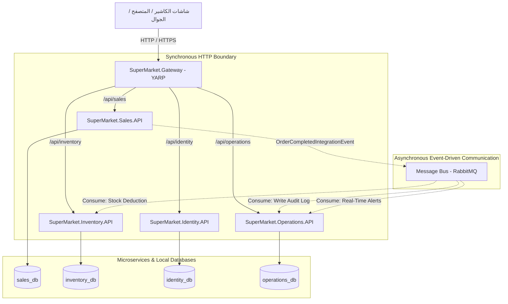

# دليل الهيكلية المعمارية لمنصة التجزئة والسوبرماركت
# Enterprise POS & Retail Management Platform — Architecture Blueprint

---

## 1. نظرة عامة على النظام (Platform Overview)

نظام **Enterprise POS & Retail Management Platform** هو منصة موزعة مصممة خصيصاً لإدارة عمليات السوبرماركت ومتاجر التجزئة الكبرى. يجمع النظام بين:
1. **السرعة الخارقة في نقاط البيع (Sub-second POS Checkout)**: تقليل زمن استجابة مسح الباركود وإصدار الفاتورة إلى أقل من 50 مللي ثانية.
2. **المتانة والاستقرار المالي (Strict Financial Consistency)**: الحفاظ على القيود المحاسبية الصارمة للورديات (Shifts) والمدفوعات والمبيعات عبر **Local ACID Transactions**.
3. **التوسع المستقل (Independent Scaling)**: إمكانية مضاعفة موارد خدمة المبيعات والكاشير في أوقات الذروة دون الحاجة لزيادة موارد الإدارات الخلفية.
4. **المعالجة غير المتزامنة (Event-Driven Decoupling)**: فصل المهام غير الحساسة لزمن الاستجابة (مثل التقارير، سجلات التدقيق، والتنبيهات) عبر **RabbitMQ Message Broker**.

---

## 2. المخطط المعماري العام (System Architecture Diagram)



---

## 3. توزيع المتطلبات التجارية الـ 12 على الخدمات (Mapping 12 Capabilities)

| # | المتطلب التجاري | الخدمة المسؤولة (Microservice) | المسؤولية التفصيلية داخل الخدمة |
| :---: | :--- | :--- | :--- |
| **1** | 🛒 **نقاط البيع (POS)** | `SuperMarket.Sales` | مسح الباركود، حساب الإجمالي والضرائب، إدارة سلة الكاشير، التعليق والاسترجاع. |
| **2** | 🕒 **Cashier Shifts (الورديات)** | `SuperMarket.Sales` | فتح الوردية، تسليم وتسلم الصندوق، تقارير X/Z، ومطابقة العجز والزيادة النقدية. |
| **3** | 💰 **المدفوعات (Payments)** | `SuperMarket.Sales` | الدفع نقداً، شبكة (Mada/Visa)، Apple Pay، ودعم الدفع المجزأ (Split Payment). |
| **4** | 🧾 **الفواتير (Invoices)** | `SuperMarket.Sales` | توليد الأرقام التسلسلية المشفرة، حساب ضريبة القيمة المضافة (VAT)، وتوليد رمز QR. |
| **5** | 🔄 **المرتجعات (Refunds)** | `SuperMarket.Sales` | إرجاع الأصناف بناءً على رقم الفاتورة، فحص سياسة الإرجاع، وإعادة الرصيد للدرج/البطاقة. |
| **6** | 📦 **المخزون (Inventory)** | `SuperMarket.Inventory` | إدارة المنتجات، الأسعار، الوحدات (كرتون/حبة)، باركود الموازين، وتتبع التواريخ والكميات. |
| **7** | 🚚 **الموردين والمشتريات** | `SuperMarket.Inventory` | إدارة الموردين، أوامر الشراء (PO)، فواتير الاستلام المخزني، ومطابقة التكلفة. |
| **8** | 🏪 **الفروع (Branches)** | `SuperMarket.Identity` | بيانات الفروع الجغرافية، تسجيل أجهزة الكاشير لكل فرع، والإعدادات الخاصة بكل متجر. |
| **9** | 👥 **الموظفين والصلاحيات** | `SuperMarket.Identity` | حسابات المستخدمين، مجموعات الصلاحيات (RBAC)، والربط مع Keycloak / JWT. |
| **10**| 📜 **Audit Logs (سجلات التدقيق)** | `SuperMarket.Operations` | استلام أحداث النظام الحساسة وتوثيقها في قاعدة بيانات غير قابلة للتعديل (Immutable). |
| **11**| 🔔 **التنبيهات (Notifications)** | `SuperMarket.Operations` | تنبيهات انخفاض المخزون، محاولات فتح الدرج غير المصرحة، وإشعارات المشرفين. |
| **12**| 📊 **التقارير والتحليلات** | `SuperMarket.Operations` | تقارير المبيعات، أداء الكاشيرية، الأصناف الأكثر مبيعاً، ولوحات تحكم الإدارة (Dashboards). |

---

## 4. التفصيل الشامل لمشاريع الـ Solution (Detailed Project Breakdown)

يتكون الحل من **18 مشروعاً برمجياً** موزعة كالتالي:

```
SuperMarketPOS/
├── src/
│   ├── BuildingBlocks/
│   │   └── SuperMarket.BuildingBlocks
│   │
│   ├── Services/
│   │   ├── Sales/
│   │   │   ├── SuperMarket.Sales.Domain
│   │   │   ├── SuperMarket.Sales.Application
│   │   │   ├── SuperMarket.Sales.Infrastructure
│   │   │   └── SuperMarket.Sales.API
│   │   │
│   │   ├── Inventory/
│   │   │   ├── SuperMarket.Inventory.Domain
│   │   │   ├── SuperMarket.Inventory.Application
│   │   │   ├── SuperMarket.Inventory.Infrastructure
│   │   │   └── SuperMarket.Inventory.API
│   │   │
│   │   ├── Identity/
│   │   │   ├── SuperMarket.Identity.Domain
│   │   │   ├── SuperMarket.Identity.Application
│   │   │   ├── SuperMarket.Identity.Infrastructure
│   │   │   └── SuperMarket.Identity.API
│   │   │
│   │   └── Operations/
│   │       ├── SuperMarket.Operations.Domain
│   │       ├── SuperMarket.Operations.Application
│   │       ├── SuperMarket.Operations.Infrastructure
│   │       └── SuperMarket.Operations.API
│   │
│   └── ApiGateway/
│       └── SuperMarket.Gateway
```

---

### أولاً: مشروع `SuperMarket.BuildingBlocks`
- **نوع المشروع**: `Class Library (.NET 10.0)`
- **الهدف الأساسي**: توفير القواعد والمجردات المشتركة لجميع الخدمات دون فرض أي تبعية خارجية أو تسريب لبيانات قواعد البيانات.
- **ما يحتويه**:
  - `Common/Entity.cs`: كلاس الأساس لجميع الكيانات مع الـ Equality Operators ومعرف الكيان `Id`.
  - `Common/AggregateRoot.cs`: كلاس الأساس لجذور التجميع مع إدارة أحداث النطاق `IDomainEvent`.
  - `Common/ValueObject.cs`: دعم كائنات القيمة غير القابلة للتعديل والمقارنة حسب المحتوى.
  - `Common/Result.cs` & `Error.cs`: نمط النتائج الوظيفي `Result<T>` للاستغناء عن إطلاق الاستثناءات في أخطاء التحقق المتوقعة.
- **ما يُمنع وضعه فيه (Boundaries)**:
  - ❌ يمنع وضع أي اتصال بقواعد البيانات أو DbContext.
  - ❌ يمنع وضع أي كود يعتمد على الـ HTTP أو الـ Controllers.
- **الحزم**: صفر حزم خارجية (Zero Dependencies).

---

### ثانياً: خدمة المبيعات `SuperMarket.Sales` (قلب الكاشير)

#### 1. `SuperMarket.Sales.Domain`
- **المسؤولية**: تعريف منطق الأعمال الخالص (Business Invariants) لعمليات البيع، الصناديق، والفواتير.
- **المحتويات**:
  - `Entities`: `Order`, `OrderItem`, `CashierShift`, `Payment`, `Invoice`, `Refund`.
  - `ValueObjects`: `Money` (عمليات الجمع والطرح والكسور)، `Barcode` (تحليل الأرقام)، `TaxRate`.
  - `Enums`: `OrderStatus`, `ShiftStatus`, `PaymentMethod`.
  - `Events`: أحداث النطاق الداخلية مثل `OrderCompletedDomainEvent`, `ShiftClosedDomainEvent`.
  - `Repositories`: واجهات فقط للـ Aggregate Roots: `IOrderRepository`, `ICashierShiftRepository`.
- **الحزم**: صفر حزم طرف ثالث.

#### 2. `SuperMarket.Sales.Application`
- **المسؤولية**: تنسيق حالات الاستخدام (Use Cases) وإدارة سير العمليات بنمط **Feature Folders**.
- **المحتويات**:
  - `Features/Sales/Commands/ScanItem/`: معالجة مسح الباركود وإضافته للفاتورة.
  - `Features/Sales/Commands/CompleteSale/`: إتمام الدفع، إغلاق الفاتورة، وحساب الباقي.
  - `Features/Shifts/Commands/OpenShift/`: فتح الوردية وإدخال الرصيد الافتتاحي للصندوق.
  - `Features/Shifts/Commands/CloseShift/`: إغلاق الوردية وحساب العجز أو الزيادة.
  - `Common/Behaviors`: `ValidationBehavior` لفحص المدخلات قبل وصولها للـ Handler، و `LoggingBehavior`.
  - `PDF Services`: توليد إيصالات وفواتير الكاشير بتنسيق PDF.
- **الحزم**: `MediatR`, `FluentValidation`, `FluentValidation.DependencyInjectionExtensions`, `MassTransit.Abstractions`, `QuestPDF`.

#### 3. `SuperMarket.Sales.Infrastructure`
- **المسؤولية**: تنفيذ الوصول للبيانات والعتاد الخارجي (Hardware).
- **المحتويات**:
  - `Persistence/SalesDbContext.cs`: تعيين الجداول في PostgreSQL وضبط الـ Foreign Keys.
  - `Repositories/`: تنفيذ واجهات الـ Repositories عبر EF Core.
  - `Hardware/`: الربط مع طابعات الإيصالات الحرارية (ESC/POS Printer) وأمر فتح درج الكاشير (Kick Cash Drawer).
  - `Messaging/`: إعداد الـ MassTransit RabbitMQ لنشر أحداث التكامل (`OrderCompletedIntegrationEvent`).
  - `Caching/`: تخزين سريع لبيانات الوردية النشطة في Redis.
- **الحزم**: `Npgsql.EntityFrameworkCore.PostgreSQL`, `Microsoft.EntityFrameworkCore.Design`, `StackExchangeRedis`, `MassTransit.RabbitMQ`.

#### 4. `SuperMarket.Sales.API`
- **المسؤولية**: استقبال طلبات شاشات الكاشير وعرض النتائج.
- **المحتويات**:
  - `Controllers/`: `SalesController`, `ShiftsController`, `InvoicesController`.
  - `Middlewares/`: `GlobalExceptionHandler` لتحويل الأخطاء إلى `ProblemDetails` القياسي (RFC 7807).
  - `Configurations/`: ضبط الـ Keycloak Authentication عبر JWT والـ Scalar API Docs وفحص الصحة Health Checks.
- **الحزم**: `Serilog.AspNetCore`, `Microsoft.AspNetCore.Authentication.JwtBearer`, `Microsoft.AspNetCore.OpenApi`, `Scalar.AspNetCore`, `AspNetCore.HealthChecks.NpgSql`, `AspNetCore.HealthChecks.Redis`, `AspNetCore.HealthChecks.Rabbitmq`.

---

### ثالثاً: خدمة المخزون والكتالوج `SuperMarket.Inventory`

- **المسؤوليات**:
  - إدارة بطاقة الصنف (Product Catalog)، الباركودات المتعددة، وحدات القياس (UOM)، وتفكيك باركود الموازين الإلكترونية.
  - إدارة المستودعات، الأرصدة المتوفرة، حد الطلب الأدنى، والتحويلات المخزنية.
  - إدارة الموردين، طلبات الشراء (Purchase Orders)، وفواتير الاستلام.
- **استهلاك الأحداث (Event Consumption)**:
  - تحتوي على `OrderCompletedConsumer` عبر RabbitMQ لخصم الكميات المباعة من المستودع المقابل للفرع بشكل غير متزامن.
- **الطبقات الأربعة**:
  - `Inventory.Domain`: كائنات `Product`, `StockBatch`, `Supplier`, `PurchaseOrder`.
  - `Inventory.Application`: ميزات `Features/Products`, `Features/Stock`, `Features/Suppliers`.
  - `Inventory.Infrastructure`: قاعدة بيانات `inventory_db` والتخزين المؤقت Redis لأسعار المنتجات الفورية.
  - `Inventory.API`: نقاط النهاية لإدارة المستودعات والتكامل مع أجهزة مسح الجرد.

---

### رابعاً: خدمة الهوية والفروع `SuperMarket.Identity`

- **المسؤوليات**:
  - إدارة الفروع، إعدادات نقاط البيع التابعة لكل فرع، والأجهزة المرتبطة.
  - إدارة حسابات موظفي السوبرماركت (كاشير، مشرف فرع، مدير مستودع، إدارة مالية).
  - إدارة الصلاحيات والأدوار (Role-Based Access Control - RBAC).
  - التحقق من الرموز الأمنية المشفرة (JWT Tokens) والتكامل مع Keycloak.
- **الطبقات الأربعة**:
  - `Identity.Domain`: كائنات `Branch`, `POSRegister`, `StaffMember`, `Role`, `Permission`.
  - `Identity.Application`: ميزات `Features/Branches`, `Features/Staff`, `Features/Authentication`.
  - `Identity.Infrastructure`: قاعدة بيانات `identity_db` والتحقق من الهوية.
  - `Identity.API`: نقاط النهاية لتسجيل الدخول وإدارة الفروع والصلاحيات.

---

### خامساً: خدمة العمليات والتحليلات `SuperMarket.Operations`

- **المسؤوليات**:
  - **Audit Logs**: التقاط جميع الحركات الحساسة (فتح الدرج، تعديل سعر، إلغاء فاتورة، تسجيل دخول).
  - **Notifications Engine**: إرسال تنبيهات بريدية أو إشعارات حية (SignalR) للمشرفين.
  - **Reporting & Analytics**: توليد تقارير المبيعات والأرباح وقراءة النماذج (Read Models) دون التأثير على قاعدة بيانات الكاشير.
- **الطبقات الأربعة**:
  - `Operations.Domain`: كائنات `AuditLogEntry`, `Notification`, `SalesReportSummary`.
  - `Operations.Application`: Consumers لاستقبال أحداث المبيعات والمخزون وبناء التقارير.
  - `Operations.Infrastructure`: قاعدة بيانات `operations_db` المحسنة لعمليات القراءة السريعة والأرشفة.
  - `Operations.API`: لوحات تحكم الإدارة والتقارير.

---

### سادساً: بوابة النظام `SuperMarket.Gateway`

- **نوع المشروع**: `ASP.NET Core Web App (YARP - Yet Another Reverse Proxy)`
- **الهدف الأساسي**: نقطة الاتصال الموحدة (Single Entry Point) لكافة تطبيقات الكاشير ولوحات التحكم.
- **المسؤوليات**:
  - توجيه المسارات:
    - `/api/sales/**` -> `SuperMarket.Sales.API`
    - `/api/inventory/**` -> `SuperMarket.Inventory.API`
    - `/api/identity/**` -> `SuperMarket.Identity.API`
    - `/api/operations/**` -> `SuperMarket.Operations.API`
  - توحيد سياسات الـ CORS وحماية الـ Rate Limiting.
  - التحقق المركزي الأولي من صلاحية الـ JWT Header قبل توجيهه للخدمات الخلفية.
- **الحزم**: `Yarp.ReverseProxy`, `Serilog.AspNetCore`.

---

## 5. القرارات المعمارية الرئيسية (Architectural Decision Records - ADRs)

### ADR-01: اعتماد 4 Coarse-Grained Microservices بدلاً من 12 Fine-Grained
- **السياق**: كان الاقتراح المبدئي تقسيم النظام إلى 12 خدمة منفصلة لكل متطلب (POS, Shift, Payment, Invoice, etc.).
- **القرار**: دمج النطاقات المترابطة بإحكام في 4 خدمات موحدة حسب دورة حياة المعاملة (Sales, Inventory, Identity, Operations).
- **العلة الهندسية**:
  1. حماية عملية الـ POS Checkout من تأخير الشبكة (Network Latency).
  2. تجنب تعقيدات الـ Distributed Transactions والـ Saga Pattern أثناء عمليات البيع السريعة.
  3. ضمان الـ Local ACID Transaction بين الفاتورة، الدفع، والوردية.

### ADR-02: نمط الـ Features داخل طبقة الـ Application
- **السياق**: النمط الكلاسيكي يضع كل الـ Commands في مجلد، وكل الـ Queries في مجلد، وكل الـ Handlers في مجلد آخر.
- **القرار**: تنظيم طبقة الـ Application حسب الميزة الوظيفية (مثلاً: `Sales/Commands/ScanItem/`).
- **العلة الهندسية**: تحقيق أعلى درجات التماسك (**High Cohesion**) وتفادي التشتت البرمجي (Shotgun Surgery) أثناء صيانة أو تعديل أي ميزة.

### ADR-03: نقاء طبقة الـ Domain من الحزم الخارجية (Domain Purity)
- **السياق**: وجود حزم مثل MediatR أو EF Core داخل الـ Domain.
- **القرار**: حظر تثبيت أي حزم NuGet داخل مشاريع الـ Domain واعتماد واجهات C# نقية (POCO).
- **العلة الهندسية**: حماية قلب النظام وقواعد الأعمال من التغييرات أو المشاكل الأمنية في الحزم الخارجية، وضمان استقلالية الأعمال عن إطار العمل.

---

## 6. إرشادات التطوير القادمة (Next Steps & Guidelines)

1. **التعامل مع الأخطاء**: يتم اعتماد نمط `Result<T>` للأخطاء المتوقعة (Validation / Business Rules) ونظام `GlobalExceptionHandler` لترجمة الاستثناءات غير المتوقعة إلى استجابات `ProblemDetails`.
2. **التعامل مع التزامن (Concurrency)**: استخدام الـ `xmin` في PostgreSQL كـ RowVersion لمنع التضارب في المخزون أو إغلاق الورديات.
3. **التوثيق الداخلي**: كل خدمة تحوي ملفات Migrations خاصة بها دون مشاركة أي مخططات قواعد بيانات.
