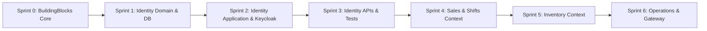

# 📋 خطة تنفيذ مهام المنصة (Engineering Sprints & Task Roadmap)
## Enterprise POS & Retail Management Platform

> **📌 فلسفة العمل:** نتبع مبادئ **Clean Code** و **SOLID** و **Pragmatic DDD** مع تطبيق أعلى المعايير الهندسية (Production-Grade).
> لا نكتب كوداً لمجرد أنه يعمل، بل نبني كوداً سهل القراءة، عالي المقروئية، مفصول المسؤوليات، وقابلاً للتوسع والصيانة بسهولة.

---

## 🗺️ خارطة السبرنتات الإجمالية (High-Level Roadmap)

---

## 🧱 Sprint 0: تأسيس حجر الأساس المشترك (BuildingBlocks Core)
* **الهدف:** بناء الأساسات المعمارية المجردة المشتركة الخالية تماماً من أي منطق بزنس خاص بسوبرماركت، لكي تعتمد عليها كافة الميكروسيرفيس.
* **المشروع المستهدف:** `src/BuildingBlocks/SuperMarket.BuildingBlocks`

### 📝 قائمة المهام التفصيلية (Tasks):

#### Task 0.1: أساسيات الـ Domain (Domain Primitives)
* [x] **`Entity<TId>`:** كلاس Generic مجرد يطبق توحيد المقارنة بالهوية (`Equals`, `GetHashCode`, ومعاملي `==`, `!=`) لمنع المقارنة المرجعية الخاطئة في C#.
* [x] **`AggregateRoot<TId>`:** يرث من `Entity<TId>` ويمتلك إدارة أحداث المجال (`IDomainEvent`) عبر دوال (`AddDomainEvent`, `ClearDomainEvents`, `DomainEvents`).
* [x] **`ValueObject`:** كلاس مجرد يوفر المقارنة التلقائية بالقيم (Structural Equality) عبر `GetEqualityComponents()`.
* [x] **`IDomainEvent` / `DomainEvent`:** عقد وسجل غير قابل للتعديل (Immutable Record) يحمل (`EventId`, `OccurredOn`).

#### Task 0.2: نمط النتائج الصريحة ومعالجة الأخطاء (Result & Error Pattern)
* [x] **`Error`:** كائن قيمة يحدد كود الخطأ، وصفه، وتصنيفه (`ErrorType`: `Failure`, `Validation`, `NotFound`, `Conflict`, `Unauthorized`, `Forbidden`).
* [x] **`Result` & `Result<T>`:** كلاس النتيجة الصريح الذي يحمل (`IsSuccess`, `IsFailure`, `Error`, `Value`) لمنع استخدام Exceptions للتحكم بالمسار (No Exceptions for Flow Control).

#### Task 0.3: واجهات القدرات المتخصصة (Capability Interfaces)
* [x] **`IAuditableEntity`:** تضمن حقول التدقيق الزمني (`CreatedAt`, `UpdatedAt`, `CreatedBy`, `UpdatedBy`).
* [x] **`ISoftDeletable`:** تضمن حقول الحذف المنطقي (`IsDeleted`, `DeletedAt`, `DeletedBy`).
* [x] **`IActivatable`:** تضمن حالة التفعيل والتعطيل التشغيلي (`IsActive`).

#### Task 0.4: أتمتة البنية التحتية في EF Core (Infrastructure Interceptors)
* [x] **`AuditSaveChangesInterceptor`:** مراقب ذكي في EF Core يملأ تواريخ الإنشاء والتعديل وهوية الموظف الحالي تلقائياً عند استدعاء `SaveChangesAsync`، ويحول أوامر `DELETE` تلقائياً إلى Soft Delete دون تدخل يدوي في الـ Handlers.

#### Task 0.5: البنية التحتية للـ CQRS وسلوكيات الـ Pipeline وأحداث الدومين (CQRS & Pipelines)
* [x] **`ICommand` & `IQuery`:** واجهات CQRS صريحة تجبر العمليات على إرجاع نمط النتائج (`Result` و `Result<T>`).
* [x] **`ValidationPipelineBehavior`:** اعتراض وفحص الطلبات تلقائياً عبر FluentValidation بشكل متوازٍ والإيقاف الفوري (Short-Circuit) عند وجود أخطاء.
* [x] **`LoggingPipelineBehavior`:** تسجيل أحداث مسار الطلب (Lifecycle Tracing) والتمييز الذكي بين تحذيرات البزنس وانهيارات الـ Exceptions.
* [x] **`PerformancePipelineBehavior`:** قياس زمن الاستجابة، تسجيل مقاييس OpenTelemetry (`Meter`, `Counter`, `Histogram`)، ومراقبة عتبة السرعة SLA.
* [x] **`PerformanceSettings`:** تطبيق نمط الخيارات (Options Pattern `IOptions<T>`) لضبط عتبة البطء ديناميكياً من `appsettings.json` مع قيمة افتراضية آمنة (500ms).
* [x] **`DispatchDomainEventsInterceptor`:** مراقب EF Core يستخرج أحداث الدومين من `IAggregateRoot` ويمسحها وينشرها تلقائياً عبر MediatR `IPublisher` عند كل `SaveChangesAsync`.

#### Task 0.6: معالجة الأخطاء المركزية ومعيار ProblemDetails (Web & Error Infrastructure)
* [x] **`GlobalExceptionHandler`:** معالج استثناءات مركزي يطبق `IExceptionHandler` يلتقط الانهيارات غير المتوقعة، يسجلها في Serilog، ويعيد رد `500 Internal Server Error` آمن يحتوي على `traceId` بمعيار RFC 7807.
* [x] **`ResultProblemDetailsExtensions`:** دوال توسعة تحول أخطاء البزنس في نمط `Result` و `Result<T>` تلقائياً إلى استجابات HTTP دلالية موحدة بمعيار RFC 7807 ProblemDetails (`400`, `404`, `409`, `401`, `403`).
* [x] **`DependencyInjection`:** دوال مساعدة `AddBuildingBlocksWeb` و `UseBuildingBlocksWeb` لتهيئة البنية التحتية للويب بسطر واحد في كل ميكروسيرفيس.

#### Task 0.7: استراتيجية الترقيم المزدوجة (Pagination Infrastructure)
* [x] **`PaginationParams` & `PagedList<T>`:** الترقيم الكلاسيكي (Offset-Based) للشاشات الإدارية والتقارير مع حساب الإجمالي `TotalCount` و `TotalPages`، ومصنع `CreateAsync` عبر EF Core، وحماية أمنية بسقف `MaxPageSize = 100`.
* [x] **`CursorParams<TCursor>` & `CursorPagedList<T, TCursor>`:** الترقيم فائق السرعة O(1) المستند للمؤشر (Keyset / Cursor-Based) للجداول المليونية وحركات الكاشير اللحظية مع تجنب استعلام `COUNT(*)` المنهك.

---

## 🔐 Sprint 1: خدمة الهوية — طبقة النطاق وقاعدة البيانات (Identity Domain & DB)
* **الهدف:** بناء نموذج البيانات والكيانات الغنية وقواعد البزنس لخدمة الهوية وتطبيق الـ Migration الأول لقاعدة بيانات `identity_db`.
* **المشاريع المستهدفة:**
  * `src/Services/Identity/SuperMarket.Identity.Domain`
  * `src/Services/Identity/SuperMarket.Identity.Infrastructure`

### 📝 قائمة المهام التفصيلية (Tasks):

#### Task 1.1: كائنات القيمة لخدمة الهوية (Value Objects)
* [x] **`BranchCode`:** حماية كود الفرع (صيغة معيارية مثل "BR-01"، تنظيف المسافات، التحقق من عدم الفراغ، الحد الأدنى 2 والأقصى 20).
* [x] **`Address`:** كائن قيمة نقي للعنوان (Street, City, Region, PostalCode) مع المقارنة الهيكلية وتسطيحه لاحقاً عبر EF Core OwnsOne (وفق ADR-ID-017).
* [x] **`RegisterCode`:** رقم محطة البيع الفريد (مثل "POS-01"، تنظيف المسافات، وحدود الطول 2-20).

#### Task 1.2: كيانات الـ Domain وجذور التجميع (Rich Domain Entities)
* [x] **`Branch` (Aggregate Root):**
  * يطبق: `Entity<Guid>, IAuditableEntity, ISoftDeletable, IActivatable`.
  * مغلق الـ Constructor، ويوفر Factory Method: `Create(...)`.
  * دوال أعمال صريحة: `UpdateDetails(...)`, `UpdateAddress(...)`, `Activate()`, `Deactivate()`, `SoftDelete(deletedBy)`.
  * إدارة ساعات العمل ومنع تكرار أيام الأسبوع `DuplicateDayOfWeek`.
  * يطلق حدث: `BranchCreatedDomainEvent`.
* [x] **`BranchOperatingHours` (Entity):** ساعات العمل اليومية لكل فرع (`DayOfWeek`, `OpenTime`, `CloseTime`)، ودعم الورديات الليلية العابرة للمنتصف `IsOvernight`.
* [x] **`POSRegister` (Aggregate Root):**
  * محطة البيع المستقلة المرتبطة بالفرع `BranchId` وبصمة العتاد `TerminalIpOrFingerprint` (وفق ADR-ID-018).
  * دوال أعمال صريحة: `UpdateDetails(...)`, `UpdateFingerprint(...)`, `ReassignBranch(...)`, `Activate()`, `Deactivate()`, `SoftDelete(...)`.
  * يطلق حدث: `POSRegisterCreatedDomainEvent`.
* [x] **`StaffMember` / `User` (Aggregate Root):**
  * بيانات الموظف، ربطه بالفرع والدور، كود الـ PIN المشفر، ومعرف Keycloak (`KeycloakUserId`).
  * أمن الحساب: عداد المحاولات الفاشلة وقفل الحساب المؤقت لمدة 15 دقيقة بعد 3 محاولات خاطئة (`Lockout`).
  * دوال أعمال صريحة: `SetPin(...)`, `RemovePin()`, `AssignToBranch(...)`, `ChangeRole(...)`, `RecordLogin(...)`, `RecordFailedLogin(...)`, `Unlock()`, `SoftDelete(...)`.
  * يطلق أحداث: `UserCreatedDomainEvent`, `UserLockedOutDomainEvent`, `UserTransferredDomainEvent`, `UserRoleChangedDomainEvent`, `UserDeactivatedDomainEvent`.
* [x] **`Permission` (Entity):** تمثيل الصلاحية بصيغة `resource:action:scope` مع الفئة والوصف.
* [x] **`PermissionGroup` (Aggregate Root):** تجميع الصلاحيات في باقات وظيفية (مثل `CashierPOSOperations`).
* [x] **`Role` (Aggregate Root):** كيان الأدوار مع التفعيل والتعطيل والتدقيق الزمني.
* [x] **`RolePermissionGroup` & `PermissionGroupItem` (Join Entities):** جداول الربط بمفاتيح أساسية مركبة وحذف فعلي Hard Delete.
* [x] **`SuperMarket.Identity.Domain.UnitTests`:** حزمة اختبارات وحدة كاملة للـ Domain Layer (103 اختبارات بنسبة نجاح 100% بزمن 132ms بنمط Data-Driven `[Theory]` + `[InlineData]`).

#### Task 1.3: إعدادات EF Core والتهجير (Infrastructure & Migrations)
* [ ] **`IdentityDbContext`:** إعداد الـ DbContext وربطه بـ `AuditSaveChangesInterceptor`.
* [ ] **`EntityConfigurations` (Fluent API):**
  * تطبيق `IEntityTypeConfiguration` لكل كيان لتحديد القيود (Indexes, MaxLengths, Foreign Keys).
  * تفعيل الـ **Global Query Filter** لمنع ظهور السجلات المحذوفة منطقياً (`is_deleted == false`).
* [ ] **Initial Migration:** إنشاء وتطبيق أول Migration لقاعدة بيانات PostgreSQL (`identity_db`).

---

## ⚡ Sprint 2: خدمة الهوية — منطق التطبيق وربط Keycloak (Identity Application Layer)
* **الهدف:** تنفيذ الـ Use Cases بنمط CQRS عبر MediatR وربط تسجيل الدخول السريع للكاشير بخادم Keycloak.
* **المشروع المستهدف:** `src/Services/Identity/SuperMarket.Identity.Application`

### 📝 قائمة المهام التفصيلية (Tasks):

#### Task 2.1: أوامر إدارة الفروع والموظفين (Commands & Handlers)
* [ ] **`CreateBranchCommand` & Handler:** مع فحص تكرار كود الفرع، وإرجاع `Result<Guid>`.
* [ ] **`RegisterStaffMemberCommand` & Handler:** تسجيل موظف جديد وتعيين دوره وفرعه.
* [ ] **`TransferStaffBranchCommand` & Handler:** نقل موظف لفرع جديد وإطلاق أحداث التحديث.

#### Task 2.2: المصادقة السريعة للكاشير (Fast Cashier Login via Keycloak)
* [ ] **`LoginWithPinCommand`:** الكاشير يرسل كود الموظف والـ PIN ورقم الجهاز:
  * التحقق من سلامة الجهاز والـ PIN محلياً في `identity_db`.
  * مخاطبة Keycloak برمجياً لإصدار `Access Token` معتمد للدور `Cashier`.

#### Task 2.3: منظومة فحص الصلاحيات اللحظية (Authorization Handler & Cache)
* [ ] **`HasPermissionAttribute`:** خاصية تزين الـ Endpoints مثل `[HasPermission("shifts:open:own")]`.
* [ ] **`PermissionAuthorizationHandler`:** فحص الصلاحيات من كاش الذاكرة / Redis في أجزاء من الميلي ثانية دون استعلام قاعدة البيانات.

---

## 🌐 Sprint 3: خدمة الهوية — واجهات الـ API والاختبارات (API Endpoints & Verification)
* **الهدف:** تعريض نقاط النهاية، توثيق OpenAPI، وتكامل معايير RFC 7807 للأخطاء.
* **المشروع المستهدف:** `src/Services/Identity/SuperMarket.Identity.API`

### 📝 قائمة المهام التفصيلية (Tasks):

#### Task 3.1: نقاط النهاية (Controllers / Minimal APIs)
* [ ] `/api/v1/auth/cashier-login`: تسجيل الدخول السريع لشاشات الـ POS.
* [ ] `/api/v1/branches`: إدارة الفروع وساعات العمل.
* [ ] `/api/v1/staff`: إدارة الموظفين، الأدوار، وتعيين الـ PIN.
* [ ] `/api/v1/permissions`: مصفوفة إدارة الصلاحيات وتوزيعها.

#### Task 3.2: معالجة الأخطاء الموحدة (RFC 7807 ProblemDetails)
* [ ] دالة تحويل موحدة `ToProblemDetails(this Result result)` لتحويل كائنات `Error` إلى ردود HTTP قياسية (`400`, `404`, `409`, `401`, `403`).

#### Task 3.3: التحقق والتأكد (Verification & Smoke Testing)
* [ ] تسجيل فرع تجريبي واستعراضه.
* [ ] تسجيل موظف كاشير وتسجيل دخوله بالـ PIN والحصول على JWT صالح من Keycloak.
* [ ] فحص صحة الـ Soft Delete واستبعاد السجلات المحذوفة تلقائياً.

---

## 🛒 نظرة على السبرنتات اللاحقة (Downstream Roadmap)

* **Sprint 4 (Sales & POS Service):**
  * دورة حياة الورديات (`Shifts`: فتح، تعليق، إغلاق، ومطابقة العجز والفائض).
  * شاشات البيع السريعة، مسح الباركود، حساب الضرائب (ZATCA)، ومعالجة الدفع (Split Payment).
* **Sprint 5 (Inventory Service):**
  * المنتجات والتصنيفات، أرصدة المخزون بالفروع، والتحويلات المخزنية.
  * سجل حركات المخزون الثابت المحمي من التعديل (`Stock Movements Ledger`).
* **Sprint 6 (Operations & Gateway):**
  * الموردون وأوامر الشراء (PO) وإثبات استلام البضائع.
  * بوابة الخدمات المركزية (YARP API Gateway) وتتبع الطلبات (Distributed Tracing عبر Jaeger).

---

> [!TIP]
> **الخطوة المباشرة:**
> نبدأ فوراً بـ **Sprint 0: Task 0.1** (إنشاء `Entity<TId>`, `AggregateRoot<TId>`, `ValueObject`, `IDomainEvent` داخل مشروع `BuildingBlocks`).
