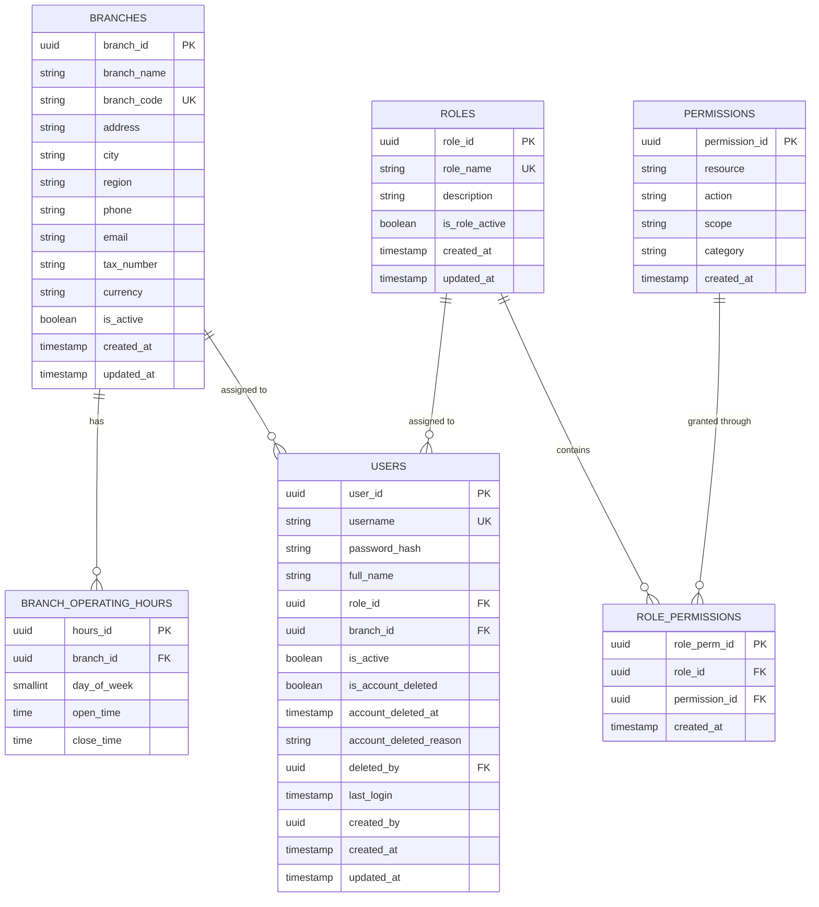
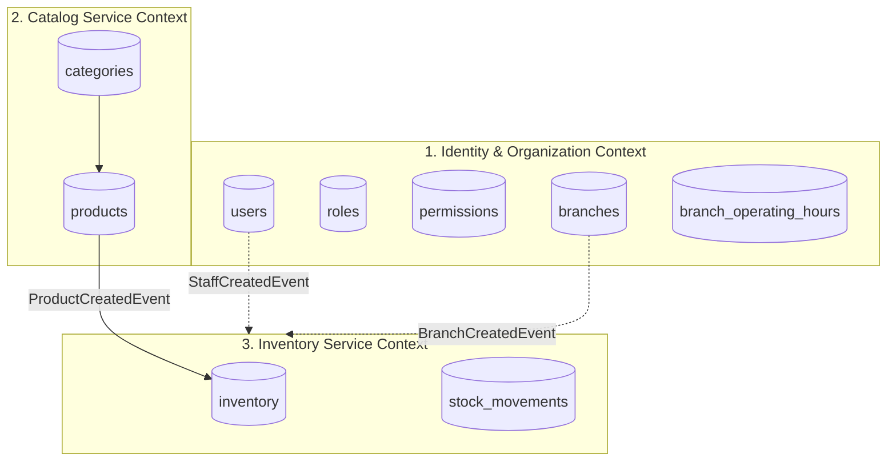

# وثيقة المواصفات الهندسية ومصفوفة الصلاحيات ونموذج البيانات
## Enterprise POS Platform: Data Specification & RBAC Architecture

> **المرجع المعتمد:** تم استخراج وبناء هذه الوثيقة مباشرة من تحليلات المخططات الهندسية:
> - [`ERD.drawio`](file:///e:/dotnet/POS/ERD.drawio) (مخطط قاعدة البيانات والعلاقات العلائقية)
> - [`roles.drawio`](file:///e:/dotnet/POS/roles.drawio) (مخطط الأدوار، الممثلين، وهيكل الصلاحيات والعمليات)
> 
> **الأولوية التنفيذية:** تبدأ هذه الوثيقة بتفصيل كل ما يخص **خدمة الهوية والصلاحيات وتوزيع الفروع (Identity & Access Management Service)** لكونها نقطة انطلاق التكويد، تليها الخدمات الأخرى ومصفوفة الصلاحيات الشاملة.

---

## فهرس المحتويات
1. [نطاق الهوية وإدارة الفروع (Identity & Branch Management Service)](#1-نطاق-الهوية-وإدارة-الفروع-identity--branch-management-service)
   - [حدود الخدمة (Service Boundaries)](#حدود-الخدمة-service-boundaries)
   - [نموذج البيانات العلائقي (Data Schema)](#نموذج-البيانات-العلائقي-data-schema)
   - [الأدوار والممثلون المعنيون بالهوية (Identity Actors & RBAC)](#الأدوار-والممثلون-المعنيون-بالهوية-identity-actors--rbac)
   - [صلاحيات وعمليات إدارة المستخدمين والأدوار والفروع](#صلاحيات-وعمليات-إدارة-المستخدمين-والأدوار-والفروع)
2. [نطاقات الخدمات اللاحقة (Downstream Services)](#2-نطاقات-الخدمات-اللاحقة-downstream-services)
   - [خدمة الكتالوج والمنتجات (Catalog Service)](#خدمة-الكتالوج-والمنتجات-catalog-service)
   - [خدمة إدارة المخزون وحركاته (Inventory Service)](#خدمة-إدارة-المخزون-وحركاته-inventory-service)
   - [خدمة المبيعات ونقاط البيع (Sales & POS Service)](#خدمة-المبيعات-ونقاط-البيع-sales--pos-service)
   - [خدمة المشتريات والموردين (Purchasing Service)](#خدمة-المشتريات-والموردين-purchasing-service)
   - [خدمة المالية والمحاسبة (Finance & Accounting Service)](#خدمة-المالية-والمحاسبة-finance--accounting-service)
3. [مصفوفة الصلاحيات الشاملة للنظام (Comprehensive RBAC Matrix)](#3-مصفوفة-الصلاحيات-الشاملة-للنظام-comprehensive-rbac-matrix)
4. [التدقيق المعماري والتصحيحات الفنية قبل التكويد (Pre-Coding Engineering Audit)](#4-التدقيق-المعماري-والتصحيحات-الفنية-قبل-التكويد-pre-coding-engineering-audit)

---

# 1. نطاق الهوية وإدارة الفروع (Identity & Branch Management Service)

### حدود الخدمة (Service Boundaries)
تمتلك **Identity Service** المسؤولية الحصرية عن:
1. **مصادقة وتفويض المستخدمين (Authentication & Authorization)** وإصدار الرموز الأمنية (JWT Tokens) والتحقق منها.
2. **إدارة حسابات الموظفين (Staff Members)** ودورة حياتهم (إنشاء، تعديل، إيقاف، وحذف منطقي Soft Delete).
3. **إدارة الأدوار والصلاحيات (Roles, Permissions & Scopes)** بنظام RBAC ديناميكي وحبيبي (Fine-Grained).
4. **الهيكل التنظيمي للفروع (Branches & Operating Hours)** وتعيين الموظفين على الفروع التابعة لهم.



---

### نموذج البيانات العلائقي (Data Schema)

#### 1. جدول المستخدمين (`users`)
> **ملاحظة معمارية وتصحيح:** تم تصحيح الأخطاء الإملائية الواردة بالمخطط الأصلي (`uderId -> user_id`، `password_hasj -> password_hash`، `accoun_deleted_reasone -> account_deleted_reason`).

| الحقل (Field) | النوع المقترح (.NET / PostgreSQL) | القيود (Constraints) | الوصف الهندسي |
| :--- | :--- | :--- | :--- |
| `user_id` | `Guid` / `UUID` | **PK**, Not Null | المعرّف الفريد الثابت للمستخدم |
| `username` | `string` / `VARCHAR(50)` | **Unique**, Not Null | اسم الدخول الفريد للنظام |
| `password_hash` | `string` / `VARCHAR(255)` | Not Null | القيمة المشفرة لكلمة المرور (Argon2id أو BCrypt) |
| `full_name` | `string` / `VARCHAR(100)` | Not Null | الاسم الكامل للموظف |
| `role_id` | `Guid` / `UUID` | **FK -> roles(role_id)**, Not Null | الدور الوظيفي للموظف في النظام |
| `branch_id` | `Guid` / `UUID` | **FK -> branches(branch_id)**, Nullable | الفرع المنتسب له الموظف (Nullable للمسؤول العام) |
| `is_active` | `bool` / `BOOLEAN` | Not Null, Default: `true` | حالة تنشيط الحساب للعمليات اليومية |
| `is_account_deleted` | `bool` / `BOOLEAN` | Not Null, Default: `false` | مؤشر الحذف المنطقي (Soft Delete) لمنع كسر السجلات القديمة |
| `account_deleted_at` | `DateTime?` / `TIMESTAMPTZ` | Nullable | تاريخ ووقت تنفيذ الحذف المنطقي |
| `account_deleted_reason` | `string?` / `VARCHAR(255)` | Nullable | سبب الحذف أو إنهاء الخدمة |
| `deleted_by` | `Guid?` / `UUID` | **FK -> users(user_id)**, Nullable | المستخدم الذي نفذ عملية الحذف |
| `last_login` | `DateTime?` / `TIMESTAMPTZ` | Nullable | آخر وقت تسجيل دخول ناجح |
| `created_by` | `Guid?` / `UUID` | Nullable | المستخدم المسؤول عن إنشاء الحساب |
| `created_at` | `DateTime` / `TIMESTAMPTZ` | Not Null, Default: `NOW()` | وقت إنشاء السجل |
| `updated_at` | `DateTime?` / `TIMESTAMPTZ` | Nullable | وقت آخر تحديث لبيانات الحساب |

#### 2. جدول الأدوار (`roles`)
| الحقل (Field) | النوع المقترح | القيود (Constraints) | الوصف الهندسي |
| :--- | :--- | :--- | :--- |
| `role_id` | `Guid` / `UUID` | **PK**, Not Null | المعرّف الفريد للدور |
| `role_name` | `string` / `VARCHAR(50)` | **Unique**, Not Null | اسم الدور (SystemAdmin, StoreManager, Cashier, etc.) |
| `description` | `string?` / `VARCHAR(255)` | Nullable | شرح وظيفي لمسؤوليات الدور |
| `is_role_active` | `bool` / `BOOLEAN` | Not Null, Default: `true` | تفعيل أو تعطيل الدور كلياً |
| `created_at` | `DateTime` / `TIMESTAMPTZ` | Not Null, Default: `NOW()` | وقت إنشاء السجل |
| `updated_at` | `DateTime?` / `TIMESTAMPTZ` | Nullable | وقت آخر تعديل |

#### 3. جدول الصلاحيات (`permissions`)
| الحقل (Field) | النوع المقترح | القيود (Constraints) | الوصف الهندسي |
| :--- | :--- | :--- | :--- |
| `permission_id` | `Guid` / `UUID` | **PK**, Not Null | المعرّف الفريد للصلاحية |
| `resource` | `string` / `VARCHAR(50)` | Not Null | المورد المعني (Users, Roles, Branches, Sales, Inventory) |
| `action` | `string` / `VARCHAR(50)` | Not Null | العملية المسموحة (Create, Read, Update, Delete, Approve, Export) |
| `scope` | `string` / `VARCHAR(50)` | Not Null | نطاق التأثير (SystemWide, BranchOnly, Self) |
| `category` | `string` / `VARCHAR(50)` | Not Null | تصنيف الصلاحية (Security, Sales, Inventory, Finance) |
| `created_at` | `DateTime` / `TIMESTAMPTZ` | Not Null, Default: `NOW()` | وقت التسجيل |

#### 4. جدول ربط الأدوار بالصلاحيات (`role_permissions`)
| الحقل (Field) | النوع المقترح | القيود (Constraints) | الوصف الهندسي |
| :--- | :--- | :--- | :--- |
| `role_perm_id` | `Guid` / `UUID` | **PK**, Not Null | المعرّف الفريد لسجل الربط |
| `role_id` | `Guid` / `UUID` | **FK -> roles(role_id)**, Not Null | الدور الوظيفي |
| `permission_id` | `Guid` / `UUID` | **FK -> permissions(permission_id)**, Not Null | الصلاحية الممنوحة |
| `created_at` | `DateTime` / `TIMESTAMPTZ` | Not Null, Default: `NOW()` | تاريخ المنح |
| *Composite Index* | `INDEX` | **Unique(role_id, permission_id)** | ضمان عدم تكرار الصلاحية لنفس الدور |

#### 5. جدول الفروع (`branches`)
| الحقل (Field) | النوع المقترح | القيود (Constraints) | الوصف الهندسي |
| :--- | :--- | :--- | :--- |
| `branch_id` | `Guid` / `UUID` | **PK**, Not Null | المعرّف الفريد للفرع |
| `branch_name` | `string` / `VARCHAR(100)` | Not Null | اسم الفرع |
| `branch_code` | `string` / `VARCHAR(20)` | **Unique**, Not Null | كود كودي مميز للفرع (مثل: BR-01) |
| `address` | `string` / `VARCHAR(255)` | Not Null | العنوان التفصيلي |
| `city` | `string` / `VARCHAR(50)` | Not Null | المدينة |
| `region` | `string` / `VARCHAR(50)` | Not Null | المنطقة الجغرافية |
| `phone` | `string` / `VARCHAR(30)` | Not Null | هاتف التواصل للفرع |
| `email` | `string` / `VARCHAR(100)` | Nullable | البريد الإلكتروني للفرع |
| `tax_number` | `string` / `VARCHAR(50)` | Not Null | الرقم الضريبي المعتمد للفرع في الفواتير |
| `currency` | `string` / `VARCHAR(10)` | Not Null, Default: `SAR` | العملة المعتمدة للفرع |
| `is_active` | `bool` / `BOOLEAN` | Not Null, Default: `true` | تفعيل أو إيقاف عمليات الفرع |
| `created_at` | `DateTime` / `TIMESTAMPTZ` | Not Null, Default: `NOW()` | وقت التسجيل |
| `updated_at` | `DateTime?` / `TIMESTAMPTZ` | Nullable | وقت آخر تحديث |

#### 6. جدول ساعات عمل الفروع (`branch_operating_hours`)
| الحقل (Field) | النوع المقترح | القيود (Constraints) | الوصف الهندسي |
| :--- | :--- | :--- | :--- |
| `hours_id` | `Guid` / `UUID` | **PK**, Not Null | المعرّف الفريد للسجل |
| `branch_id` | `Guid` / `UUID` | **FK -> branches(branch_id)**, Not Null | معرّف الفرع المرتبط |
| `day_of_week` | `short` / `SMALLINT` | Not Null, Range: `0-6` | يوم الأسبوع (0 = الأحد، 6 = السبت) |
| `open_time` | `TimeOnly` / `TIME` | Not Null | وقت بداية العمل الرسمي |
| `close_time` | `TimeOnly` / `TIME` | Not Null | وقت انتهاء العمل الرسمي |

---

### الأدوار والممثلون المعنيون بالهوية (Identity Actors & RBAC)

بحسب تفريغ المخطط المعماري [`roles.drawio`](file:///e:/dotnet/POS/roles.drawio)، تتفاعل جهتان رئيسيتان مع وظائف الهوية:

1. **مدير النظام العام (System Admin):** يمتلك تحكماً مركزياً عبر كامل المنصة والفروع.
2. **مدير المتجر / الفرع (Store Manager):** يمتلك تحكماً محلياً محصوراً في موظفي وإعدادات فرعه الخاص فقط.

```mermaid
graph TD
    subgraph System Admin Operations
        SA((System Admin)) --> M_Users[Manage Users]
        SA --> M_Roles[Manage Roles]
        SA --> M_Branches[Manage Branches]
        SA --> M_System[Setup System Configuration]
        SA --> M_Monitor[Platform Monitoring]
        SA --> M_Backup[Database Backup]
    end

    subgraph Store Manager Operations (Scoped to Branch)
        SM((Store Manager)) --> SM_Emp[Branch Employee Management]
        SM --> SM_Set[Branch Settings & Hours]
        SM --> SM_Notif[Branch Notifications]
    end

    M_Users --> U1[إنشاء مستخدم]
    M_Users --> U2[تعديل مستخدم]
    M_Users --> U3[تفعيل/تعطيل مستخدم]
    M_Users --> U4[حذف مستخدم]
    M_Users --> U5[إعادة تعيين كلمة السر]

    M_Roles --> R1[إنشاء Role]
    M_Roles --> R2[تعديل صلاحيات Role]
    M_Roles --> R3[حذف Role]

    M_Branches --> B1[إنشاء فرع جديد]
    M_Branches --> B2[تعديل بيانات الفرع]
    M_Branches --> B3[تعطيل/تفعيل فرع]
    M_Branches --> B4[نقل المدراء بين الفروع]

    SM_Emp --> E1[إنشاء موظف في فرعه]
    SM_Emp --> E2[تعديل موظف في فرعه]
    SM_Emp --> E3[تفعيل/تعطيل موظف في فرعه]
    SM_Emp --> E4[إعادة تعيين كلمة مرور موظف]
    SM_Emp --> E5[تعيين/تغيير Role لموظف في فرعه]
```

---

### صلاحيات وعمليات إدارة المستخدمين والأدوار والفروع

#### أ. شجرة صلاحيات مدير النظام (System Admin)
* **إدارة المستخدمين (`Users:Manage`):**
  * `Users.Create`: إضافة حسابات موظفين في أي فرع.
  * `Users.Update`: تعديل بيانات المستخدمين الأساسية.
  * `Users.ToggleStatus`: تفعيل أو تجميد حساب.
  * `Users.Delete`: تنفيذ حذف منطقي مع توثيق السبب والمستخدم المنفذ.
  * `Users.ResetPassword`: فرض إعادة تعيين كلمة مرور الموظف.
* **إدارة الأدوار (`Roles:Manage`):**
  * `Roles.Create`: استحداث دور جديد برمجياً.
  * `Roles.UpdatePermissions`: تعديل مصفوفة الصلاحيات الممنوحة لدور محدد.
  * `Roles.Delete`: إزالة دور شريطة عدم ارتباطه بأي مستخدم نشط.
* **إدارة الفروع (`Branches:Manage`):**
  * `Branches.Create`: افتتاح فرع جديد وإصدار كوده الفريد.
  * `Branches.Update`: تحديث بيانات السجل الضريبي والعناوين وجهات الاتصال.
  * `Branches.ToggleStatus`: إيقاف فرع مؤقتاً أو تفعيله.
  * `Branches.TransferManagers`: نقل صلاحيات مدراء الفروع وتغيير الفروع المسندة إليهم.
* **إعدادات النظام الشاملة (`System:Setup`):**
  * ضبط نسب الضريبة العامة والعملات الأساسية.
  * إعداد خوادم البريد والإشعارات (SMTP / Twilio / Push).
  * ربط بوابات الدفع (Payment Gateways).
  * إعدادات قوالب الطباعة والفواتير الإلكترونية (ZATCA e-Invoicing).
* **المراقبة والنسخ الاحتياطي (`Monitoring & Backup`):**
  * مشاهدة كافة السجلات عبر الفروع (Cross-Branch System Logs).
  * فحص سجلات الأخطاء ومراقبة الأداء ومؤشرات الاستخدام.
  * النسخ الاحتياطي اليدوي والمجدول واسترجاع النسخ وتصدير البيانات.

#### ب. شجرة صلاحيات مدير الفرع (Store Manager)
* **إدارة موظفي الفرع (`BranchStaff:Manage`):**
  * محصورة بحكم النطاق (`Scope: BranchOnly`) حيث يمنع مدير الفرع منعاً باتاً من التعديل على أي موظف خارج نطاق فرعه المسند إليه في الـ JWT Token:
  * إنشاء موظف تابع لفرعه فقط (كاشير، مستودع، إلخ).
  * تعديل بيانات موظف في فرعه.
  * تفعيل/تعطيل موظف في فرعه.
  * إعادة تعيين كلمة مرور موظف الفرع.
  * إسناد أو تغيير Role الموظف داخل الفرع (وفق الأدوار المسموح له تفويضها).
* **إعدادات الفرع (`Branch:Settings`):**
  * ضبط ساعات العمل اليومية (`branch_operating_hours`).
  * تخصيص ترويسة وتذييل فاتورة الفرع (Header & Footer).
  * إعدادات طابعات نقاط البيع بالفرع وتنبيهات الفرع الداخلية.

---

# 2. نطاقات الخدمات اللاحقة (Downstream Services)

> **قاعدة معمارية هامة:** بناءً على مبادئ الـ Microservices و Clean Architecture، الجداول الموضحة أدناه لا تشارك قاعدة بيانات `identity_db` بشكل مباشر، بل تتبع الخدمات المستقلة التالية ويتم التكامل بينها عبر معرّفات الـ UUIDs وأحداث الـ Domain Events المنقولة عبر Message Bus (RabbitMQ).



---

### خدمة الكتالوج والمنتجات (Catalog Service)

#### جدول التصنيفات (`categories`)
* `category_id` (PK, UUID)
* `category_name` (VARCHAR(100), Not Null)
* `description` (VARCHAR(255), Nullable)
* `is_active` (BOOLEAN, Default: true)
* `created_at`, `updated_at` (TIMESTAMPTZ)

#### جدول المنتجات (`products`)
* `product_id` (PK, UUID)
* `barcode` (VARCHAR(50), **Unique**, Index)
* `category_id` (FK -> categories)
* `product_name` (VARCHAR(150), Not Null)
* `description` (TEXT, Nullable)
* `brand` (VARCHAR(50), Nullable)
* `unit` (VARCHAR(20), Not Null - مثال: حبة، كجم، كرتون)
* `is_active` (BOOLEAN, Default: true)
* `is_weighable` (BOOLEAN, Default: false - للمنتجات ذات الوزن والميزان)
* `created_at`, `updated_at` (TIMESTAMPTZ)

---

### خدمة إدارة المخزون وحركاته (Inventory Service)

#### جدول المخزون بالفرع (`inventory`)
* `inventory_id` (PK, UUID)
* `product_id` (UUID - معرّف المنتج المرجعي من Catalog)
* `branch_id` (UUID - معرّف الفرع المرجعي من Identity)
* `quantity` (DECIMAL(12,3), Not Null, Default: 0)
* `min_stock_level` (DECIMAL(12,3), حد أدنى لإطلاق التنبيهات)
* `reorder_point` (DECIMAL(12,3), نقطة إعادة الطلب)
* `cost_price` (DECIMAL(12,4), سعر التكلفة)
* `selling_price` (DECIMAL(12,4), سعر بيع التجزئة)
* `wholesale_price` (DECIMAL(12,4), سعر بيع الجملة)
* `location_in_store` (VARCHAR(50), موقع التخزين في الرف / المستودع)
* `expiry_date` (DATE, Nullable, تاريخ انتهاء الصلاحية)
* `last_stock_check` (TIMESTAMPTZ, تاريخ آخر جرد)
* `created_at`, `updated_at` (TIMESTAMPTZ)

#### جدول حركات المخزون (`stock_movements`)
* `movements_id` (PK, UUID)
* `product_id` (UUID, Not Null)
* `branch_id` (UUID, Not Null)
* `type` (**Enum**, قيم الحركة المستخرجة من المخطط):
  * `purchase` (شراء وإدخال جديد)
  * `sale` (صرف بموجب فاتورة مبيعات)
  * `return` (إرجاع من عميل)
  * `adjustment` (تعديل يدوي / تسوية جرد)
  * `transfer_in` (تحويل وارد من فرع آخر)
  * `transfer_out` (تحويل صادر إلى فرع آخر)
  * `damage` (إتلاف بضاعة)
  * `expired` (استبعاد لانتهاء الصلاحية)
* `quantity` (DECIMAL(12,3), قيمة موجبة للإضافة وسالبة للخصم)
* `reference_type` (VARCHAR(50), نوع المرجع: فاتورة مبيعات / طلب شراء / تسوية جرد)
* `reference_id` (UUID, معرّف الوثيقة المرجعية)
* `reason` (VARCHAR(255), سبب الحركة)
* `performed_by` (UUID, الموظف الذي نفذ الحركة - مرجع إلى `users.user_id`)
* `created_at` (TIMESTAMPTZ, Default: NOW())

---

### خدمة المبيعات ونقاط البيع (Sales & POS Service)

تختص بالعمليات التي ينفذها **الكاشير (Cashier)** و**مدير المتجر (Store Manager)**:
1. **إدارة الورديات (Shift Management):**
   * فتح وردية جديدة بإيداع نقدي افتتاحي (Float Cash).
   * تعليق الوردية مؤقتاً.
   * إغلاق الوردية وإجراء الجرد النقدي ومطابقة الفروقات.
2. **عملية البيع (Sales Transaction):**
   * مسح الباركود أو البحث السريع.
   * إدارة بنود السلة، تعديل الكميات، تطبيق الخصومات المسموحة.
   * تعليق الفواتير (Hold Orders) واسترجاعها لاحقاً.
3. **الدفع وإنهاء العملية (Payment & Finalization):**
   * استقبال الدفع: نقدي، بطاقة مدى/ائتمان، دفع إلكتروني، دفع مقسم (Split Payment).
   * حساب المتبقي وإصدار الفاتورة الضريبية المبسطة.
4. **المرتجعات (Returns):**
   * البحث بالفاتورة الأصلية وتحديد الأصناف المراد إرجاعها بشرط موافقة المشرف/المدير.

---

### خدمة المشتريات والموردين (Purchasing Service)

تختص بالعمليات التي ينفذها **مدير المشتريات (Purchasing Manager)**:
1. **إدارة الموردين (Supplier Management):**
   * تسجيل الموردين الجدد وتقييم أدائهم (الالتزام، الجودة، الأسعار).
2. **طلبات الشراء (Purchase Orders - PO):**
   * إنشاء طلب شراء بحالة مسودة (Draft) أو معلق (Pending).
   * إرسال الـ PO للمورد ومتابعة حالة التوريد.
3. **استلام البضاعة (Goods Receipt):**
   * فحص الشحنة ومطابقتها مع الـ PO الأصلي ورقم فاتورة المورد.
   * الاستلام الجزئي (مع إبقاء الـ PO مفتوحاً).
   * إثبات النواقص، الزيادات، أو التوالف بالصور والتقارير وإرسال إشعار للمورد.
4. **طلب المستحقات:**
   * رفع مطالبات دفع الموردين إلى المحاسب (Accountant) للاعتماد.

---

### خدمة المالية والمحاسبة (Finance & Accounting Service)

تختص بالعمليات التي ينفذها **المحاسب (Accountant)**:
1. **تسوية الورديات والمبيعات:**
   * مراجعة تقارير الورديات وفروقات الصندوق واعتماد تسويات الكاش.
2. **الرقابة على المرتجعات:**
   * مراجعة طلبات الإرجاع واعتماد أو رفض المعاملات المالية المترتبة عليها.
3. **مدفوعات الموردين:**
   * تدقيق مستحقات الموردين وتنفيذ عمليات الصرف البنكي أو النقدي.
4. **التقارير المالية والضريبية:**
   * تقارير الإقرار الضريبي (VAT Reports).
   * قائمة الأرباح والخسائر (P&L) والتدفقات النقدية (Cash Flow).
   * سجلات التدقيق المالي ومطابقة الحركات البنكية.

---

# 3. مصفوفة الصلاحيات الشاملة للنظام (Comprehensive RBAC Matrix)

المصفوفة التالية توثق بدقة توزيع المسؤوليات والصلاحيات المستخرجة من [`roles.drawio`](file:///e:/dotnet/POS/roles.drawio) على الأدوار الستة الرئيسية:

| مجال العمليات / الصلاحية | System Admin | Store Manager | Cashier | Inventory Manager | Purchasing Manager | Accountant |
| :--- | :---: | :---: | :---: | :---: | :---: | :---: |
| **إدارة المستخدمين والأدوار (المنصة ككل)** | ✅ كامل | ❌ | ❌ | ❌ | ❌ | ❌ |
| **إدارة موظفي الفرع وتعيين أدوارهم** | ✅ | ✅ (بفرعه فقط) | ❌ | ❌ | ❌ | ❌ |
| **إدارة الفروع وساعات العمل** | ✅ (كل الفروع) | ✅ (إعدادات فرعه) | ❌ | ❌ | ❌ | ❌ |
| **إعدادات النظام العامة والنسخ الاحتياطي** | ✅ كامل | ❌ | ❌ | ❌ | ❌ | ❌ |
| **فتح وإغلاق وتعليق الورديات** | ❌ | ✅ (إغلاق طارئ) | ✅ (ورديته) | ❌ | ❌ | ❌ |
| **مراجعة فروقات الورديات واعتماد التسوية** | ❌ | ✅ | ❌ | ❌ | ❌ | ✅ |
| **تنفيذ عمليات البيع ومسح الباركود والدفع** | ❌ | ❌ | ✅ كامل | ❌ | ❌ | ❌ |
| **الموافقة على مرتجع أو خصم استثنائي** | ❌ | ✅ | ❌ | ❌ | ❌ | ✅ (مالياً) |
| **إنشاء منتجات وتعديل الأسعار والبيانات** | ❌ | ❌ | ❌ | ✅ كامل | ❌ | ❌ |
| **إدارة مهمات الجرد (كلي / جزئي) وإدخال النتائج** | ❌ | ❌ | ❌ | ✅ كامل | ❌ | ❌ |
| **الموافقة على تسوية فروقات الجرد (Adjustment)** | ❌ | ✅ | ❌ | ❌ | ❌ | ❌ |
| **نقل المخزون بين الفروع وتأكيد الاستلام** | ❌ | ✅ (طلب نقل) | ❌ | ✅ (تنفيذ وتأكيد) | ❌ | ❌ |
| **طباعة ملصقات الباركود وتسميات الأسعار** | ❌ | ❌ | ❌ | ✅ كامل | ❌ | ❌ |
| **إدارة الموردين وتقييم أدائهم** | ❌ | ❌ | ❌ | ❌ | ✅ كامل | ❌ |
| **إنشاء طلبات الشراء ومتابعة التوريد (PO)** | ❌ | ❌ | ❌ | ❌ | ✅ كامل | ❌ |
| **تسجيل استلام البضائع وإثبات التوالف/الفروقات** | ❌ | ❌ | ❌ | ❌ | ✅ كامل | ❌ |
| **تسجيل واعتماد دفعات الموردين** | ❌ | ❌ | ❌ | ❌ | ✅ (طلب الدفعة) | ✅ (اعتماد وتنفيذ) |
| **التقارير المالية والضريبية والأرباح والخسائر** | ❌ | ❌ | ❌ | ❌ | ❌ | ✅ كامل |
| **تقارير المبيعات وأداء الكاشيرين** | ✅ | ✅ (بفرعه) | ❌ | ❌ | ❌ | ✅ |
| **تقارير المخزون والنواقص والتوالف** | ✅ | ✅ (بفرعه) | ❌ | ✅ كامل | ❌ | ❌ |
| **سجلات التدقيق الأمني والمالي (Audit Logs)** | ✅ (سجلات النظام) | ❌ | ❌ | ❌ | ❌ | ✅ (السجلات المالية) |

---

# 4. التدقيق المعماري والتصحيحات الفنية قبل التكويد (Pre-Coding Engineering Audit)

بصفتنا مهندسي نظم وحلول معمارية، قمنا بتدقيق مخططات الـ ERD والـ Roles واستخلاص التصحيحات والتوصيات التالية لضمان إنتاج كود إنتاجي (Production-Ready) خالٍ من العيوب:

### 1. تصحيحات أخطاء المخطط والطباعة (Schema Typos Correction)
1. **في جدول Users:** 
   - `uderId` تم تصحيحه إلى `user_id`.
   - `password_hasj` تم تصحيحه إلى `password_hash`.
   - `a ccoun_deleted_reasone` تم تصحيحه إلى `account_deleted_reason`.
   - `accoun_deleted_at` تم تصحيحه إلى `account_deleted_at`.
2. **في جدول Roles & Categories:**
   - `descriptipn` تم تصحيحه إلى `description`.
   - `update_at` تم توحيده مع باقي الجداول إلى `updated_at`.
3. **في جدول Branches Operating Hours:**
   - `hourse_id` تم تصحيحه إلى `hours_id`.
   - `day_of_weak` تم تصحيحه إلى `day_of_week`.
4. **في جدول Stock Movements:**
   - `reasone` تم تصحيحه إلى `reason`.

### 2. حدود المفاتيح الأجنبية في الـ Microservices (Foreign Key Boundaries)
* **المشكلة:** في مخطط الـ ERD الكلي، تظهر علاقات ربط بين `stock_movements` وكل من `users` و `branches` و `products`.
* **الحل المعماري:** داخل قاعدة بيانات كل خدمة مستقلة (مثل `identity_db`) لا ننشئ قيد مفتاح أجنبي مادي في قاعدة البيانات (Database Hard FK) نحو جداول في خدمات أخرى (مثل جداول المنتجات في `catalog_db`). بدلاً من ذلك، نستخدم **Logical UUID References**، ويتم التحقق عبر الـ API / Domain Events لضمان استقلالية قواعد البيانات ومبدأ **Database-per-Service**.

### 3. استراتيجية تشفير وأمان كلمات المرور (Password Security)
* يجب عدم تخزين أي كلمات مرور بنصوص واضحة.
* استخدام خوارزمية **Argon2id** أو **PBKDF2** المدمجة في ASP.NET Core Identity مع تطبيق معايير تعقيد لكلمة المرور (Upper, Lower, Digit, Special, Min 8 chars).

### 4. استراتيجية الحذف المنطقي وسجل المراجعة (Soft Deletion & Audit Trail)
* دعم الـ Global Query Filters في Entity Framework Core بحيث لا يتم استرجاع الحسابات المحذوفة منطقياً (`is_account_deleted == true`) في الاستعلامات العادية تلقائياً.
* الحفاظ على حقول المراجعة (`created_by`, `created_at`, `deleted_by`, `account_deleted_at`) لضمان تتبع المسؤولية القانونية والأمنية عن كل حساب.

---

> [!TIP]
> **الخطوة التالية المباشرة:**
> بهذا التحليل، أصبح لدينا تعريف هندسي متكامل لكافة الكيانات والأدوار والصلاحيات. نحن الآن جاهزون لبدء مرحلة **تكويد خدمة الهوية (Identity Service)** ابتداءً من طبقة النطاق (Domain Entities & Value Objects) ثم طبقة البنية التحتية (EF Core Configurations & Migrations).
