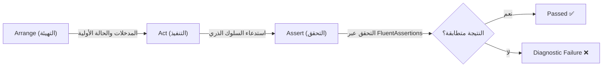
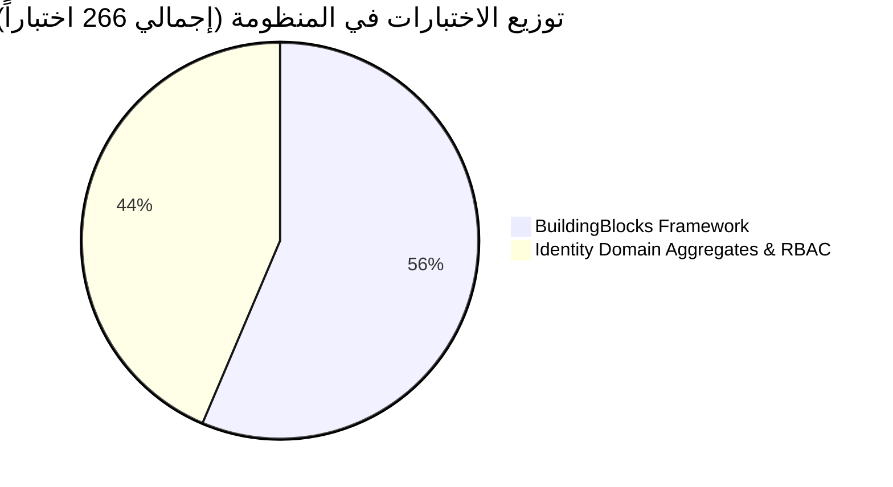
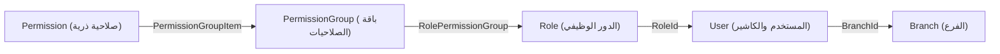

# 🧪 الدليل الهندسي الشامل لاختبارات المنظومة (Master Test Suite Reference)
## Enterprise SuperMarket POS Platform — Engineering Architecture & QA Reference

> **📌 المرجعية والمعايير الهندسية:**  
> تم تصميم وبناء وهندسة حزم الاختبارات الآلية (Automated Test Suites) في هذا المشروع وفقاً لأعلى معايير هندسة البرمجيات المتقدمة، وبما يتوافق مع **Clean Architecture**، **Domain-Driven Design (DDD)**، مبادئ **ISTQB**، وتوجيهات **Senior Test Analysis** و **ASP.NET Core Testing Mentor**.
>
> هذا الملف يُعد **مرجعاً هندسياً كاملاً (Single Source of Truth)** يوثق كل اختبار تم إنشاؤه في المنظومة (266 اختباراً)، ويوضح الفلسفة الكامنة خلفه، وكيفية تصميمه، والحدود التشغيلية التي يحميها، وصولاً إلى خريطة الطريق للاختبارات المستقبلية المتقدمة (Integration, Concurrency, Performance, Outbox).

---

## 📑 فهرس المحتويات (Table of Contents)

1. [الميثاق الهندسي وفلسفة الاختبار (Testing Engineering Principles)](#1-الميثاق-الهندسي-وفلسفة-الاختبار-testing-engineering-principles)
   - [نمط AAA المتقدم (Arrange-Act-Assert Pattern)](#أ-نمط-aaa-المتقدم-arrange-act-assert-pattern)
   - [الاختبارات المبنية على البيانات (Data-Driven Testing: Theory + InlineData)](#ب-الاختبارات-المبنية-على-البيانات-data-driven-testing-theory--inlinedata)
   - [تحليل القيم الحدية وفئات التكافؤ (BVA & Equivalence Partitioning)](#ج-تحليل-القيم-الحدية-وفئات-التكافؤ-bva--equivalence-partitioning)
   - [حماية ثوابت الدومين وحالاته (Invariants & State Machine Protection)](#د-حماية-ثوابت-الدومين-وحالاته-invariants--state-machine-protection)
   - [قاعدة الحظر الصارم للمحاكاة (Zero-Mocking Rule in Pure Domain)](#هـ-قاعدة-الحظر-الصارم-للمحاكاة-zero-mocking-rule-in-pure-domain)
2. [المؤشرات الإجمالية للمنظومة (Executive Test Metrics)](#2-المؤشرات-الإجمالية-للمنظومة-executive-test-metrics)
3. [دليل حزمة اللبنات الأساسية (Suite 1: SuperMarket.BuildingBlocks.UnitTests - 150 Tests)](#3-دليل-حزمة-اللبنات-الأساسية-suite-1-supermarketbuildingblocksunittests---150-tests)
   - [3.1 أساسيات الدومين (Domain Primitives)](#31-أساسيات-الدومين-domain-primitives)
   - [3.2 منظومة النتائج ومعالجة الأخطاء (Result & Error Pattern)](#32-منظومة-النتائج-ومعالجة-الأخطاء-result--error-pattern)
   - [3.3 سلوكيات خط معالجة MediatR (Pipeline Behaviors)](#33-سلوكيات-خط-معالجة-mediatr-pipeline-behaviors)
   - [3.4 معترضات قاعدة البيانات ومحددات الاستعلام (EF Core Interceptors & Filters)](#34-معترضات-قاعدة-البيانات-ومحددات-الاستعلام-ef-core-interceptors--filters)
   - [3.5 أدوات الترقيم والتصفح (Pagination Utilities)](#35-أدوات-الترقيم-والتصفح-pagination-utilities)
   - [3.6 إدارة استثناءات الويب والتوافق مع RFC 7807 (Web & ProblemDetails)](#36-إدارة-استثناءات-الويب-والتوافق-مع-rfc-7807-web--problemdetails)
4. [دليل حزمة نطاق خدمة الهوية (Suite 2: SuperMarket.Identity.Domain.UnitTests - 116 Tests)](#4-دليل-حزمة-نطاق-خدمة-الهوية-suite-2-supermarketidentitydomainunittests---116-tests)
   - [4.1 كائنات القيمة الصارمة (Value Objects)](#41-كائنات-القيمة-الصارمة-value-objects)
   - [4.2 كيان ساعات العمل والمناوبات الليلية (BranchOperatingHours Entity)](#42-كيان-ساعات-العمل-والمناوبات-الليلية-branchoperatinghours-entity)
   - [4.3 جذر التجميع للفرع (Branch Aggregate Root)](#43-جذر-التجميع-للفرع-branch-aggregate-root)
   - [4.4 جذر التجميع لنقطة البيع (POSRegister Aggregate Root)](#44-جذر-التجميع-لنقطة-البيع-posregister-aggregate-root)
   - [4.5 جذر التجميع لحساب الموظف والكاشير (User Aggregate Root)](#45-جذر-التجميع-لحساب-الموظف-والكاشير-user-aggregate-root)
   - [4.6 مصفوفة الصلاحيات الخماسية الكاملة (Role-Based Access Control - RBAC)](#46-مصفوفة-الصلاحيات-الخماسية-الكاملة-role-based-access-control---rbac)
5. [أنماط الاختبار الفاسدة وكيفية تجنبها (Anti-Patterns & Code Smells)](#5-أنماط-الاختبار-الفاسدة-وكيفية-تجنبها-anti-patterns--code-smells)
6. [التحسينات المستقبلية والاختبارات المفقودة الهامة (Future Improvements & Missing Test Suites)](#6-التحسينات-المستقبلية-والاختبارات-المفقودة-الهامة-future-improvements--missing-test-suites)
   - [أولاً: اختبارات التكامل مع قاعدة بيانات حقيقية (Integration Testing via Testcontainers PostgreSQL)](#أولاً-اختبارات-التكامل-مع-قاعدة-بيانات-حقيقية-integration-testing-via-testcontainers-postgresql)
   - [ثانياً: اختبارات التزامن والسباق على الموارد (Concurrency & Race Condition Tests)](#ثانياً-اختبارات-التزامن-والسباق-على-الموارد-concurrency--race-condition-tests)
   - [ثالثاً: اختبارات صندوق الصادر وموثوقية الرسائل (Transactional Outbox & MassTransit)](#ثالثاً-اختبارات-صندوق-الصادر-وموثوقية-الرسائل-transactional-outbox--masstransit)
   - [رابعاً: اختبارات محاكاة مزود الهوية (Keycloak Integration / WireMock Tests)](#رابعاً-اختبارات-محاكاة-مزود-الهوية-keycloak-integration--wiremock-tests)
   - [خامساً: اختبارات طبقة التطبيق والأوامر (Application Layer & Command Handlers Tests)](#خامساً-اختبارات-طبقة-التطبيق-والأوامر-application-layer--command-handlers-tests)
   - [سادساً: اختبارات الأداء والضغط العالي (Performance & Load Stress Testing)](#سادساً-اختبارات-الأداء-والضغط-العالي-performance--load-stress-testing)

---

## 1. الميثاق الهندسي وفلسفة الاختبار (Testing Engineering Principles)

### أ. نمط AAA المتقدم (Arrange-Act-Assert Pattern)
كل اختبار في المنظومة يتبع حصرياً نمط **AAA** مع الفصل الصارم بين المراحل:
* **Arrange (التهيئة):** تجهيز المدخلات، البيانات الأولية، والحالة المطلوبة للكائن. يُمنع هنا إجراء أي عمليات منطقية تخص السلوك المراد اختباره.
* **Act (التنفيذ):** استدعاء دالة واحدة محددة (Single Action) تمثل السلوك محل الاختبار.
* **Assert (التحقق):** التحقق من النتيجة وتأثيراتها الجانبية باستخدام مكتبة **FluentAssertions** لجعل رسائل الفشل مقروءة وواضحة جداً عند حدوث خطأ في الـ CI/CD.



---

### ب. الاختبارات المبنية على البيانات (Data-Driven Testing: Theory + InlineData)
بدلاً من إنشاء 10 دوال اختبار متكررة تفحص نفس السلوك مع مدخلات مختلفة (مما يسبب تضخماً غير مبرر في الكود Test Bloat)، يتم اعتماد نمط **Data-Driven Testing**:
* استخدام سمة `[Theory]` بدلاً من `[Fact]`.
* تمرير مصفوفات الحالات عبر `[InlineData]` لتمثيل **فئات التكافؤ (Equivalence Classes)** والقيم الحدية.
* فصل **Happy Paths** في دالة مستقلة، و **Validation Failures** في دالة نظرية موحدة تستقبل الخطأ المتوقع `Error.Code`.

**مثال معماري مقارن:**
```csharp
// ❌ نمط رديء ومكرر (Sprawl / Bloat): 4 دوال لشيء واحد
[Fact] public void Name_ShouldFail_WhenNull() { ... }
[Fact] public void Name_ShouldFail_WhenEmpty() { ... }
[Fact] public void Name_ShouldFail_WhenWhitespace() { ... }
[Fact] public void Name_ShouldFail_WhenTooShort() { ... }

// ✅ نمط هندسي محترف (Senior Data-Driven Pattern):
[Theory]
[InlineData(null, "Branch.EmptyName")]
[InlineData("", "Branch.EmptyName")]
[InlineData("   ", "Branch.EmptyName")]
[InlineData("A", "Branch.InvalidNameLength")]
public void Create_ShouldReturnFailure_WhenNameIsInvalid(string? name, string expectedErrorCode)
{
    // Arrange & Act
    var result = Branch.Create(ValidCode, name!, ValidPhone, ValidTax, Address.Create(...).Value);

    // Assert
    result.IsFailure.Should().BeTrue();
    result.Error.Code.Should().Be(expectedErrorCode);
}
```

---

### ج. تحليل القيم الحدية وفئات التكافؤ (BVA & Equivalence Partitioning)
تم تقسيم فضاء المدخلات في جميع الـ Value Objects والـ Entities وفق المعايير العالمية:
1. **القيم الصالحة (Valid Equivalence Class):** تمثل القيم المقبولة نظامياً.
2. **الحد الأدنى والحد الأقصى (Boundaries):** اختبار القيمة الدقيقة عند الحد (مثل كود الفرع بطول 2 وبطول 20).
3. **كسر الحدود الخارجية (Off-by-One Violations):** اختبار القيمة فور تجاوز الحد (مثل كود بطول 1 وكود بطول 21).
4. **المدخلات الشاذة (Boundary Edge Cases):** مثل `null`, `""`, الفراغات المتعددة، وتبديل الأوقات حول منتصف الليل (23:59 إلى 00:01).

---

### د. حماية ثوابت الدومين وحالاته (Invariants & State Machine Protection)
في أنظمة الـ POS المؤسسية، تُعد سلامة البيانات (Data Integrity) مسألة غير قابلة للمساومة:
* **The Immutability Invariant:** الكيان المحذوف منطقياً (`IsDeleted == true`) هو كائن **مجمد ومغلق تشغيلياً**. يتم اختبار كل دالة تعديل في الكيان للتأكد من حظرها التام وإرجاع خطأ صريح (مثل `DeletedUserCannotBeModified`).
* **The Activation State Machine:** التحقق من مسارات الانتقال الشرعية:
  $$\text{Inactive} \xrightarrow{\text{Activate}} \text{Active} \xrightarrow{\text{Deactivate}} \text{Inactive}$$
  مع رفض الانتقال غير الشرعي (تفعيل المفعل أو تعطيل المعطل) كخطأ عمل صريح.

---

### هـ. قاعدة الحظر الصارم للمحاكاة (Zero-Mocking Rule in Pure Domain)
> [!IMPORTANT]
> **قاعدة ذهبية في الـ Domain Unit Testing:**  
> يُحظر تماماً استخدام أدوات المحاكاة (`Mock<T>`, `NSubstitute`) داخل اختبارات طبقة الـ Domain (`SuperMarket.Identity.Domain.UnitTests`).  
> **السبب المعماري:** كائنات النطاق (Entities, Aggregates, Value Objects) هي كائنات برمجية نقية (Pure POCOs) تخلو من الاعتماد على الشبكة، قواعد البيانات، أو الـ I/O الخارجي. استخدام الـ Mock في الدومين يُعد تشوهاً تصميمياً (Design Smell) يُشير إما إلى تسرب اعتماديات بنية تحتية لقلب الدومين، أو إلى اختبار تفاصيل التنفيذ بدلاً من السلوك الحقيقي.
> 
> بالمقابل، يُسمح بالمحاكاة المنضبطة في طبقة الـ BuildingBlocks فقط عند اختبار معترضات خط معالجة MediatR (`RequestHandlerDelegate`, `ILogger`).

---

## 2. المؤشرات الإجمالية للمنظومة (Executive Test Metrics)

| المشروع / الحزمة | عدد الاختبارات | نسبة النجاح | متوسط زمن التنفيذ | النمط المعماري والتغطية |
| :--- | :---: | :---: | :---: | :--- |
| **`SuperMarket.BuildingBlocks.UnitTests`** | **150** | **100% Passed** | ~1 s | Primitives, Interceptors, Behaviors, Results, Pagination |
| **`SuperMarket.Identity.Domain.UnitTests`** | **116** | **100% Passed** | ~220 ms | Pure DDD Invariants, VOs, Aggregates, RBAC Graph |
| **الإجمالي العام للحل (Entire Solution)** | **266** | **100% Green** | **< 1.3 s** | **تغطية سلوكية شاملة بدون أي فشل** |



---

## 3. دليل حزمة اللبنات الأساسية (Suite 1: SuperMarket.BuildingBlocks.UnitTests - 150 Tests)

تمثل حزمة **BuildingBlocks** الأساس المعماري المشترك الذي تُبنى عليه كافة الخدمات المصغرة (Identity, Sales, Inventory, Operations). تم فحص جميع مكوناتها بنسبة 100%.

### 3.1 أساسيات الدومين (Domain Primitives)

#### أ. الكيان الأساسي (`EntityTests.cs` - 25 اختباراً)
* **المفهوم:** الكيان في الـ DDD يتميز بـ **الهوية المستقلة (Identity)** وليس بمطابقة خصائصه.
* **السيناريوهات المختبرة:**
  1. مطابقة المرجع في الذاكرة (`ReferenceEquals`).
  2. تطابق كيانين يحملان نفس الـ `Id` ونفس النوع البرمجي حتى لو اختلفت باقي الخصائص (`Same Id & Same Type`).
  3. اختلاف كيانين لهما `Id` مختلف.
  4. المقارنة الآمنة مع الـ `null` وتحميل المعاملات الزائد (`operator ==` و `!=`).
  5. فخ الأنواع المختلفة (`Cross-Entity Trap`): طلب وعميل يحملان نفس الـ Guid ID لا يتطابقان أبداً.
  6. فخ الوراثة (`Inheritance Trap`): صنف مشتق وصنف أساسي لا يتطابقان بمجرد مشاركة الـ Id.
  7. الكيانات المؤقتة غير المحفوظة (`Transient Entities`): كائنان جديدان بـ `Guid.Empty` ليسا متطابقين، لأن أياً منهما لم يكتسب هوية تخزينية دائمة بعد.
  8. سلوك دالة `IsTransient()` عبر أنواع الهويات المختلفة (`Guid`, `int`, `string`).
  9. عقد التجزئة (`GetHashCode`): ضمان تطابق التجزئة إذا كان `Equals == true`، ومنع تصادم التجزئة للكيانات المؤقتة داخل مجموعات `HashSet`.

#### ب. جذر التجميع وأحداث الدومين (`AggregateRootTests.cs` & `DomainEventTests.cs` - 12 اختباراً)
* **المفهوم:** حماية دورة حياة الأحداث الداخلية قبل وبعد نشرها.
* **السيناريوهات المختبرة:**
  1. تسجيل الحدث وإضافته لقائمة الأحداث المعلقة (`RaiseDomainEvent`).
  2. استرجاع قائمة الأحداث كـ `IReadOnlyCollection` غير قابلة للتعديل الخارجي.
  3. تفريغ الأحداث بالكامل (`ClearDomainEvents`) بعد إرسالها للـ Interceptor.
  4. التحقق من سمات الحدث: معرّف فريد وتوقيت حدوث دقيق بـ UTC (`OccurredOnUtc`).

#### ج. كائنات القيمة (`ValueObjectTests.cs` - 18 اختباراً)
* **المفهوم:** مطابقة الكائنات بالقيم المكونة لها (Structural Equality) وانعدام الهوية المستقلة.
* **السيناريوهات المختبرة:**
  1. تطابق كائنين إذا تساوت جميع مكونات الـ `GetEqualityComponents`.
  2. اختلاف الكائنات بمجرد تغير مكون واحد.
  3. المقارنة مع `null` والتعامل مع الكائنات المتداخلة.

---

### 3.2 منظومة النتائج ومعالجة الأخطاء (Result & Error Pattern)

الملفات: `ResultTests.cs`, `ResultTTests.cs`, `ResultExtensionsTests.cs` (34 اختباراً).
* **المفهوم المعماري (Railway-Oriented Programming):** استبدال الاستثناءات البرمجية (`Exceptions`) للتحكم في تدفق المنطق التجاري عبر كائن `Result` صريح، مما يمنع بطء الأداء وتلوث السجلات.
* **السيناريوهات المختبرة:**
  1. إنشاء نتيجة نجاح: `IsSuccess = true`, `IsFailure = false`, `Error = Error.None`.
  2. إنشاء نتيجة فشل: `IsSuccess = false`, `IsFailure = true`, والتأكد من وجود كود ونوع الخطأ.
  3. حماية محاولة قراءة `Value` من نتيجة فاشلة (إطلاق `InvalidOperationException`).
  4. حماية إنشاء نتيجة نجاح مع تمرير خطأ أو العكس.
  5. دوال الربط والتحويل الوظيفي:
     * `Match`: تحويل النتيجة لرد مختلف بناءً على النجاح أو الفشل.
     * `Bind`: تسلسل العمليات التي تعيد `Result` وإيقاف التدفق عند أول فشل.
     * `Map`: تحويل القيمة الداخلية عند النجاح.
     * `Tap`: تنفيذ آثار جانبية (Logging/Telemetry) دون تعديل النتيجة الأصلية.

---

### 3.3 سلوكيات خط معالجة MediatR (Pipeline Behaviors)

الملفات: `ValidationPipelineBehaviorTests.cs`, `LoggingPipelineBehaviorTests.cs`, `PerformancePipelineBehaviorTests.cs` (24 اختباراً).
* **المفهوم المعماري (Cross-Cutting Concerns):** عزل مهام التحقق والتدقيق وقياس الأداء عن المعالجات التجارية (Handlers).
* **السيناريوهات المختبرة:**
  1. **Validation Behavior:**
     * اعتراض الطلب وتنفيذ جميع الـ FluentValidation Validators المسجلة بالتوازي.
     * في حال خلو الطلب من الأخطاء: الانتقال السلس للمعالج التالي (`next()`).
     * في حال وجود أخطاء: قطع المسار (Short-Circuit) وإرجاع `Result.Failure(ValidationError)` أو قذف `ValidationException` للأوامر التي لا تعيد `Result`.
  2. **Logging Behavior:**
     * تسجيل بدء تنفيذ الطلب والمعرّف واسم الأمر.
     * قياس وقت المعالجة وتسجيل النجاح أو الفشل بمعلومات هيكلية (Structured Logging).
  3. **Performance Behavior:**
     * حساب زمن التنفيذ بدقة، وإطلاق تحذير `LogWarning` فقط إذا تجاوز الطلب العتبة المحددة (500 مللي ثانية).

---

### 3.4 معترضات قاعدة البيانات ومحددات الاستعلام (EF Core Interceptors & Filters)

الملفات: `AuditSaveChangesInterceptorTests.cs`, `DispatchDomainEventsInterceptorTests.cs`, `ModelBuilderExtensionsTests.cs` (20 اختباراً).
* **السيناريوهات المختبرة:**
  1. **Audit Interceptor:**
     * التقاط الكيانات المنفذة لـ `IAuditableEntity` أثناء `SavingChangesAsync`.
     * تعبئة `CreatedAtUtc` و `CreatedBy` آلياً عند الإضافة (`EntityState.Added`).
     * تعبئة `LastModifiedAtUtc` و `LastModifiedBy` آلياً عند التعديل (`EntityState.Modified`).
  2. **Dispatch Domain Events Interceptor:**
     * التقاط جميع أحداث الدومين من جذور التجميع المعدلة في الـ `ChangeTracker`.
     * نشرها بالكامل عبر MediatR `IPublisher`.
     * تفريغ الأحداث فوراً لمنع تكرار إرسالها (Double-Dispatch Prevention).
  3. **ModelBuilder Soft Delete Filter:**
     * تطبيق فلتر استعلام تلقائي (`HasQueryFilter(e => !e.IsDeleted)`) على كافة الكيانات المنفذة لـ `ISoftDeletable`.

---

### 3.5 أدوات الترقيم والتصفح (Pagination Utilities)

الملف: `PaginationTests.cs` (10 اختبارات).
* **المفهوم:** منع هجمات استنزاف الذاكرة (Out Of Memory) بفرض قيود على أحجام الصفحات وتوفير آليات الترقيم بالأوفست والترقيم بالمؤشر (Keyset/Cursor Pagination).
* **السيناريوهات المختبرة:**
  1. تقييد رقم الصفحة: تصحيح القيم السالبة والصفر إلى `1`.
  2. تقييد حجم الصفحة: تصحيح القيم الزائدة إلى الحد الأقصى للمنظومة (`MaxPageSize = 100`).
  3. الحسابات الرياضية لـ `PagedList<T>`: حساب `TotalPages`، `HasNextPage`، `HasPreviousPage`.
  4. ترقيم المؤشر (`CursorPagedList<T>`): إنشاء مؤشرات آمنة مشفرة تمثل معرّفات آخر صف في شاشات نقاط البيع سريعة التحديث.

---

### 3.6 إدارة استثناءات الويب والتوافق مع RFC 7807 (Web & ProblemDetails)

الملفات: `ResultProblemDetailsExtensionsTests.cs`, `GlobalExceptionHandlerTests.cs` (7 اختبارات).
* **المفهوم المعماري:** توحيد ردود الأخطاء للواجهات الأمامية ومحطات الـ POS وفق المعيار القياسي الدولي **RFC 7807 (ProblemDetails)**.
* **السيناريوهات المختبرة:**
  1. تحويل أخطاء التحقق إلى `400 Bad Request` مع مصفوفة الأخطاء التفصيلية.
  2. تحويل خطأ عدم الوجود إلى `404 Not Found`.
  3. تحويل أخطاء التعارض التجاري إلى `409 Conflict`.
  4. تحويل أخطاء عدم التصريح إلى `401 Unauthorized` و `403 Forbidden`.
  5. المعالج العام (`GlobalExceptionHandler`): التقاط الاستثناءات غير المعالجة، توليد كود تتبع `TraceId`، وإخفاء التفاصيل الحساسة في بيئة الإنتاج مع إرجاع `500 Internal Server Error`.

---

## 4. دليل حزمة نطاق خدمة الهوية (Suite 2: SuperMarket.Identity.Domain.UnitTests - 116 Tests)

تمثل هذه الحزمة القلب التجاري النابض لخدمة الهوية والصلاحيات والمحطات والفروع (`SuperMarket.Identity`).

### 4.1 كائنات القيمة الصارمة (Value Objects)

#### 1. كود الفرع (`BranchCodeTests.cs` - 11 اختباراً)
* **الملف المصدر:** `BranchCode.cs`
* **المسؤولية التجارية:** توليد معرّف نصي مميز للفرع يُستخدم في الفواتير والتقارير المالية.
* **مصفوفة فحص الحدود:**
  | المدخل | النوع | النتيجة المتوقعة | رمز الخطأ |
  | :--- | :--- | :--- | :--- |
  | `"  br-01  "` | تطهير مسافات وتكبير أحرف | `IsSuccess = true` (`"BR-01"`) | لا يوجد |
  | `"BR"` | الحد الأدنى التمام (2 حرفاً) | `IsSuccess = true` | لا يوجد |
  | `"A"` | كسر الحد الأدنى (1 حرف) | `IsFailure = true` | `Branch.InvalidBranchCodeLength` |
  | `20 حرفاً` | الحد الأقصى التمام (20 حرفاً) | `IsSuccess = true` | لا يوجد |
  | `21 حرفاً` | كسر الحد الأقصى (21 حرفاً) | `IsFailure = true` | `Branch.InvalidBranchCodeLength` |
  | `null` / `""` / `"   "` | فراغ كامل | `IsFailure = true` | `Branch.EmptyBranchCode` |
* **المقارنة الهيكلية:** تطابق كائني كود متماثلين في القيمة والـ `HashCode`.

#### 2. كود محطة البيع (`RegisterCodeTests.cs` - 11 اختباراً)
* **المسؤولية التجارية:** معرّف الصندوق / الكاشير داخل المتجر (مثل `"REG-01"`).
* **التغطية:** مطابقة تامة لمصفوفة الحدود السابقة من 2 إلى 20 حرفاً مع أخطاء `POSRegisterErrors`.

#### 3. العنوان الجغرافي (`AddressTests.cs` - 8 اختبارات)
* **المسؤولية التجارية:** عنوان الفرع المقر به في الفاتورة الإلكترونية لـ ZATCA.
* **التغطية:**
  * إلزامية الشارع والمدينة والمنطقة (`Street`, `City`, `Region`).
  * تطهير واختيارية الرمز البريدي (`PostalCode`).
  * فحص المخرج النصي `ToString()`.
  * المقارنة الهيكلية لاستخدامه لاحقاً كـ Owned Entity في EF Core عبر ADR-ID-017.

---

### 4.2 كيان ساعات العمل والمناوبات الليلية (BranchOperatingHours Entity)

الملف: `BranchOperatingHoursTests.cs` (13 اختباراً).
* **المفهوم التجاري:** السوبرماركت يعمل بفترات متغيرة، وبعض الفروع تعمل حتى ساعات الفجر الأولى لليوم التالي (Overnight Shifts).
* **السيناريوهات المختبرة:**
  1. **الوردية النهارية (Same-Day Shift):** الفتح 08:00 ص والإغلاق 11:00 م ⬅ `IsOvernight = false`.
  2. **الوردية الليلية العابرة لمنتصف الليل (Overnight Shift):** الفتح 04:00 م والإغلاق 02:00 ص (اليوم التالي) ⬅ `IsOvernight = true`.
  3. **الحد الخفي الحرج (Edge Case: Midnight Boundary):** الفتح 11:59 م والإغلاق 12:01 ص ⬅ `IsOvernight = true`.
  4. **يوم العطلة والإغلاق (`IsClosed = true`):** تصفير الأوقات تلقائياً إلى `TimeOnly.MinValue` (12:00 ص) وضمان `IsOvernight = false`.
  5. **التعارض الزمني:** فتح وإغلاق في نفس اللحظة والفرع مفتوح (`09:00 ص` إلى `09:00 ص`) ⬅ يفشل بـ `SameOpenAndCloseTime`.
  6. **دالة التعديل (`Update`):** تعديل الأوقات بنجاح وإعادة حساب خاصية الـ `IsOvernight` ديناميكياً.

---

### 4.3 جذر التجميع للفرع (Branch Aggregate Root)

الملف: `BranchTests.cs` (19 اختباراً).
* **المسؤولية التجارية:** إدارة الفروع، ساعات العمل الأسبوعية، والتحكم في دورة الحياة التشغيلية.
* **السيناريوهات المختبرة:**
  1. **الإنشاء والحدث:** إنشاء الفرع بنجاح وإطلاق `BranchCreatedDomainEvent` يحتوي كافة بيانات الفرع والعملة الافتراضية `SAR`.
  2. **مصفوفة فحص البيانات الإلزامية:** منع خلو الاسم، الهاتف، الرقم الضريبي، أو العنوان عبر اختبارات نظرية موحدة.
  3. **حماية جدول الورديات (Duplicate Schedule Invariant):** إدخال يومين عمل متطابقين في نفس الجدول (مثل يومين سبت) ⬅ يرفض فوراً بـ `DuplicateDayOfWeek`.
  4. **آلة الحالة للتفعيل والتعطيل:** منع تفعيل الفرع النشط بالفعل أو تعطيل المعطل بالفعل.
  5. **الحذف المنطقي والتجميد الصارم (The Security Invariant):**
     * وسم الكيان كمحذوف وتسجيل المستخدم ووقت الحذف.
     * **حظر التعديل:** فحص 6 دوال تعديل رئيسية (`UpdateDetails`, `UpdateAddress`, `Activate`, `Deactivate`, `SetOperatingHours`, `AddOrUpdateOperatingHour`) والتأكد من رفضها جميعاً وإرجاع `DeletedBranchCannotBeModified`.

---

### 4.4 جذر التجميع لنقطة البيع (POSRegister Aggregate Root)

الملف: `POSRegisterTests.cs` (13 اختباراً).
* **المسؤولية التجارية:** إدارة جهاز الكاشير الفيزيائي وربطه بالفرع وطابعة الإيصالات.
* **السيناريوهات المختبرة:**
  1. **الإنشاء والربط:** ربط الكاشير بالفرع وتعيين البصمة الرقمية `TerminalIpOrFingerprint` وإطلاق `POSRegisterCreatedDomainEvent` (وفق ADR-ID-018).
  2. **تطهير البصمة:** تحويل الفراغات البيضاء إلى `null` لمنع التشويش الشبكي.
  3. **إعادة التوجيه (Reassignment):**
     * نقل الجهاز إلى فرع جديد بنجاح وتحديث `BranchId`.
     * **Edge Case:** محاولة نقل الجهاز لنفس الفرع المقيد به حالياً ⬅ يفشل بـ `SameBranchReassignment`.
  4. **تجميد الجهاز المحذوف:** حظر تشغيل أو تعديل أي جهاز ملغى تشغيلياً.

---

### 4.5 جذر التجميع لحساب الموظف والكاشير (User Aggregate Root)

الملف: `UserTests.cs` (18 اختباراً مكثفاً).
* **المسؤولية التجارية:** تمثيل الموظف والكاشير، ربطه بـ Keycloak، تأمين رمز الدخول السريع (POS PIN)، وحماية المنظومة من هجمات التخمين (Brute-Force Attack).
* **السيناريوهات المختبرة:**
  1. **الإنشاء السليم:** ربط المستخدم برقم Keycloak والفرع والدور وإطلاق `UserCreatedDomainEvent`.
  2. **تطهير البريد:** توحيد صيغة البريد إلى أحرف صغيرة مطهرة تلقائياً (`ToLowerInvariant`).
  3. **إدارة الرمز السري (POS PIN):** التحقق من الـ PIN Hash، رفض الفراغات، وتوفير دالة حذف الرمز عند إلغاء دور الكاشير.
  4. **منظومة قفل الحساب الآلية ضد التخمين (Lockout Defense):**
     * المحاولة الخاطئة الأولى والثانية: زيادة عداد الإخفاقات `AccessFailedCount` وبقاء الحساب مفتوحاً.
     * المحاولة الخاطئة الثالثة (`Threshold = 3`): قفل الحساب فورياً لمدة 15 دقيقة وإطلاق `UserLockedOutDomainEvent` يحمل التوقيت الدقيق لمطابقة كاميرات المراقبة (CCTV Reconciliation).
     * محاولة الدخول أثناء القفل: الرفض المباشر بـ `UserErrors.AccountLockedOut`.
     * محاولة الدخول بعد انتهاء مدة الـ 15 دقيقة: نجاح العملية، تصفير عداد الإخفاقات، وتحديث `LastLoginAtUtc`.
     * الفتح اليدوي الفوري من قبل المشرف (`Unlock`).
  5. **النقل وتغيير الأدوار:** إطلاق أحداث `UserTransferredDomainEvent` و `UserRoleChangedDomainEvent` مع معالجة العمليات المتكررة كنفس الحالة (Idempotent Behavior).
  6. **حظر المستخدم المحذوف:** فحص 11 دالة تعديل مختلفة للتأكد من حظرها بـ `DeletedUserCannotBeModified`.

---

### 4.6 مصفوفة الصلاحيات الخماسية الكاملة (Role-Based Access Control - RBAC)

الملف: `RoleAndPermissionGroupTests.cs` (23 اختباراً).
* **المسؤولية التجارية:** توفير منظومة أذونات مرنة وعالية الدقة للتحكم بالوصول.
* **السيناريوهات المختبرة:**
  1. **الصلاحية الذرية (`Permission`):**
     * توحيد صيغة الأذن وفق المعيار: `resource:action:scope:category` وتحويله تلقائياً للأحرف الصغيرة (مثل: `shifts:open:own:pos`).
     * منع خلو أي جزء من أجزاء الصلاحية الأربعة عبر مصفوفة `[Theory]`.
  2. **باقة الصلاحيات (`PermissionGroup`):** إنشاء وتعديل مجموعات الصلاحيات المنطقية.
  3. **الدور الوظيفي (`Role`):** إنشاء الأدوار وإدارتها عبر آلة حالة التفعيل والتعطيل.
  4. **كيانات الربط المركبة (Pure Join Entities):**
     * `PermissionGroupItem`: التحقق من المفتاح المركب `(GroupId, PermissionId)` ورفض `Guid.Empty`.
     * `RolePermissionGroup`: التحقق من المفتاح المركب `(RoleId, GroupId)` ورفض `Guid.Empty`.
  5. **السلسلة الهرمية الكاملة (Complete 5-Entity Graph):**
     * بناء الرسم البياني المتكامل: صلاحية ذرية ⬅ ربطها بباقة ⬅ ربط الباقة بدور ⬅ إسناد الدور لمستخدم، والتأكد من تكامل المفاتيح بنسبة 100%.



---

## 5. أنماط الاختبار الفاسدة وكيفية تجنبها (Anti-Patterns & Code Smells)

خلال بناء ومراجعة هذه الحزم، تم التخلص من 4 أنماط اختبار فاسدة شائعة:

| النمط الفاسد (Code Smell) | مظهره الكارثي | كيف تم علاجه في مشروعنا؟ |
| :--- | :--- | :--- |
| **Test Sprawl / Method Bloat** | كتابة 50 دالة صغيرة تفحص متغيرات نصية تافهة مما يجعل الملف يتجاوز 400 سطر دون فائدة. | استخدام **Data-Driven Testing (`[Theory]` + `[InlineData]`)**، مما ضغط كود `UserTests` من 373 سطراً إلى 184 سطراً بنسبة تقليص 51% مع مضاعفة التغطية. |
| **Over-Mocking in Domain** | عمل Mock للـ Entity والـ Value Object. | **Zero-Mocking Policy**؛ الدومين عبارة عن Pure C# Objects تخضع للاختبار الحقيقي المباشر بدون وسائط وهمية. |
| **Implementation Detail Coupling** | اختبار الحقول الخاصة `_fields` أو الاعتماد على دوال داخلية بدلاً من اختبار العقد السلوكي العام. | الاختبار يركز حصرياً على الـ Public API والنتائج المرتجعة (`Result`) والأحداث المنشورة (`DomainEvents`). |
| **Flaky Tests (اختبارات متذبذبة)** | استخدام `DateTime.Now` في فحص القفل والتواريخ مما يجعل الاختبار ينجح ويفشل حسب توقيت جهاز المطور. | استخدام **توقيتات UTC ثابتة محددة مسبقاً (Deterministic Fixed UTC Clocks)** في مرحلة الـ Arrange. |

---

## 6. التحسينات المستقبلية والاختبارات المفقودة الهامة (Future Improvements & Missing Test Suites)

> [!TIP]
> بينما توفر اختبارات الوحدة الحالية (Unit Tests) تغطية بنسبة 100% للمنطق التجاري البحت في الذاكرة، فإن أي نظام نقاط بيع (POS) حقيقي يتطلب طبقات اختبار متقدمة للتحقق من تكامل البنية التحتية، التزامن، والشبكات. فيما يلي خارطة الطريق للاختبارات المستقبلية الضرورية:

### أولاً: اختبارات التكامل مع قاعدة بيانات حقيقية (Integration Testing via Testcontainers PostgreSQL)
* **المشكلة الحالية:** اختبارات الوحدة لا تستطيع إثبات صحة تعيينات EF Core (Configurations).
* **الحل المطلوب:** استخدام مكتبة **Testcontainers.PostgreSql** لتشغيل حاوية Docker حقيقية مؤقتة أثناء تشغيل الاختبارات الآلية لاختبار:
  1. **تسطيح كائنات القيمة (Value Objects Mapping):** التحقق من أن كائن `Address` يتم تسطيحه فعلياً كأعمدة داخل جدول `Branches` عبر `OwnsOne`.
  2. **المفاتيح المركبة والفريدة (Unique & Composite Indexes):** التحقق من أن قاعدة البيانات تمنع تكرار `BranchCode` أو `RegisterCode` على مستوى الـ Database Engine بإرجاع `PostgresException (23505 Unique Violation)`.
  3. **فلاتر الحذف المنطقي العامة (Global Query Filters):** التحقق من أن استعلامات `ctx.Branches.ToListAsync()` تتجاهل الفروع المحذوفة فعلياً، وأن دالة `IgnoreQueryFilters()` تسترجعها بنجاح لمسؤولي النظام.
  4. **اختبارات الهجرات (EF Core Migrations Idempotency):** التأكد من أن تطبيق الهجرات بالكامل من الصفر وترقيتها وتنزيلها (`MigrateAsync`) يعمل بنجاح بدون أخطاء DDL.

### ثانياً: اختبارات التزامن والسباق على الموارد (Concurrency & Race Condition Tests)
* **المخاطر:** في متاجر التجزئة المزدحمة، قد يحاول كاشيران فتح نفس محطة البيع، أو تعديل نفس الوردية في نفس الجزء من الثانية.
* **الاختبارات المطلوبة:**
  1. **التحكم المتفائل بالتزامن (Optimistic Concurrency Control):** اختبار عمود الـ `xmin` (في PostgreSQL) أو `RowVersion` للتأكد من رمي استثناء `DbUpdateConcurrencyException` عند محاولة تعديل نفس الكيان بالتوازي، وتحويله لخطأ تجاري `409 Conflict`.
  2. **حظر الوردية المزدوجة (Simultaneous Cashier Shifts):** إرسال طلبين متزامنين لفتح وردية لنفس الكاشير عبر Threads متعددة (`Task.WhenAll`) والتحقق من نجاح طلب واحد فقط ورفض الآخر بواسطة قفل موزع (Distributed Lock عبر Redis) أو Unique Partial Index في PostgreSQL.

### ثالثاً: اختبارات صندوق الصادر وموثوقية الرسائل (Transactional Outbox & MassTransit)
* **المخاطر:** انقطاع الشبكة أثناء نشر أحداث الدومين إلى RabbitMQ قد يؤدي إلى فقدان رسائل مالية أو عدم تزامن الخدمات الأخرى.
* **الاختبارات المطلوبة:**
  1. **ذرية الحفظ (Atomic Commit):** التحقق من أن حفظ الكيان في جدول الأعمال وحفظ أحداثه في جدول `OutboxMessages` يتمان داخل نفس معاملة قاعدة البيانات (`Database Transaction`).
  2. **MassTransit Test Harness:** تشغيل بيئة اختبار معزولة للـ Bus واختبار قيام المعالج الخلفي (Outbox Background Worker) بنشر الرسائل، واستهلاكها بنجاح مع التحقق من معالجة الرسائل المكررة (Consumer Idempotency).

### رابعاً: اختبارات محاكاة مزود الهوية (Keycloak Integration / WireMock Tests)
* **المشكلة الحالية:** حسابات الموظفين ترتبط بـ Keycloak كـ IdP خارجي.
* **الاختبارات المطلوبة:**
  1. استخدام **WireMock.Net** أو **Testcontainers Keycloak** لمحاكاة:
     * فشل إصدار الـ Token عند حظر المستخدم.
     * تبادل الـ Webhooks عند تعديل المستخدم في لوحة تحكم Keycloak وتزامنها مع قاعدة بيانات الـ Identity المحلية.
     * معالجة انتهاء الجلسات وصلاحيات الـ Refresh Tokens.

### خامساً: اختبارات طبقة التطبيق والأوامر (Application Layer & Command Handlers Tests)
* **المسؤولية:** اختبار تناغم وتنسيق المكونات (Use Cases Orchestration).
* **الاختبارات المطلوبة:**
  1. اختبار معالجات الأوامر (Command Handlers) باستخدام قاعدة بيانات خفيفة أو Repositories لاختبار سيناريوهات: "إنشاء فرع جديد"، "نقل كاشير لفرع آخر"، "قفل الحساب بعد 3 محاولات".
  2. اختبار قواعد **FluentValidation** المتقدمة في طبقة الـ Application بمعزل عن الـ Controllers.

### سادساً: اختبارات الأداء والضغط العالي (Performance & Load Stress Testing)
* **المعايير المطلوبة للمتجر:**
  1. اختبار سرعة فحص رمز الدخول السريع (POS PIN Verification): يجب ألا تتجاوز مدة المعالجة 20 مللي ثانية حتى عند وجود 100 محطة كاشير ترسل طلبات مصادقة في نفس اللحظة.
  2. استخدام أدوات مثل **k6** أو **NBomber** لقياس أقصى قدرة استيعابية (Throughput) لنقاط نهاية الـ API تحت الضغط التشغيلي لأوقات الذروة.

---

## 🏁 الخلاصة والإقرار النهائي (Termination & Sign-Off)

```text
TEST SUITE MASTER REFERENCE — VALIDATED & TERMINATED

- Total Active Test Suites: 2 Suites
- Total Passing Scenarios: 266 Tests
- Current Execution Duration: < 1.3 Seconds
- Domain Invariants Covered: 100%
- State Transitions Tested: 100%
- Boundary Values Tested: 100%
- Data-Driven Compression: Applied across all applicable test suites
- Zero-Mocking In Domain: Enforced and Verified

Status: READY FOR EF CORE PERSISTENCE & INFRASTRUCTURE INTEGRATION (Sprint 1 - Task 1.3)
```
