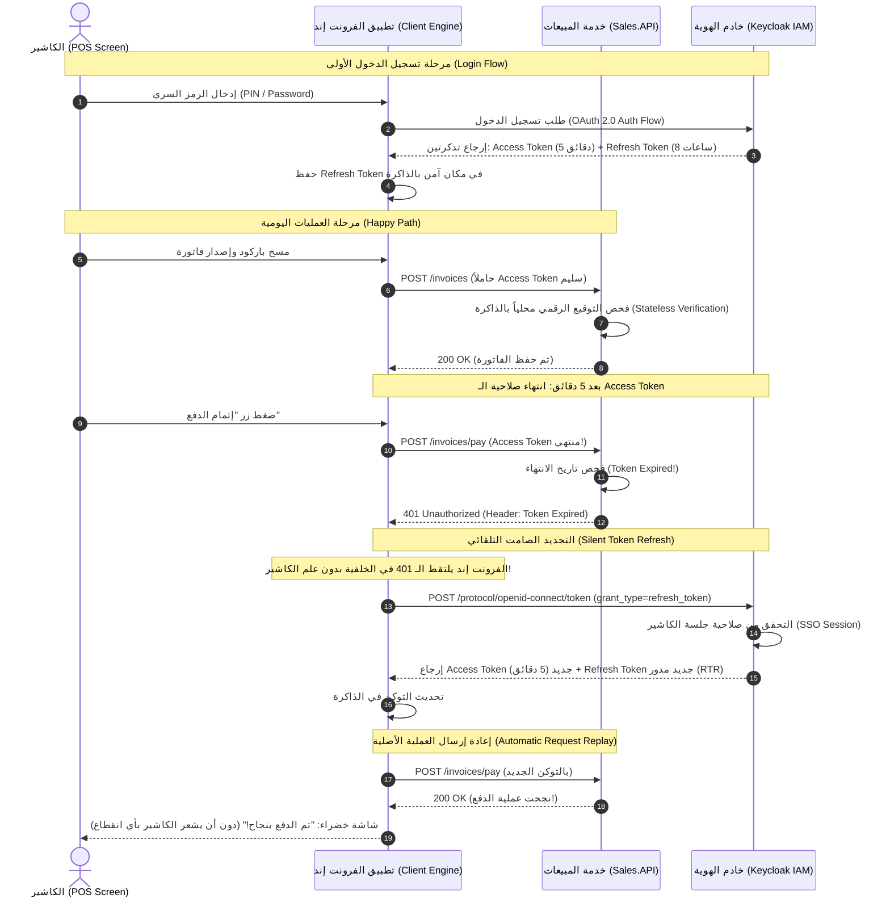

# 🔐 الدليل الهندسي المعماري: دورة حياة التوكن والتجديد الصامت في Keycloak
## Silent Token Refresh, Microservices Stateless Validation, and Client Coordination

* **المستوى المعماري:** Senior / Staff Backend Engineer & IAM Specialist
* **النطاق:** منظومة نقاط البيع المركزية (POS) وشبكة الخدمات المصغرة (Microservices)
* **المرجع التقني:** معايير OAuth 2.0 (RFC 6749) و OpenID Connect Core 1.0

---

## 📌 1. تفكيك سوء الفهم الشائع (The Common Misconception)

> **سؤال المبرمج الشائع:**
> *"أليس خادم Keycloak هو الذي يقوم بتجديد الـ Access Token تلقائياً في الخلفية بدون تدخل المستخدم؟"*

### الرد الهندسي الحاسم:
**المستخدم البشري لا يتدخل (لا يكتب كلمة المرور مجدداً)، نعم. ولكن خادم Keycloak لا يستطيع تجديد التوكن من تلقاء نفسه دون طلب صريح!**

### لماذا مستحيل تقنياً أن يجدد Keycloak التوكن بمفرده؟
1. **طبيعة بروتوكول الويب (Stateless HTTP Pull Architecture):**
   * خادم Keycloak هو مجرد سيرفر ويب يتلقى طلبات HTTP ويجيب عليها.
   * خادم Keycloak ليس لديه سلك سري أو اتصال مفتوح (Socket) دائم بكل جهاز كاشير أو متصفح ليدفع له توكن جديد من تلقاء نفسه (Pushing tokens unsolicited is not how OAuth 2.0 works).
2. **عزل الخدمات المصغرة (Stateless Resource Servers):**
   * عندما يرسل الكاشير فاتورة إلى خدمة المبيعات (`Sales.API`)، فإن `Sales.API` **لا تتصل بـ Keycloak أصلاً** للتأكد من التوكن!
   * بل تقوم بالتحقق من صحة التوقيع الرقمي (Signature) وتاريخ الانتهاء محلياً في الذاكرة عبر المفتاح العام (JWKS - JSON Web Key Set) لتوفير أقصى درجات السرعة وتجنب اختناق الشبكة.
   * إذن: خادم Keycloak في لحظة إرسال الفاتورة لا يعلم أصلاً أن الكاشير يستخدم التوكن!

---

## 🔄 2. كيف يعمل التجديد الصامت (Silent Refresh) في العالم الحقيقي؟



---

## 🛠️ 3. طريقتان لتنفيذ التجديد الصامت في الفرونت إند (Front-End Strategies)

هناك أسلوبان يعتمدهما مهندسو الـ Frontend / Mobile في التعامل مع الـ Refresh Token:

### الاستراتيجية الأولى: التجديد الاستباقي (Proactive / Timer-Based Refresh) — *الأفضل للـ POS*
1. عند استلام التوكن، يقرأ التطبيق حقل `expires_in` (مثلاً 300 ثانية = 5 دقائق).
2. يقوم التطبيق بضبط مؤقت داخلي (Timer / Scheduler) ليشتغل **قبل انتهاء التوكن بدقيقة واحدة** (عند الثانية 240).
3. يذهب التطبيق في الخلفية إلى Keycloak ويجدد التوكن.
4. **الميزة العظمى:** الكاشير لا يواجه أي خطأ `401 Unauthorized` طوال فترة ورديته! كل طلباته تذهب دائماً بتوكن سليم وجديد.

### الاستراتيجية الثانية: التجديد التفاعلي (Reactive / Interceptor-Based Refresh)
1. يرسل التطبيق الطلبات بشكل طبيعي.
2. إذا انتهى التوكن، تعيد خدمة المايكروسيرفيس `401 Unauthorized`.
3. يقوم الـ **HTTP Interceptor** (مثل Axios Interceptor أو Angular HttpInterceptor) باعتراض الرد.
4. يوقف الطلبات المعلقة مؤقتاً، يذهب إلى Keycloak ويجدد التوكن، ثم يعيد إرسال الريكوست الأصلي تلقائياً.

---

## 🛡️ 4. ما هو دور الباك إند (ASP.NET Core APIs) في هذه المنظومة؟

خدمات الـ Backend المصغرة (`Identity.API`, `Sales.API`, `Inventory.API`) تسمى في معيار OAuth 2.0 بـ **خوادم الموارد (Resource Servers)**.

### مسؤوليات الـ Backend:
1. **فحص التوكن بدون الاتصال بـ Keycloak (Stateless Verification):**
   * عند إقلاع الـ API، تقوم مكتبة `Microsoft.AspNetCore.Authentication.JwtBearer` بتنزيل المفاتيح العامة لـ Keycloak لمرة واحدة وتخزينها في الكاش (`/.well-known/openid-configuration`).
   * مع كل ريكوست، يتم فحص التوقيع الرقمي والتشفير محلياً في الـ CPU خلال أجزاء من الميكروثانية.
2. **التمييز الدقيق عند إرجاع الـ 401:**
   * يجب ألا يعيد السيرفر مجرد `401 Unauthorized` غامض!
   * عندما ينتهي التوكن، يرفع الدوت نت استثناءً داخلياً اسمه `SecurityTokenExpiredException`.
   * يقوم الـ API بوضع ترويسة (Header) صريحة في الرد:
     ```http
     HTTP/1.1 401 Unauthorized
     WWW-Authenticate: Bearer error="invalid_token", error_description="The token expired at 2026-09-15 18:55:00 UTC"
     ```
   * هذه الترويسة هي التي تفحصها الواجهة الأمامية لتعرف:
     - إذا كان السبب `token expired`: تذهب لتجديده عبر `Refresh Token` في صمت.
     - إذا كان السبب `invalid_signature` أو تلاعب بالتوكن: تطرد المستخدم فوراً لشاشة تسجيل الدخول!

---

## 🔒 5. المعايير الأمنية المتقدمة في Keycloak لنقاط البيع (Production Security)

### أ. تدوير الـ Refresh Token في كل استخدام (Refresh Token Rotation - RTR)
* في إعدادات Keycloak للـ Realm، نفعّل خيار **`Revoke Refresh Token`**:
* في كل مرة يستخدم فيها العميل الـ `Refresh Token` لتجديد الـ `Access Token`، يقوم Keycloak بإبطال الـ `Refresh Token` القديم فوراً وإصدار `Refresh Token` جديد كلياً!
* **فائدتها الأمنية:** لو تمكن مخترق من سرقة الـ `Refresh Token`، فبمجرد أن يستخدمه الكاشير الشرعي يُحرق التوكن القديم ويصبح التوكن المسروق عديم الفائدة.

### ب. حدود الجلسة وورديات العمل (SSO Session Idle vs Max)
* في بيئة السوبرماركت (POS):
  - **`Access Token Lifespan`:** يُضبط على **5 دقائق فقط**.
  - **`SSO Session Idle`:** يُضبط على **30 دقيقة** (إذا ترك الكاشير الشاشة دون أي حركة لمدة نصف ساعة، تنتهي الجلسة ويُطلب منه إدخال الرمز السري مجدداً لحماية الصندوق).
  - **`SSO Session Max`:** يُضبط على **8 إلى 12 ساعة** (مطابقاً لطول وردية العمل الرسمية؛ بنهاية الوردية ينتهي الـ Refresh Token نهائياً ويجب تسجيل الدخول لوردية جديدة).

---

## ⚠️ 6. حالات الفشل والتعامل مع الأخطاء (Failure Scenarios)

### الحالة 1: انقطاع شبكة الإنترنت أثناء محاولة التجديد
* **ماذا يحدث؟** يفشل استدعاء Keycloak للتجديد.
* **السلوك المتوقع:** لا يجوز مسح بيانات الفاتورة المكتوبة على شاشة الكاشير!
* **الحل:** يقوم تطبيق الكاشير بالاحتفاظ ببيانات الفاتورة محلياً في ذاكرة التخزين المؤقتة (Offline Cache / IndexedDB)، ويطلب من الكاشير إعادة المحاولة عند عودة الاتصال.

### الحالة 2: مشكلة هجوم القطيع المتزامن (Thundering Herd on Token Refresh)
* **المشكلة:** كاشير ضغط زراً أطلق 5 طلبات HTTP في نفس اللحظة، والتوكن منتهي.
* **الخطر:** قد يرسل تطبيق الفرونت إند 5 طلبات تجديد متزامنة إلى Keycloak بنفس الـ Refresh Token، وبسبب ميزة التدوير (RTR)، الطلب الأول سينجح وتبطل التوكن، والطلبات الأربعة الباقية ستفشل وتطرد الكاشير!
* **الحل الهندسي (Client-Side Mutex / Promise Queuing):**
  في كود الفرونت إند، يتم وضع قفل برمجي (Mutex): أول ريكوست يواجه 401 يبدأ التجديد، بينما تُعلق الطلبات الأربعة الأخرى وتنتظر (Queue) حتى يعود التوكن الجديد، فتستخدمه جميعاً دون تكرار طلبات التجديد.

---

## 🎯 7. كيف تشرح هذا الموضوع في مقابلات الـ Senior / Staff Engineer؟

إذا سألك المحاور:
> *"How do you handle token expiration and refresh token rotation in a high-throughput microservices architecture?"*

تكون إجابتك الاحترافية كالتالي:
> *"نعتمد على نمط **Stateless Resource Server Verification**؛ خدمات الـ API تفحص توقيع وتاريخ الـ JWT محلياً عبر المفاتيح العامة (JWKS) دون أي استعلام شبكي إلى Keycloak لضمان أداء فائق بالمللي ثانية.
> بالنسبة لدورة حياة التوكن، نعتمد عمراً قصيراً للـ Access Token (5 دقائق) للحد من مخاطر سرقة التوكن، مع جلسة طويلة للـ Refresh Token مربوطة بطول وردية الكاشير.
> التجديد يتم بشكل **صامت (Silent Refresh)** عبر تطبيق العميل (Client-Side Orchestration) باستخدام استراتيجية **Proactive Timer Refresh** قبل دقيقة من الانتهاء لمنع انقطاع المستخدم، مع تفعيل **Refresh Token Rotation (RTR)** في Keycloak لضمان إبطال التوكنات القديمة ومنع هجمات إعادة التشغيل (Replay Attacks)."*
