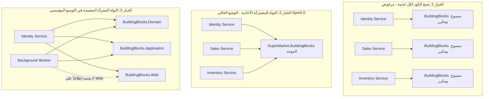

# 🏛️ نمط النواة المشتركة المجزأة ومبدأ أقل الصلاحيات المعمارية
## Granular Shared Kernel & Architectural Least Privilege Pattern

* **الحالة:** مقترح معماري استراتيجي ومسار تحسين مستقبلي (Strategic Architecture Roadmap)
* **المجال والمشروع:** `SuperMarket.BuildingBlocks` / خدمات المنظومة الموزعة (Microservices)
* **التصنيف:** Architectural Patterns / Microservices Dependency Management / InfoSec Boundaries
* **المؤلفون:** Senior Backend Engineer & Architecture Reviewer

---

## 1. Context & The Core Dilemma (سياق المعضلة الهندسية)

أثناء تصميم وبناء مكتبة الأساس المشتركة (`SuperMarket.BuildingBlocks`) التي تعتمد عليها كافة خدمات السوبرماركت (`Identity`, `Sales`, `Inventory`, `Operations`)، برز تساؤل معماري جوهري حول المخاطر ونطاق التأثير (Blast Radius):

> *"هل من الصحيح معمارياً استخدام مكتبة `BuildingBlocks` واحدة مركزية لكل الخدمات؟ ألا يجعل ذلك النظام مهدداً بالكامل لو وُجدت ثغرة أو خطأ في هذه المكتبة؟ أليس الأفضل عزل كل خدمة بمكتبة أساسية خاصة بها لتقليل الخطر وتطبيق مبدأ أقل الصلاحيات (Least Privilege)؟"*

---

## 2. المصطلحات والأنماط المعمارية الأكاديمية (Architectural Taxonomy)

الفكرة التي طرحها المهندس في هذا التساؤل تمس جوهر نظريات هندسة البرمجيات المعاصرة، وتندرج تحت ثلاثة مصطلحات معمارية قياسية عالمياً:

### أ. نمط النواة المشتركة المجزأة (Granular Shared Kernel Pattern)
* في مراجع **Domain-Driven Design (DDD)** للمؤلفين *Eric Evans* و *Vaughn Vernon*:
  - عندما تشترك عدة سياقات محددة (Bounded Contexts) في كود موحد، يُسمى هذا الكود **Shared Kernel**.
  - إذا جُمع كل الكود في مشروع واحد ضخم، يُسمى **Monolithic Shared Kernel** (وهو ما قد يسبب تضخماً في التبعيات).
  - عندما يُفكك هذا الكود المشترك إلى حزم رشيقة مستقلة بحسب طبيعة المسؤولية التقنية، يُسمى **Granular / Fine-Grained Shared Kernel**.

### ب. مبدأ فصل الواجهات على مستوى الحزم (Architectural Interface Segregation Principle - ISP)
* مبدأ **ISP** من مبادئ SOLID ينص على: *"لا ينبغي إجبار العميل على الاعتماد على واجهات لا يستخدمها"*.
* عند تطبيق هذا المبدأ على مستوى هيكلية المشاريع (Assembly Level)، يُسمى **Package Segregation** أو **Component Segregation**:
  - إذا كانت خدمة معينة مجرد معالج خلفي (Background Consumer) لا يستقبل طلبات ويب، فلماذا نُجبرها على الاعتماد على مكتبة تحتوي على `GlobalExceptionHandler` و `ProblemDetails` الخاصة بـ HTTP؟

### ج. مبدأ أقل الصلاحيات المعماري (Architectural Least Privilege / Zero-Trust Dependencies)
* في أمن المعمارية (Application Security Architecture):
  - لا تمنح أي خدمة وصولاً برمجياً إلى مكتبات أو قدرات لا تحتاجها في دورة حياتها؛ للحد من مساحة الهجوم السطحية (Attack Surface Reduction).

---

## 3. مقارنة البدائل والخيارات المعمارية (Options Evaluation)



### المقارنة التحليلية الشاملة:

| وجه المقارنة | الخيار 1: مكتبة خاصة لكل خدمة (Per-Service Copy) | الخيار 2: مكتبة مركزية موحدة (Monolithic BuildingBlocks) | الخيار 3: مكتبات مجزأة بالقدرات (Granular BuildingBlocks) |
| :--- | :--- | :--- | :--- |
| **مبدأ DRY** | **انتهاك كارثي:** تكرار مئات الأسطر في كل خدمة. | **محقق 100%:** الكود مكتوب ومحدث في مكان واحد. | **محقق 100%:** الكود مركزي ومقسم بحسب الطبقات. |
| **اتساق الـ APIs (Contract Drift)** | **معدوم:** كل خدمة ستعدل شكل الأخطاء والترقيم بمفردها. | **متسق تماماً:** كل الخدمات تعيد نفس نمط RFC 7807. | **متسق تماماً:** معيار موحد لكل المنظومة. |
| **مبدأ أقل الصلاحيات (Least Privilege)** | غير محقق هندسياً (فوضى برمجية). | منخفض: الخدمات الخلفية ترى كود الويب و EF Core. | **فائق:** كل خدمة تستدعي فقط الطبقة التي تحتاجها. |
| **عزل نطاق التأثير (Blast Radius)** | معزول لكن الثغرات تتكرر في الخفاء. | تعديل خاطئ يؤثر على بناء كل الخدمات فوراً. | معزول مع إمكانية تحويلها إلى Versioned NuGet Packages. |
| **تكلفة الصيانة والتعقيد المبدئي** | كابوس صيانة في بيئات الإنتاج الحقيقية. | **منخفضة جداً ومثالية للبدء (Sprint 0).** | ممتازة للأنظمة الضخمة (Enterprise Roadmap). |

---

## 4. الفخ الأمني: لماذا تفشل السجلات (Logs) في كشف الثغرات المشتتة؟

طُرحت فرضية أثناء النقاش مفادها:
> *"لو قمنا بنسخ وتشتيت كود الأساسيات في كل خدمة، فإن الـ Logs ستكشف لنا أي خدمة تظهر فيها مشكلة أمنية (مثل قراءة التوكن)، وسنقوم بحلها في تلك الخدمة دون نسيان غيرها."*

### الحقيقة الصادمة في أمن التطبيقات (Application Security Reality):
1. **الثغرات الأمنية لا تولد استثناءات (Vulnerabilities Do Not Throw Exceptions):**
   - إذا وقع استثناء مثل `NullReferenceException` أو `DbException`، فإن الـ Logger سيسجله باللون الأحمر ويراه المهندس فوراً.
   - لكن إذا كانت هناك ثغرة في التحقق من الـ Token (مثل التلاعب بـ `BranchId` عبر هجمات BOLA / IDOR):
     - المخترق يرسل التوكن المتلاعب به.
     - الكود يقبله بصمت، ويستعلم فواتير الفرع المستهدف، ويرجع البيانات كاملة.
     - الـ Logger سيسجل: `INFO: HTTP GET /api/sales 200 OK in 25ms`.
     - **الـ Logs خضراء والعملية تبدو ناجحة 100%، بينما الشركة تُسرق بالكامل في صمت تام!**
2. **كارثة الاعتماد على الذاكرة البشرية (The Human Memory Trap):**
   - عندما يكتشف مدقق أمني (Penetration Tester) هذه الثغرة، لو كان كود التحقق منسوخاً في 5 خدمات مختلفة:
     - المطور سيصلحها في `Identity` و `Sales`.
     - لكنه قد ينسى خدمة `Operations` أو `Inventory`؛ لأن الـ Logs لم تُظهر أي خطأ سابق فيها.
     - تظل هذه الخدمة **باباً خلفياً مفتوحاً (Backdoor) لشهور أو سنوات**.
3. **مبدأ المصدر الوحيد للحقيقة (Single Source of Truth - SSOT):**
   - في كود الحماية والأساسيات التشغيلية، يجب أن يُكتب الكود في **مكان واحد مركزي**. إصلاحه في ذلك المكان يُغلق الثغرة في كامل المنظومة الموزعة دون ترك أي احتمالية للخطأ البشري.

---

## 5. المعمارية المستهدفة وخارطة الطريق (Target Evolution Architecture)

### متى ننتقل من `SuperMarket.BuildingBlocks` الموحد إلى النمط المجزأ؟
* **المرحلة الحالية (MVP & Sprint 0-2):**
  الاعتماد على مشروع `SuperMarket.BuildingBlocks` الواحد هو الخيار الأفضل والأبسط والأسرع تنفيذاً (تطبيقاً لمبدأي KISS و YAGNI)، خاصة مع وجود حل واحد مجمع (`SuperMarketPOS.slnx`).
* **مرحلة التوسع المؤسسي (Enterprise Multi-Repo / Independent Teams):**
  عندما يعمل على المنظومة أكثر من فريق مستقل، ويتم فصل المستودعات إلى Multi-Repo، نقوم بتفكيك `BuildingBlocks` إلى حزم داخلية خاصة:

```
packages/
├── SuperMarket.BuildingBlocks.Domain.nupkg
│   └── (Entities, ValueObjects, DomainEvents)
├── SuperMarket.BuildingBlocks.Application.nupkg
│   └── (CQRS Interfaces, Pipeline Behaviors, Result Pattern, Pagination DTOs)
├── SuperMarket.BuildingBlocks.Infrastructure.Persistence.nupkg
│   └── (EF Core Interceptors, Soft Delete, Auditing Filters)
└── SuperMarket.BuildingBlocks.Web.nupkg
    └── (ProblemDetails, GlobalExceptionHandler, ResultExtensions)
```

---

## 6. أسئلة المقابلات الوظيفية والدفاع المعماري (Interview Defense)

### ❓ سؤال المقابلة:
> *"هل تفضل Monolithic Shared Kernel أم Granular Shared Libraries في معمارية المايكروسيرفس؟ ولماذا لا تنسخ كود الأساسيات في كل خدمة لعزل المخاطر؟"*

### 💡 الإجابة الاحترافية:
> "نسخ كود البنية التحتية داخل كل خدمة يُعد Anti-Pattern كارثياً؛ لأنه ينتهك مبدأ DRY ويؤدي إلى انحراف معايير الـ API (Contract Drift) وثغرات أمنية صامتة مستحيل تتبعها عبر الـ Logs. 
> 
> في المقابل، نعتمد على **Granular Shared Kernel**؛ حيث نفصل الأساسيات التقنية البحتة (Agnostic Primitives) عن منطق البزنس، ونقسمها معمارياً بحسب مبدأ **Package-level Interface Segregation** (مثل فصل طبقة الويب عن طبقة البيانات). 
> 
> وفي بيئات العمل الكبرى، يتم نشر هذه المكتبات كـ **Internal Versioned NuGet Packages**، مما يمنح كل خدمة استقلالية الترقية (Versioning Isolation) دون المساس بمركزية الكود وجودته."
