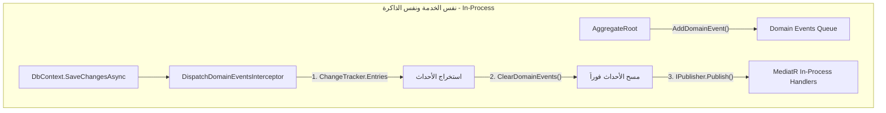

# 🧱 مكتبة النواة المشتركة (SuperMarket.BuildingBlocks)

> **المسؤولية المعمارية:** تمثل هذه المكتبة حجر الأساس (Foundational Building Block) المشترك لجميع الخدمات المصغرة (Microservices) في منظومة نقاط البيع (POS). تحتوي على المفاهيم المعمارية المجردة لقواعد الـ Domain-Driven Design (DDD) ونمط النتائج الصريحة (Result Pattern) لمعالجة أخطاء البزنس بأعلى أداء وموثوقية، دون أي اعتماد على أطر عمل خارجية للبنية التحتية (Zero External Infrastructure Dependencies).

---

## 📑 فهرس المكونات (Architecture Index)

1. [مفاهيم الـ Domain المعتمدة (DDD Primitives)](#1-مفاهيم-الـ-domain-المعتمدة-ddd-primitives)
2. [نمط النتائج ومعالجة الأخطاء (Result & Error Pattern)](#2-نمط-النتائج-ومعالجة-الأخطاء-result--error-pattern)
3. [التشريح البرمجي والتفصيلي للكود (Deep-Dive Technical Breakdown)](#3-التشريح-البرمجي-والتفصيلي-للكود-deep-dive-technical-breakdown)
4. [البرمجة الوظيفية وسلسلة العمليات (Railway-Oriented Programming: Match, Ensure, Map, Bind)](#4-البرمجة-الوظيفية-وسلسلة-العمليات-railway-oriented-programming)
5. [المقارنة المعمارية وهل هذا التصميم Over-Engineering؟](#5-المقارنة-المعمارية-وهل-هذا-التصميم-over-engineering)
6. [المعايير القياسية والتوثيق الرسمي لشركة Microsoft](#6-المعايير-القياسية-والتوثيق-الرسمي-لشركة-microsoft)
7. [أتمتة البنية التحتية في EF Core (AuditSaveChangesInterceptor & SoftDeleteFilter)](#7-أتمتة-البنية-التحتية-في-ef-core)
8. [البنية التحتية لـ CQRS وسلوكيات الـ Pipeline (MediatR Pipeline Behaviors)](#8-البنية-التحتية-لـ-cqrs-وسلوكيات-الـ-pipeline)
9. [ناشر أحداث الدومين التلقائي (DispatchDomainEventsInterceptor)](#9-ناشر-أحداث-الدومين-التلقائي-dispatchdomaineventsinterceptor)
10. [مصفوفة القرارات المعمارية، المقايضات، والتكلفة والحل (Architectural Decisions & Trade-Offs)](#10-مصفوفة-القرارات-المعمارية-المقايضات-والتكلفة-والحل)

---

## 1. مفاهيم الـ Domain المعتمدة (DDD Primitives)

| المكون | نوع الكيان | المسؤولية المعمارية |
| :--- | :--- | :--- |
| `Entity<TId>` | `abstract class` | كيان يمتلك هوية فريدة (`Id`) تميزه عبر الزمن، وتتحقق المساواة فيه بالهوية وليس بالبيانات الحقلية (`IEquatable`). |
| `AggregateRoot<TId>` | `abstract class` | جذر التجميع المسؤول عن حماية شروط وقواعد العمل (Invariants)، ويحتوي على سجل آمن للأحداث الداخلية (`IDomainEvent`). |
| `ValueObject` | `abstract class` | كائن عديم الهوية، تعتمد مساواته كلياً على القيم المحتواة بداخله (Structural Equality). |
| `DomainEvent` | `abstract record` | حدث يمثل تغييراً في حالة النظام وقع في الماضي داخل نطاق البزنس ومسجل بتوقيت UTC غير قابل للتلاعب. |
| `IAuditableEntity` | `interface` | تضمن تتبع تاريخ الإنشاء والتعديل (`CreatedAt`, `CreatedBy`, `UpdatedAt`, `UpdatedBy`) بتوقيت UTC. |
| `ISoftDeletable` | `interface` | تضمن الحذف المنطقي (`IsDeleted`, `DeletedAt`, `DeletedBy`) للحفاظ على السجلات المالية والتاريخية من الحذف الفعلي. |
| `IActivatable` | `interface` | تضمن التحكم بالحالة التشغيلية (`IsActive`) كإيقاف وردية أو تعليق فرع دون حذفه. |

### 💡 لماذا واجهات القدرات المتخصصة (Capability Interfaces) بدلاً من `BaseEntity` موحد؟
1. **تجنب كلاس الإله (God Object Anti-Pattern):** فرض حقول الحذف والتدقيق في كلاس وراثة موحد يجبر كيانات لا تحتاج للحذف (مثل `AuditLog` غير القابل للحذف أو التعديل، أو `BranchOperatingHours`) على حمل حقول زائدة لا معنى لها، مما ينتهك مبدأ فصل الواجهات (Interface Segregation Principle).
2. **تفضيل التركيب على الوراثة (Composition over Inheritance):** C# لا تدعم الوراثة المتعددة؛ استخدام الواجهات يعطي كل كيان حرية اختيار قدراته بدقة: كيان يحتاج تدقيق فقط، كيان يحتاج تدقيق وحذف منطقي، وآخر لا يحتاج أياً منهما.
3. **الأتمتة عبر الـ Interceptors:** في طبقة الـ Infrastructure، يفحص `AuditSaveChangesInterceptor` الكيانات عبر هذه الواجهات تلقائياً ويملأ بياناتها دون تدخل يدوي.

---

## 2. نمط النتائج ومعالجة الأخطاء (Result & Error Pattern)

### الفلسفة الأساسية:
في معمارية الأنظمة المؤسسية (Enterprise POS):
* **الاستثناءات (Exceptions) تُحجز فقط للكوارث غير المتوقعة:** مثل انقطاع الاتصال بقاعدة البيانات، انهيار الشبكة، أو نفاد الذاكرة (`OutOfMemoryException`). هذه الأخطاء تُترك لتصل إلى `IExceptionHandler` المركزي لترد بـ `500 Internal Server Error`.
* **أخطاء البزنس (Domain Failures) متوقعة ومحسوبة:** مثل "الباركود غير موجود"، "الرصيد غير كافٍ"، "الوردية مغلقة بالفعل". هذه ليست كوارث تقنية، بل مسارات عمل بديلة (Alternative Business Flows) يجب التعبير عنها بنوع إرجاع صريح (`Result` أو `Result<T>`).

---

## 3. التشريح البرمجي والتفصيلي للكود (Deep-Dive Technical Breakdown)

### أ. لماذا حددنا أرقام صريحة في الـ Enum (`Failure = 0`, `Validation = 1`, ...)؟

```csharp
public enum ErrorType
{
    Failure = 0,
    Validation = 1,
    NotFound = 2,
    Conflict = 3,
    Unauthorized = 4,
    Forbidden = 5
}
```

#### لماذا هذا القرار؟
1. **استقرار التخزين والـ Serialization عبر الشبكة (Binary & Database Stability):**
   عند تخزين نوع الخطأ في قاعدة البيانات، أو إرساله عبر Redis / RabbitMQ / HTTP Headers، يتم تحويل الـ Enum في كثير من الأحيان إلى قيمته الرقمية (`int`). لو قمنا بإضافة عنصر جديد مثل `Critical` في أول الـ Enum بدون أرقام صريحة، سيحدث ما يُعرف بـ **Silent Index Shift Bug**؛ حيث يصبح `Failure = 1` و `Validation = 2` وتتحول كل البيانات التاريخية المخزنة إلى بيانات فاسدة وخاطئة!
2. **قاعدة الـ Zero-Initialization في C#:**
   القيمة الافتراضية لأي struct في .NET هي الصفر (`default(ErrorType) == 0`). تحديد `Failure = 0` يضمن أنه إذا تم إنشاء متغير بالخطأ دون إسناد صريح، فإنه يشير تلقائياً إلى الفشل العام ولا يشير إلى تصنيف غير مقصود.
3. **توضيح سوء الفهم الشائع:**
   في كود C# النظيف، لا أحد يكتب رقم `2` أو `5`؛ المبرمج يكتب دوماً `ErrorType.NotFound` بشكل قوي النوعية (Strongly Typed). الأرقام الصريحة وُضعت لحماية النظام من التبدلات الخفية للـ Compiler أثناء الصيانة والتحديثات المستقبلية.

---

### ب. تشريح `sealed record Error`:

```csharp
public sealed record Error
{
    public static readonly Error None = new(string.Empty, string.Empty, ErrorType.Failure);
    public static readonly Error NullValue = new("General.NullValue", "The specified result value is null.", ErrorType.Failure);

    public string Code { get; }
    public string Description { get; }
    public ErrorType Type { get; }

    private Error(string code, string description, ErrorType type)
    {
        Code = code;
        Description = description;
        Type = type;
    }

    public static Error Failure(string code, string description) =>
        new(code, description, ErrorType.Failure);
}
```

1. **لماذا `sealed`؟**
   * تمنع أي كود آخر من الوراثة من الكلاس (`class CustomError : Error`).
   * **الأمان وحماية الـ Invariants:** كائن الخطأ هو مجرد ناقل بيانات (Data Carrier)، ولا نرغب في أن يضيف أحد وراثة تغير قواعد المقارنة أو تضيف دوالاً تخل بمبدأ المسؤولية الواحدة.
   * **أداء الـ JIT Compiler (Devirtualization):** عندما يعلم المترجم أن الكلاس `sealed`، يقوم بتحسين استدعاء الدوال وتجاوز جدول الـ Virtual Method Table، مما يرفع سرعة التنفيذ.
2. **هل `Error` كلمة محجوزة في C#؟**
   * **لا.** `Error` ليست كلمة محجوزة في لغة C# إطلاقاً (عكس كلمات مثل `class`, `record`, `switch`, `return`). هي مجرد اسم كلاس عادي ومعبّر للغاية.
3. **ما معنى `public static readonly Error None`؟**
   * الصيغة العامة لتعريف أي متغير أو حقل في C# هي: `[مستوى الوصول] [نوع البيانات] [اسم المتغير] = [القيمة]`.
   * كلمة `Error` قبل كلمة `None` تمثل **نوع البيانات (Data Type)**، تماماً كما تكتب `int count` أو `string name`.
   * `static readonly`: هذا كائن ثابت وفريد في الذاكرة (Singleton Pattern).
   * **الـ Null Object Pattern:** بدلاً من إرجاع `null` عندما تنجح العملية مما يسبب `NullReferenceException` القاتل، نرجع كائناً صريحاً يمثل "عدم وجود خطأ" وهو `Error.None`.
4. **ماذا عن `get;` بدون `set;`؟ كيف تسند القيم؟**
   * هذا هو مبدأ **عدم القابلية للتعديل (Immutability)**.
   * يتم إسناد الخصائص حصراً داخل **الـ Constructor الخاص (Private Constructor)** عند لحظة الإنشاء.
   * بعد الإنشاء، يستحيل على أي كود تعديل `error.Code = "..."`. هذا يحقق أعلى درجات الأمان التزامني (Thread Safety) في أنظمة الـ POS متعددة الخيوط.
5. **لماذا كلمة `new(...)` بدون ذكر اسم الكلاس في `Failure`؟**
   * هذه ميزة حديثة في C# تسمى **Target-Typed New Expression** (قُدمت في C# 9).
   * طالما أن نوع الإرجاع للدالة معروف صراحة (`public static Error Failure(...)`)، فإن كتابة `new Error(...)` تُعد تكراراً غير مفيد. كتابة `new(...)` تجعل الكود أنظف وأسهل للقراءة.

---

### ج. تشريح صلب `Result` والـ Invariants:

```csharp
public class Result
{
    protected internal Result(bool isSuccess, Error error)
    {
        if (isSuccess && error != Error.None)
            throw new InvalidOperationException("A successful result cannot be initialized with an error.");

        if (!isSuccess && error == Error.None)
            throw new InvalidOperationException("A failure result must be initialized with a non-empty error.");

        IsSuccess = isSuccess;
        Error = error;
    }

    public bool IsSuccess { get; }
    public bool IsFailure => !IsSuccess;
    public Error Error { get; }
}
```

1. **ماذا تعني `protected internal`؟**
   * `internal`: الكونسلتراكتور مرئي فقط داخل نفس المشروع (`SuperMarket.BuildingBlocks`). لا يمكن لأي كود خارجي (مثل الـ Controllers أو الخدمات) استدعاؤه بـ `new Result(...)`.
   * `protected`: يسمح للكلاسات الوارثة (مثل `Result<TValue>`) بالوصول إليه واستدعاء `base(isSuccess, error)`.
   * هذا يفرض على جميع المطورين إنشاء النتائج حصراً عبر الـ Factory Methods الآمنة (`Result.Success()`, `Result.Failure(...)`).
2. **لماذا الشروط القاسية في الـ Constructor (Invariants)؟**
   * يطبق هذا الكود مبدأ معماري شهير يُعرف بـ **Making Invalid States Unrepresentable**.
   * **الشرط الأول:** هل يعقل أن تكون العملية ناجحة (`isSuccess == true`) ولكن معها كود خطأ `NotFound`؟ هذا تناقض منطقي مفسد للبيانات!
   * **الشرط الثاني:** هل يعقل أن تفشل العملية (`isSuccess == false`) ولكن الخطأ فارغ `Error.None`؟ كيف سيعرف المستخدم أو الـ Frontend سبب الفشل؟
   * وجود هذه الـ Guards يضمن استحالة خروج كائن `Result` مشوه أو متناقض إلى النظام.
3. **من أين أتت `IsSuccess`؟**
   * هي الخاصية المكتوبة أسفل الكونستركتور مباشرة: `public bool IsSuccess { get; }`.

---

## 4. البرمجة الوظيفية وسلسلة العمليات (Railway-Oriented Programming)

ملف `ResultExtensions.cs` يطبق نمطاً معمارياً ثورياً مقتبساً من البرمجة الوظيفية يُسمى **مسار السكة الحديدية (Railway-Oriented Programming - ROP)**:

```
                  ┌──────────────┐      ┌──────────────┐
  المدخلات ───►───│ الخطوة الأولى│───►──│ الخطوة الثانية│───►─── نتيجة ناجحة (Green Track)
                  └──────┬───────┘      └──────┬───────┘
                         │ فشل                 │ فشل
                         ▼                     ▼
                  ═════════════════════════════════════════════► نتيجة فاشلة (Red Track)
```

### أ. فك رموز الدالة `Match`:

```csharp
public static TOutput Match<TOutput>(
    this Result result,
    Func<TOutput> onSuccess,
    Func<Error, TOutput> onFailure)
{
    ArgumentNullException.ThrowIfNull(onSuccess);
    ArgumentNullException.ThrowIfNull(onFailure);

    return result.IsSuccess ? onSuccess() : onFailure(result.Error);
}
```

* **`this Result result`:** Extension Method في C#، تجعل الدالة تبدو وكأنها عضو داخلي في كائن الـ `result`.
* **`Func<TOutput> onSuccess`:** مؤشر لدالة (Delegate) لا تأخذ أي معاملات وتُرجع نوع `TOutput`. يتم تنفيذها فقط عند النجاح.
* **`Func<Error, TOutput> onFailure`:** مؤشر لدالة تأخذ الخطأ `Error` كمدخل وتُرجع `TOutput`. يتم تنفيذها فقط عند الفشل.
* **الفائدة المعمارية للـ `Match`:** تجبر المطور في طبقة الـ API Controller على كتابة سيناريو النجاح وسيناريو الفشل معاً، وتمنعه تماماً من نسيان معالجة الخطأ:

```csharp
// مثال تطبيقي في Minimal API أو Controller:
return result.Match(
    onSuccess: () => Results.Ok(new { message = "تم إغلاق الوردية بنجاح" }),
    onFailure: error => Results.BadRequest(error)
);
```

### ب. دوال `Ensure`, `Map`, `Bind`:
* **`Ensure` (التحقق الشرطي):** تتحقق من شرط منطقي إضافي على القيمة داخل الـ `Result`؛ إذا تحقق الشرط يستمر بنجاح، وإذا خالفه يتحول فوراً إلى فشل بالخطأ المحدد.
* **`Map` (التحويل):** تحول نوع البيانات داخل النتيجة الناجحة من شكل إلى آخر (مثلاً من Entity إلى DTO) دون الحاجة لفحص `if (result.IsSuccess)`.
* **`Bind` (الربط التسلسلي):** تربط عملية بعملية أخرى تُرجع هي أيضاً `Result`، فإذا فشلت الأولى تتوقف السلسلة فوراً وتتجاوز الثانية (Short-Circuiting).

---

## 5. المقارنة المعمارية وهل هذا التصميم Over-Engineering؟

| وجه المقارنة | رمي الاستثناءات (Throw Exceptions) | نمط النتائج (Result Pattern) |
| :--- | :--- | :--- |
| **طبيعة المعالجة** | خفية وغير واضحة في الـ Method Signature (GOTO خفي). | صريحة في الـ Type System (`Result<T>` تُعلن عن كل شيء). |
| **استهلاك الذاكرة والمعالج** | مكلف جداً (توليد Stack Trace وحجز كائنات ضخمة في الرام). | فائق السرعة وخفيف (مجرد struct/record خفيف في الرام). |
| **تجربة المطور (DX)** | المطور ينسى كتابة `try-catch` فينهار السيرفر. | المطور مجبور عبر الـ Compiler على معالجة النجاح والفشل. |
| **توافقية الـ HTTP APIs** | تحتاج Middleware معقد لترجمة كل نوع Exception. | تتحول بأسطر بسيطة إلى معيار ProblemDetails (RFC 7807). |

> **الحكم المعماري (Architectural Verdict):**
> ليس Over-Engineering إطلاقاً في نظام نقاط بيع وسوبرماركت مركزي يعالج آلاف عمليات مسح الباركود وفتح الورديات في الثانية الواحدة. بل هو المعيار الصناعي المعتمد عالمياً لمنع تسرب الأخطاء وحماية أداء السيرفرات من الانهيار تحت الضغط.

---

## 6. المعايير القياسية والتوثيق الرسمي لشركة Microsoft

1. **دليل معمارية المايكروسيرفس الرسمي من Microsoft (.NET Microservices Architecture eBook):**
   * الفصل: *"Design domain errors and result patterns"*
   * الرابط الرسمي: [Microsoft Architecture: Microservice Domain Events & Error Handling](https://learn.microsoft.com/en-us/dotnet/architecture/microservices/microservice-ddd-cqrs-patterns/domain-events-design-implementation)
2. **معيار معالجة الأخطاء في ASP.NET Core وإخراج RFC 7807 Problem Details:**
   * الرابط الرسمي: [Microsoft Learn: Handle errors in ASP.NET Core APIs](https://learn.microsoft.com/en-us/aspnet/core/fundamentals/error-handling)
3. **توجيهات تصميم مكتبات .NET الرسمية (Framework Design Guidelines - Exceptions vs Return Values):**
   * تنص الوثيقة صراحة على: *"Do not use exceptions for normal flow of control. Use the Tester-Doer Pattern or Try Pattern / Result Object"*.
   * الرابط الرسمي: [Microsoft Learn: Exceptions and Performance](https://learn.microsoft.com/en-us/dotnet/standard/design-guidelines/exceptions-and-performance)

---

## 7. أتمتة البنية التحتية في EF Core

### أ. مراقب الحفظ التلقائي (`AuditSaveChangesInterceptor`):
يقوم الـ Interceptor باعتراض كل عمليات `SaveChanges` و `SaveChangesAsync` في EF Core وتطبيق القواعد التالية آلياً:
1. **أتمتة التتبع الزمني (`IAuditableEntity`):**
   * عند إضافة سجل جديد (`Added`): يملأ `CreatedAt` بتوقيت UTC الحالي ويملأ `CreatedBy` بمعرف المستخدم الحالي من Keycloak (أو `"SYSTEM"` للعمليات الخلفية).
   * عند تعديل سجل قائم (`Modified`): يملأ `UpdatedAt` و `UpdatedBy`، **ويعطل تعديل `CreatedAt` و `CreatedBy` برمجياً لمنع التلاعب بالسجلات التاريخية**.
2. **أتمتة الحذف المنطقي (`ISoftDeletable`):**
   * عند إرسال أمر حذف (`Deleted`): يلغي أمر الـ SQL DELETE ويحوله إلى `Modified`، ويضع `IsDeleted = true` مع توثيق وقت ومعرف من قام بالحذف.

### ب. فلترة الاستعلامات العامة (`ModelBuilderExtensions.ApplySoftDeleteQueryFilter`):
تتيح دالة التوسعة `ApplySoftDeleteQueryFilter()` ضبط فلتر استعلام عام (Global Query Filter) تلقائياً لكل الجداول التي تطبق `ISoftDeletable`، مما يستبعد السجلات المحذوفة منطقياً من جميع استعلامات الـ `SELECT` دون الحاجة لكتابة `WHERE is_deleted = false` في كل استعلام.
وعند رغبة الإدارة في فحص السجلات المحذوفة، يتم تجاوز الفلتر ببساطة عبر:
```csharp
var allBranches = await context.Branches.IgnoreQueryFilters().ToListAsync();
```

---

## 8. البنية التحتية لـ CQRS وسلوكيات الـ Pipeline

> **الفلسفة:** عزل الاهتمامات المشتركة (Cross-Cutting Concerns) عن معالجات البزنس (Handlers)، وتطبيق نمط المزيّن (Decorator Pattern) عبر MediatR Pipelines وفق المعيار المعماري الموصى به من Microsoft.

### أ. واجهات الـ CQRS الصريحة (`ICommand` و `IQuery`):
بدلاً من استخدام `IRequest<T>` مباشرة من MediatR، قمنا بتعريف واجهات دلالية صريحة تجبر جميع العمليات على إرجاع نمط النتائج:
* **`ICommand` و `ICommand<TResponse>`:** تمثل عمليات تغيير الحالة (State Mutations). ترجع دائماً `Result` أو `Result<TResponse>`.
* **`IQuery<TResponse>`:** تمثل عمليات القراءة والاستعلام (Read-Only Queries). ترجع دائماً `Result<TResponse>`.
* **الفائدة الهندسية:** منع المطور من إرجاع كائنات مجردة أو رمي استثناءات، وضمان تجانس معالجة الردود عبر كل الخدمات.

### ب. بوابة التفتيش والتحقق (`ValidationPipelineBehavior`):
* **الوظيفة:** اعتراض الطلبات وفحصها تلقائياً عبر مكتبة `FluentValidation` قبل أن تصل إلى الـ Handler أو تلمس قاعدة البيانات.
* **التنفيذ المتوازي:** تشغيل جميع الفاحصين المسجلين في نفس الوقت عبر `Task.WhenAll`.
* **الإيقاف المبكر (Short-Circuiting):** في حال وجود أي مخالفة، يتم إيقاف المسار فوراً وتحويل الأخطاء إلى `Result.Failure` مع كود `General.Validation`، دون تشغيل الـ Handler.
* **مصنع النتائج للأنواع العامة (`Result Factory`):** استخدام الانعكاس المحسّن للتعامل مع الـ Generic Types (`Result` vs `Result<T>`).

### ج. تتبع دورة حياة الطلب (`LoggingPipelineBehavior`):
* **الوظيفة:** تسجيل الأحداث الهيكلية (Structured Logging) لدورة حياة الطلب اعتماداً على `ILogger` كمجرّد رسمي من مايكروسوفت دون الارتباط المباشر بـ Serilog.
* **التصنيف الذكي:**
  - تسجيل `Information` عند دخول الطلب بنجاح.
  - تسجيل `Warning` عند حدوث خطأ بزنس متوقع (`IsFailure == true`) مع ذكر كود الخطأ وتفاصيله، دون اعتبار ذلك انهياراً للنظام.
  - تسجيل `Error` كامل مع الـ StackTrace عند حدوث استثناء غير متوقع (`Unhandled Exception`) قبل إعادة رميه.

### د. مراقبة الأداء والمقاييس (`PerformancePipelineBehavior`):
* **الوظيفة:** قياس زمن الاستجابة باستخدام `Stopwatch` ومراقبة اتفاقية مستوى الخدمة (SLA).
* **OpenTelemetry Native Metrics:** استخدام `System.Diagnostics.Metrics.Meter` لتسجيل:
  - `pos_requests_total`: عداد إجمالي لعدد الطلبات المعالجة.
  - `pos_request_duration_ms`: رسم بياني (Histogram) يوزع أزمنة الاستجابة بالمللي ثانية لتغذية Prometheus و Grafana.
* **حماية `finally`:** استخدام كتلة `finally` لضمان حساب الوقت وتحديث العدادات بدقة حتى لو انهار الطلب باستثناء مفاجئ.

### هـ. نمط الخيارات والإعدادات الديناميكية (`PerformanceSettings` & Options Pattern):
* **كلاس الإعدادات:** `PerformanceSettings` بخصائص قوية النوعية (`SlowRequestThresholdMs`) وقيمة افتراضية آمنة (`500ms`).
* **الربط مع `appsettings.json`:** عبر مفتاح القسم الثابت `PerformanceSettings.SectionName = "Performance"`.
* **البرمجة الدفاعية (Defensive Fallback):** حقن اختياري `IOptions<PerformanceSettings>? options = null`؛ بحيث يعمل الكود بسلاسة بقيمة 500ms دون الحاجة لكتابة إعدادات في الـ Unit Tests أو الخدمات البسيطة.

---

## 9. ناشر أحداث الدومين التلقائي (DispatchDomainEventsInterceptor)



### أ. الفرق الجوهري: Domain Event vs Integration Event
| وجه المقارنة | Domain Event (أحداث النطاق الداخلي) | Integration Event (أحداث التكامل الخارجي) |
| :--- | :--- | :--- |
| **النطاق والحدود** | داخل نفس الميكروسيرفيس ونفس الذاكرة (In-Process). | عبر الشبكة بين ميكروسيرفسز مختلفة (Out-of-Process). |
| **وسيلة النقل** | محلياً عبر MediatR `IPublisher`. | عبر Message Broker (مثل RabbitMQ أو Kafka). |
| **المعاملة المالية والبيانات** | تحدث ضمن نفس الـ Database Transaction أو تتبعها محلياً. | تتبع مبدأ الاتساق النهائي (Eventual Consistency) عبر Outbox Pattern. |
| **الهدف** | إخطار مكونات فرعية داخل نفس النطاق (تحديث إحصاءات، سجلات داخلية). | إشعار الخدمات المستقلة (مثل إشعار المخازن بخصم الكمية بعد الفاتورة). |

### ب. لماذا الاعتماد على SaveChangesInterceptor؟
1. **منع النسيان البشري:** عدم إجبار المطور على استدعاء `_mediator.Publish` يدوياً في كل Handler.
2. **عزل النطاق (Pure Domain):** تظل الكيانات خالية من أي حقن لخدمات مثل MediatR، ومسؤوليتها تقتصر على تسجيل ما حدث في `_domainEvents`.
3. **حماية التكرار (Idempotency Protection):** يتم مسح الأحداث `root.ClearDomainEvents()` **قبل** عملية النشر الفعلية لضمان عدم تكرار النشر إذا قام الـ Handler الفرعي باستدعاء `SaveChangesAsync` آخر داخل نفس السلسلة.

---

## 10. مصفوفة القرارات المعمارية، المقايضات، والتكلفة والحل

| القرار المعماري | لماذا اتخذناه؟ (Why) | ما البديل المرفوض؟ (Why Not) | المقايضات والتكلفة (Trade-Off / Cost) | الحل المعتمد والمطبق (The Solution) |
| :--- | :--- | :--- | :--- | :--- |
| **فصل Logging عن Performance** | تطبيق مبدأ SRP وتوفير المرونة لتعطيل أو اختبار مقاييس الأداء بمعزل عن سجلات النص. | دمج الـ Logging والـ Metrics وساعة التوقيف في كلاس واحد كبير. | زيادة استدعاء دالة واحدة في الـ Pipeline (Microsecond Overhead). | كلاس `LoggingPipelineBehavior` للـ Lifecycle فقط، وكلاس `PerformancePipelineBehavior` للمقاييس والساعة. |
| **Options Pattern للـ Threshold** | إتاحة ضبط عتبة البطء (مثل 300ms للـ POS و 2000ms للتقارير) بدون إعادة بناء الكود. | تثبيت القيمة كـ `const int = 500` في الكود المصدري. | تعقيد بسيط لحقن `IOptions<T>` مع ملفات الإعدادات. | كلاس `PerformanceSettings` بقيمة افتراضية دفاعية آمنة وحقن `IOptions<PerformanceSettings>?`. |
| **EF Core Interceptor للأحداث** | أتمتة إطلاق الـ Domain Events مركزياً عند الحفظ. | النشر اليدوي داخل كل Command Handler أو حقن الوسيط داخل الـ Entity. | صعوبة التحكم في ترتيب المعالجة إذا تطلبت الأحداث سلوكاً مخصصاً جداً. | `DispatchDomainEventsInterceptor` يعترض `SavingChangesAsync` ويمسح الأحداث وينشرها بـ `IPublisher`. |
| **Native System.Diagnostics.Metrics** | الاعتماد على معيار مايكروسوفت الأصيل المتوافق مع OpenTelemetry دون حزم خارجية. | تضمين حزم OpenTelemetry الكاملة داخل مكتبة BuildingBlocks. | يتطلب تهيئة OpenTelemetry Exporters في مشروع الـ Web API لاحقاً. | تعريف `Meter` و `Counter` و `Histogram` مدمجة بأقل استهلاك للذاكرة وبدون تبعيات طرف ثالث. |

---

## 11. استراتيجية الترقيم المزدوجة (Dual-Strategy Pagination)

> **المبدأ المعماري:** لا يوجد حل واحد يناسب الجميع (No One-Size-Fits-All) في أنظمة نقاط البيع الضخمة؛ شاشات الإدارة تحتاج ترقيماً مختلفاً تماماً عن شاشات الكاشير وعمليات الفواتير اللحظية.

### أ. النمط الكلاسيكي: `PagedList<T>` و `PaginationParams` (Offset-Based)
* **مجال الاستخدام:** شاشات الإدارة، إعدادات النظام، وقوائم الفروع والموظفين المحدودة (< 100,000 سجل).
* **المخرجات:** يوفر `PageNumber` و `PageSize` و `TotalCount` و `TotalPages` ويتيح للمستخدم القفز لأي صفحة مباشرة مع أزرار (السابق / التالي).
* **المصنع المدمج:** دالة `PagedList<T>.CreateAsync(query, pageNumber, pageSize)` تنفذ `CountAsync` و `Skip/Take/ToListAsync` بكفاءة عبر EF Core.

### ب. النمط اللحظي فائق السرعة: `CursorPagedList<T, TCursor>` و `CursorParams<TCursor>` (Keyset / Cursor-Based)
* **مجال الاستخدام:** جداول المبيعات المليونية، حركات الكاشير، سجلات التدقيق (Audit Logs)، والتمرير اللانهائي (Infinite Scroll).
* **المخرجات:** أداء ثابت $O(1)$ يعتمد على الفهرس (Index Seek)؛ **يتجنب استعلام `COUNT(*)` المنهك تماماً**، ولا يتأثر بانزلاق البيانات (Zero Data Drift).

### جـ. الحماية الدفاعية والتهيئة الديناميكية (`PaginationSettings`):
* **كلاس الإعدادات:** `PaginationSettings` يوفر قابلية الضبط لـ `DefaultPageSize` و `MaxPageSize` عبر `appsettings.json` تحت قسم `"Pagination"`.
* **الحماية ثنائية الطبقات (Defense-in-Depth):**
  - **طبقة Fallback الدفاعية:** ثوابت أمان صلبة داخل الـ Records (`FallbackMaxPageSize = 100`, `FallbackDefaultPageSize = 10 / 20`) تضمن حماية السيرفر من هجمات الـ DoS حتى لو تعطلت ملفات الإعدادات.
  - **طبقة الربط المرن:** تتيح حقن `IOptions<PaginationSettings>` داخل الـ Validation Pipelines أو الـ Handlers للتحقق الديناميكي دون تلويث الـ DTOs بتبعيات الـ DI.


