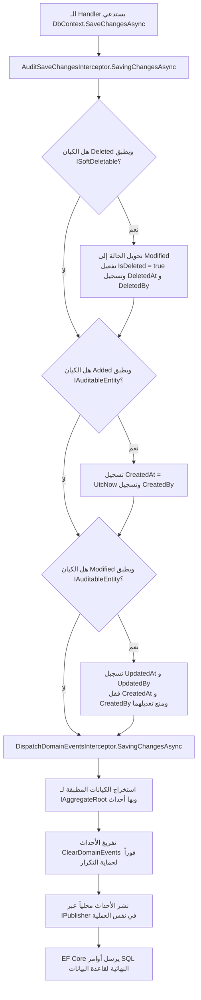

# التشريح المعماري لمكتبة SuperMarket.BuildingBlocks

> **الحالة الراهنة (Current State):** `Implemented`  
> **النمط المعماري (Architectural Pattern):** النواة المشتركة (Shared Kernel) وفق مبادئ Clean Architecture و Domain-Driven Design (DDD).

---

## 1. الهيكلية العامة وموقع المكتبة في المنظومة

تعمل `SuperMarket.BuildingBlocks` كـ **Shared Kernel** مركزي في معمارية المايكروسيرفس والـ Modular Monolith لمنظومة نقاط البيع (POS). تحتوي المكتبة على اللبنات التجريدية المشتركة التي تعتمد عليها كافة الـ Bounded Contexts في النظام (`Identity`, `Inventory`, `Sales`, `Operations`).

تنقسم المكتبة داخلياً إلى أربعة مكونات معزولة تطبق اتجاه التبعيات في Clean Architecture:

```text
┌─────────────────────────────────────────────────────────────┐
│                       Infrastructure                        │
│   • AuditSaveChangesInterceptor                             │
│   • DispatchDomainEventsInterceptor                         │
│   • GlobalExceptionHandler                                  │
│   • ModelBuilderExtensions                                  │
└──────────────┬───────────────────────────────┬──────────────┘
               │                               │
               ▼                               ▼
┌───────────────────────────────┐     ┌────────────────────────┐
│          Application          │     │        Results         │
│   • CQRS Command/Query Markers│     │   • Result / Result<T> │
│   • Pipeline Behaviors        │────►│   • Error / ErrorType  │
│   • Pagination Primitives     │     │   • ROP Extensions     │
└──────────────┬────────────────┘     │   • ProblemDetails     │
               │                      └────────────────────────┘
               ▼                               ▲
┌───────────────────────────────┐              │
│            Domain             │──────────────┘
│   • Entity<TId>               │
│   • AggregateRoot<TId>        │
│   • ValueObject, DomainEvent  │
│   • Capability Interfaces     │
└───────────────────────────────┘
```

---

## 2. تحليل الطبقات والمسؤوليات البرمجية

### 2.1 طبقة الـ Domain (`SuperMarket.BuildingBlocks.Domain`)
* **المسؤولية المعمارية:** تعريف اللبنات الأساسية للـ Domain-Driven Design وعقود قدرات الكيانات.
* **تعتمد على (Depends On):** بيئة .NET الأساسية ومجردات `MediatR` (تحديداً واجهة `INotification` لأحداث الدومين). خالية بنسبة 100% من أي تبعية لقواعد البيانات أو الـ ORMs أو إطار عمل الويب.
* **مستخدمة من قِبل (Used By):** طبقات `Application` و `Infrastructure` في BuildingBlocks، بالإضافة إلى طبقات الـ Domain في كافة الخدمات التابعة (`SuperMarket.Sales.Domain`, إلخ).
* **يجب أن تحتوي على:**
  - كلاسات الكيانات الأساسية (`Entity<TId>`) التي تفرض المساواة بالهوية والتحقق من حالة الكيان العابر (Transient State).
  - كلاس جذر التجميع (`AggregateRoot<TId>`) المسؤول عن احتواء طابور الأحداث الداخلية (`IDomainEvent`).
  - كلاس كائن القيمة (`ValueObject`) الذي يفرض المساواة المكوناتية الهيكلية (Structural Equality).
  - سجل حدث الدومين (`DomainEvent`) الذي يضمن وجود `EventId` وتوقيت UTC ثابت لا يتغير.
  - واجهات القدرات المتخصصة: `IAuditableEntity`، `ISoftDeletable`، `IActivatable`، `IAggregateRoot`.
* **يجب ألا تحتوي إطلاقاً على:**
  - أكواد وصول لقواعد البيانات، أو جمل SQL، أو كلاسات خاصة بـ EF Core.
  - قواعد بزنس خاصة بخدمات معينة (مثل حسابات ضريبة القيمة المضافة أو إدارة ورديات الكاشير).
  - أي استدعاءات خارجية عبر الشبكة أو كلاسات HTTP.

### 2.2 طبقة النتائج ومعالجة الأخطاء (`SuperMarket.BuildingBlocks.Results`)
* **المسؤولية المعمارية:** توفير نموذج نوعي خفيف ومحكم للتعبير عن مخرجات العمليات دون اللجوء لرمي الاستثناءات في مسار التحكم (Control Flow).
* **تعتمد على:** بيئة .NET بالإضافة لمجردات HTTP من ASP.NET Core لدعم معيار RFC 7807 ProblemDetails.
* **مستخدمة من قِبل:** جميع الطبقات عبر كافة الخدمات.
* **يجب أن تحتوي على:**
  - كلاسات `Result` و `Result<TValue>` مع حماية شروط الحالة في الـ Constructor.
  - سجل `Error` الثابت وتصنيف `ErrorType` ذي القيم الرقمية الصريحة.
  - دوال البرمجة الوظيفية وسلسلة العمليات (ROP): `Match`، `Ensure`، `Map`، `Bind`.
  - دالة التوسعة `ToProblemDetails()` لترجمة نوع الخطأ إلى كود HTTP متوافق مع معايير IETF.
* **يجب ألا تحتوي على:**
  - استثناءات خاصة أو منطق بزنس مخصص.

### 2.3 طبقة الـ Application (`SuperMarket.BuildingBlocks.Application`)
* **المسؤولية المعمارية:** توفير واجهات CQRS وسلوكيات الـ Pipeline المشتركة وتجريدات الترقيم المحايدة لقواعد البيانات.
* **تعتمد على:** `Domain`، `Results`، `MediatR`، `FluentValidation`، و `Microsoft.EntityFrameworkCore` (لتنفيذ استعلامات الترقيم غير المتزامنة على `IQueryable`).
* **مستخدمة من قِبل:** طبقات الـ Application في كافة الخدمات.
* **يجب أن تحتوي على:**
  - واجهات `ICommand` و `ICommand<TResponse>` و `IQuery<TResponse>` ومعالجاتها.
  - سلوكيات الـ Pipeline: `ValidationPipelineBehavior`، `LoggingPipelineBehavior`، `PerformancePipelineBehavior`.
  - كلاسات إعدادات الخيارات: `PerformanceSettings` و `PaginationSettings`.
  - نماذج الترقيم: `PaginationParams`، `PagedList<T>`، `CursorParams<TCursor>`، `CursorPagedList<T, TCursor>`.
* **يجب ألا تحتوي على:**
  - معالجات أوامر بزنس ملموسة خاصة بخدمة معينة.

### 2.4 طبقة الـ Infrastructure (`SuperMarket.BuildingBlocks.Infrastructure`)
* **المسؤولية المعمارية:** توفير مراقبات EF Core التلقائية، وفلاتر الاستعلام الشاملة، ومعالجة أخطاء HTTP المركزية، ودوال تسجيل الخدمات في الـ DI.
* **تعتمد على:** كافة الطبقات السابقة (`Domain`، `Application`، `Results`) بالإضافة إلى `Microsoft.EntityFrameworkCore` و `Microsoft.AspNetCore.App`.
* **مستخدمة من قِبل:** مشاريع الـ Infrastructure ومشاريع الـ Web API المضيفة للخدمات.
* **يجب أن تحتوي على:**
  - `AuditSaveChangesInterceptor`: يراقب الحفظ لتوثيق توقيت UTC والمستخدم، وتحويل الحذف الفعلي إلى منطقي، وقفل بيانات الإنشاء من التعديل.
  - `DispatchDomainEventsInterceptor`: يعترض الحفظ لاستخراج ونشر أحداث الدومين محلياً وتفريغها قبل إتمام المعاملة.
  - `GlobalExceptionHandler`: يطبق `IExceptionHandler` لإنتاج استجابة RFC 7807 موحدة للاستثناءات غير المتوقعة (500) مع تتبع الـ `TraceId`.
  - `ModelBuilderExtensions.ApplySoftDeleteQueryFilter`: يطبق فلتر استعلام عام على كل كيان يحقق `ISoftDeletable`.
  - `ICurrentUserContext`: عقد الوصول لمعرف وسياق المستخدم الحالي من الـ JWT Claims.
  - `DependencyInjection`: دوال ربط خدمات الويب والـ Middleware.
* **يجب ألا تحتوي على:**
  - كلاسات `DbContext` ملموسة أو سلاسل اتصال بقواعد البيانات.

---

## 3. تدفق البيانات ومسار التحكم (Data & Control Flow)

### 3.1 دورة حياة الطلب عبر CQRS Pipeline
عند إرسال أي Command أو Query عبر `ISender.Send(...)`:
1. **طبقة السجلات (Logging):** يسجل `LoggingPipelineBehavior` اسم الطلب عند دخوله بنية `Information`.
2. **طبقة مقاييس الأداء (Performance):** يبدأ `PerformancePipelineBehavior` ساعة التوقيف (`Stopwatch`).
3. **طبقة التحقق (Validation):** يستخرج `ValidationPipelineBehavior` كافة الفواحص المسجلة عبر FluentValidation وينفذها تزامناً عبر `Task.WhenAll`. في حال وجود أي خطأ، يوقف المسار فوراً (Short-Circuit) ويرجع `Result.Failure(Error.Validation(...))` دون الوصول للـ Handler.
4. **طبقة التنفيذ (Execution):** ينفذ الـ Handler منطق العملية في طبقة الـ Application للخدمة.
5. **ما بعد التنفيذ (Post-Execution):**
   - إذا أرجع الـ Handler نتيجة فاشلة (`IsFailure == true`)، يسجل سلوك الـ Logging تحذيراً `Warning` مع ذكر كود ووصف الخطأ.
   - يسجل سلوك الـ Performance زمن التنفيذ في المقياس `pos_request_duration_ms` ويزيد عداد `pos_requests_total`. إذا تجاوز الزمن العتبة المحددة، يُطلق تحذير بطء.
   - في حال حدوث Exception غير معالج، يسجل سلوك الـ Logging خطأ `Error` مع الـ StackTrace ويعيد رميه ليصل إلى `GlobalExceptionHandler`.

### 3.2 مسار الحفظ والاعتراض في قاعدة البيانات


---

## 4. القيود والحدود المعمارية (Architectural Constraints)

1. **نقاء طبقة الـ Domain (Domain Purity):**
   لا تملك طبقة الـ Domain أي اتصال بأطر عمل قواعد البيانات أو شبكات الاتصال. أحداث الدومين ترتبط فقط بـ MediatR `INotification` لغرض النشر الداخلي في الذاكرة.
2. **حماية التناقض المنطقي (Invariants Enforcement):**
   تمنع المكتبة كلياً إنشاء كائنات مشوهة؛ حيث يفحص الـ Constructor التناقضات المنطقية ويرمي استثناءً فورياً إذا حاول المطور إنشاء نجاح مصحوب بخطأ أو فشل مصحوب بـ `Error.None`.
3. **مناعة بيانات الإنشاء التاريخية (Audit Immutability):**
   يتحكم `AuditSaveChangesInterceptor` في بيانات تتبع التغييرات بـ EF Core ليمنع جمل SQL UPDATE من المساس بـ `CreatedAt` أو `CreatedBy`:
   ```csharp
   entry.Property(nameof(IAuditableEntity.CreatedAt)).IsModified = false;
   entry.Property(nameof(IAuditableEntity.CreatedBy)).IsModified = false;
   ```
4. **أمان نشر الأحداث التزامني (Idempotent Event Dispatching):**
   يتم مسح الأحداث من جذر التجميع عبر `root.ClearDomainEvents()` قبل إرسالها لـ `_publisher.Publish(...)`، لضمان عدم إعادة إطلاق نفس الأحداث إذا قام أحد معالجات الأحداث باستدعاء `SaveChangesAsync()` أخرى في نفس السلسلة.
