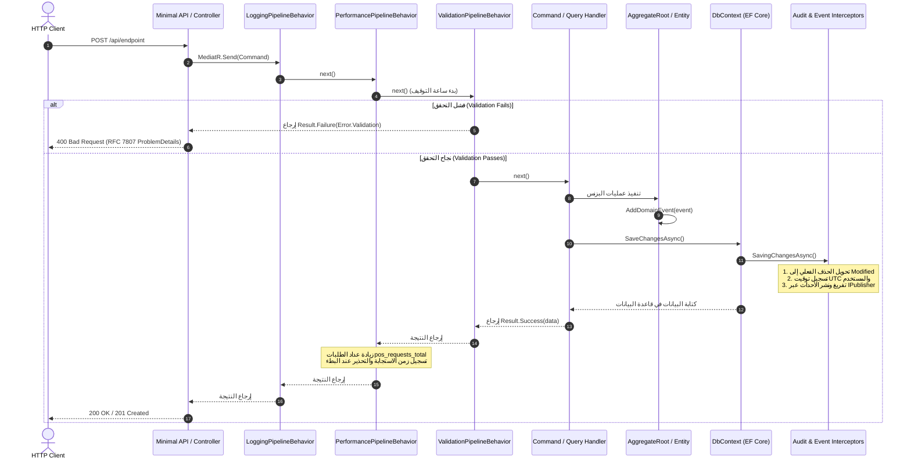

# مكتبة النواة المشتركة (SuperMarket.BuildingBlocks) — الدليل الهندسي والمعماري

> **الحالة الراهنة (Current State):** `Implemented` (مكتملة ومطبقة برمجياً)  
> **إطار العمل المستهدف (Target Framework):** `.NET 10.0` (`net10.0`)  
> **النطاق المعماري (Scope):** مكتبة النواة المشتركة (Shared Kernel) لكافة الخدمات المصغرة (Microservices) في منظومة SuperMarket POS.

---

## 1. نظرة عامة والهدف المعماري (Overview & Purpose)

تمثل `SuperMarket.BuildingBlocks` حجر الأساس المعماري الموحد لجميع الخدمات في منظومة نقاط البيع (Identity، Inventory، Sales، Operations). صُممت المكتبة لتوفير بنية تحتية هندسية عالية الأداء وقابلة لإعادة الاستخدام، مع عزل تام عن أي منطق بزنس خاص بخدمة بعينها.

توفر المكتبة حلولاً متكاملة للآتي:
* **مفاهيم الـ Domain-Driven Design (DDD):** كلاسات أساسية للـ Entities، الـ Aggregate Roots، الـ Value Objects، والـ Domain Events، مع واجهات قدرات (Capability Interfaces).
* **إدارة الأخطاء ونمط النتائج الصريحة (Result Pattern):** التخلص التام من رمي الـ Exceptions في مسارات العمل المتوقعة باستخدام `Result` و `Result<TValue>` مع دعم البرمجة الوظيفية (Railway-Oriented Programming).
* **سلوكيات الـ Pipeline في نمط CQRS:** اعتراض طلبات MediatR آلياً للتحقق عبر FluentValidation، وتسجيل السجلات المهيكلة (Structured Logging)، ومراقبة اتفاقية مستوى الخدمة (SLA).
* **المراقبة والمقاييس اللحظية (Observability & Metrics):** مقاييس أصيلة عبر `System.Diagnostics.Metrics` جاهزة للتكامل مع OpenTelemetry و Prometheus و Grafana بدون حزم خارجية.
* **أتمتة البنية التحتية في EF Core:** اعتراض عمليات الحفظ (`SaveChangesInterceptor`) لتدقيق التواريخ وتتبع المستخدمين آلياً، وتحويل الحذف الفعلي إلى حذف منطقي (Soft Delete)، ونشر أحداث الدومين محلياً.
* **استراتيجية الترقيم المزدوجة (Dual-Strategy Pagination):** ترقيم يعتمد على الإزاحة (Offset-Based) للشاشات الإدارية، وترقيم يعتمد على الفهارس والمؤشرات (Keyset / Cursor-Based) لمعاملات الكاشير فائقة السرعة.
* **توحيد مخرجات أخطاء HTTP (RFC 7807 ProblemDetails):** ترجمة أخطاء البزنس إلى ProblemDetails قياسية، ومعالجة مركزية للاستثناءات غير المتوقعة (500) عبر `IExceptionHandler`.

---

## 2. الحدود والمسؤوليات المعمارية (Architectural Boundaries)

```
┌────────────────────────────────────────────────────────────────────────┐
│                        SuperMarket POS Platform                        │
│                                                                        │
│   ┌────────────────┐   ┌────────────────┐   ┌──────────────────────┐   │
│   │ Identity Svc   │   │ Inventory Svc  │   │ Sales / POS Svc      │   │
│   └───────┬────────┘   └───────┬────────┘   └──────────┬───────────┘   │
│           │                    │                       │               │
│           ▼                    ▼                       ▼               │
│   ┌────────────────────────────────────────────────────────────────┐   │
│   │                 SuperMarket.BuildingBlocks                     │   │
│   │                                                                │   │
│   │  [Domain]        Entity<TId>, AggregateRoot<TId>, ValueObject  │   │
│   │  [Results]       Result, Result<T>, Error, ROP Extensions      │   │
│   │  [Application]   CQRS Interfaces, MediatR Pipeline Behaviors    │   │
│   │  [Infrastructure] EF Core Interceptors, ProblemDetails Handler │   │
│   └────────────────────────────────────────────────────────────────┘   │
└────────────────────────────────────────────────────────────────────────┘
```

### ما ينتمي لمكتبة BuildingBlocks:
* التجريدات العامة (Generic Abstractions) الخالية تماماً من منطق البزنس الخاص بالسوبرماركت.
* معالجات الاهتمامات المشتركة (Cross-Cutting Concerns) كالتحقق والتدقيق والمقاييس وتسجيل الأحداث.
* مراقبات EF Core العامة وفلاتر الاستعلام الشاملة (Global Query Filters).
* نماذج النتائج الصريحة وتصنيفات الأخطاء.

### ما لا ينتمي إطلاقاً للمكتبة:
* قواعد أو حسابات البزنس المحددة (مثل حسابات الضرائب، الخصومات، ورديات الكاشير، أو أرصدة المخازن).
* كلاسات `DbContext` الملموسة أو ملفات الـ Database Migrations.
* الـ DTOs أو الـ Commands أو الـ Queries الخاصة بالخدمات.
* عملاء الـ APIs الخارجية (مثل عميل Keycloak، أو بوابات الدفع الإلكتروني، أو تعريفات طابعات الفواتير).

---

## 3. الهيكل المجلدي للمشروع (Directory Structure)

```text
src/BuildingBlocks/SuperMarket.BuildingBlocks/
├── Application/
│   ├── ICommand.cs                        # واجهات أوامر CQRS (Result / Result<T>)
│   ├── IQuery.cs                          # واجهات استعلامات CQRS (Result<T>)
│   ├── ValidationPipelineBehavior.cs      # التحقق المتوازي عبر FluentValidation والإيقاف المبكر
│   ├── LoggingPipelineBehavior.cs         # تتبع دورة حياة الطلب والسجلات المهيكلة
│   ├── PerformancePipelineBehavior.cs     # قياس أزمنة الاستجابة ومقاييس OpenTelemetry
│   ├── PerformanceSettings.cs             # إعدادات عتبة البطء عبر Options Pattern
│   ├── PaginationSettings.cs              # إعدادات حدود الترقيم عبر Options Pattern
│   ├── PaginationParams.cs                # معاملات الترقيم الكلاسيكي المحمية دفاعياً
│   ├── PagedList.cs                       # منفذ الترقيم الكلاسيكي غير المتزامن عبر EF Core
│   ├── CursorParams.cs                    # معاملات ترقيم المؤشرات (Keyset)
│   └── CursorPagedList.cs                 # حاوية نتائج ترقيم المؤشرات بدون COUNT(*)
├── Domain/
│   ├── Entity.cs                          # الكيان الأساسي ومقارنة الهوية وحالة Transient
│   ├── AggregateRoot.cs                   # جذر التجميع وإدارة طابور أحداث الدومين
│   ├── IAggregateRoot.cs                  # عقد واجهة جذر التجميع للمراقبين
│   ├── ValueObject.cs                     # كائن القيمة والمساواة الهيكلية المكوناتية
│   ├── IDomainEvent.cs                    # عقد أحداث الدومين المتوافق مع MediatR INotification
│   ├── DomainEvent.cs                     # السجل الأساسي بـ EventId وتوقيت UTC ثابت
│   ├── IAuditableEntity.cs                # واجهة قدرة التدقيق: CreatedAt و UpdatedAt
│   ├── ISoftDeletable.cs                  # واجهة قدرة الحذف المنطقي: IsDeleted و DeletedAt
│   └── IActivatable.cs                    # واجهة قدرة التفعيل والتعطيل: IsActive
├── Infrastructure/
│   ├── AuditSaveChangesInterceptor.cs     # مراقب EF Core للتدقيق الزمني والحذف المنطقي
│   ├── DispatchDomainEventsInterceptor.cs # مراقب EF Core لنشر أحداث الدومين محلياً
│   ├── GlobalExceptionHandler.cs          # معالج مركزي للاستثناءات وفق معيار RFC 7807
│   ├── ICurrentUserContext.cs             # عقد استخراج هوية المستخدم الحالي والـ Claims
│   ├── ModelBuilderExtensions.cs          # فلتر استعلام عام (Global Filter) للحذف المنطقي
│   └── DependencyInjection.cs             # دوال التوسعة لحقن التبعيات وإعداد الـ Pipeline
└── Results/
    ├── ErrorType.cs                       # تصنيف نوع الخطأ برمجياً (Validation, NotFound, ...)
    ├── Error.cs                           # سجل الخطأ الثابت غير القابل للتعديل
    ├── Result.cs                          # كلاس النتيجة غير العام مع حماية الشروط الصارمة
    ├── ResultT.cs                         # كلاس النتيجة العام Result<TValue> مع حماية القيمة
    ├── ResultExtensions.cs                # دوال البرمجة الوظيفية: Match, Ensure, Map, Bind
    └── ResultProblemDetailsExtensions.cs  # محول النتائج إلى معيار HTTP ProblemDetails
```

---

## 4. مخطط تدفق الطلبات والتنفيذ (Main Flow)



---

## 5. دليل التنقل البرمجي (Where to Go When...)

| عند الرغبة في... | الملف المعني | الإجراء الهندسي |
| :--- | :--- | :--- |
| **إضافة تصنيف خطأ جديد** | `Results/ErrorType.cs` و `Results/Error.cs` | أضف عنصراً جديداً برقم صريح في الـ Enum، وأضف دالة مصنع في `Error`، ثم اضبط حالة الـ HTTP في `ResultProblemDetailsExtensions.cs`. |
| **إضافة واجهة قدرة جديدة للكيانات** | مجلد `Domain/` | عرّف الواجهة (مثل `ITenantScoped`)، ثم نفّذ معالجتها التلقائية في `AuditSaveChangesInterceptor.cs` أو `ModelBuilderExtensions.cs`. |
| **تعديل عتبة مراقبة بطء الطلبات (SLA)** | `appsettings.json` (قسم `"Performance"`) | غيّر قيمة `SlowRequestThresholdMs` (تعمل افتراضياً بقيمة دفاعية 500ms عبر `PerformanceSettings.cs`). |
| **ضبط حدود الترقيم القصوى** | `appsettings.json` (قسم `"Pagination"`) | عدل قيم `DefaultPageSize` و `MaxPageSize` عبر `PaginationSettings.cs`. |
| **تفعيل BuildingBlocks في الـ Web API** | ملف `Program.cs` الخاص بالخدمة | استدعِ `builder.Services.AddBuildingBlocksWeb()` و `app.UseBuildingBlocksWeb()`. |
| **ربط المراقبين مع DbContext الخدمة** | مشروع `Infrastructure` في الخدمة | احقن `AuditSaveChangesInterceptor` و `DispatchDomainEventsInterceptor` داخل `options.AddInterceptors()`. |

---

## 6. القواعد والمعايير المعمارية الصارمة (Architectural Constraints)

1. **الأنواع الصريحة كعقود إرجاع:** كافة أوامر واستعلامات CQRS ملزمة بإرجاع `Result` أو `Result<TResponse>`. يُحظر تماماً رمي Exceptions لأخطاء البزنس المتوقعة.
2. **شروط الحالة الصحيحة (Invariants):** لا يمكن منطقياً أو برمجياً إنشاء `Result` ناجح يحمل خطأ، ولا إنشاء `Result` فاشل يحمل `Error.None`. مخالفة ذلك ترمي `InvalidOperationException` فوراً أثناء الإنشاء لمنع الحالات المشوهة.
3. **أمان الوصول للقيمة:** محاولة قراءة `Result<T>.Value` عندما تكون `IsSuccess == false` سترمي استثناءً فورياً لمنع كوارث `NullReferenceException`.
4. **مناعة سجلات التدقيق التاريخية:** عند تعديل أي كيان، يمنع `AuditSaveChangesInterceptor` تعديل حقلي `CreatedAt` و `CreatedBy` برمجياً عبر استبعادهما من جمل الـ SQL UPDATE.
5. **منع الحذف الفيزيائي:** الكيانات المطبقة لـ `ISoftDeletable` تتحول أوامر حذفها آلياً إلى تحديث منطقي مع توثيق الوقت ومعرف المستخدم.
6. **تفريغ الأحداث قبل النشر:** يتم مسح طابور أحداث الدومين من جذر التجميع قبل البدء في استدعاء الـ Handlers عبر `IPublisher`؛ لحماية النظام من التكرار والحلقات اللانهائية.
