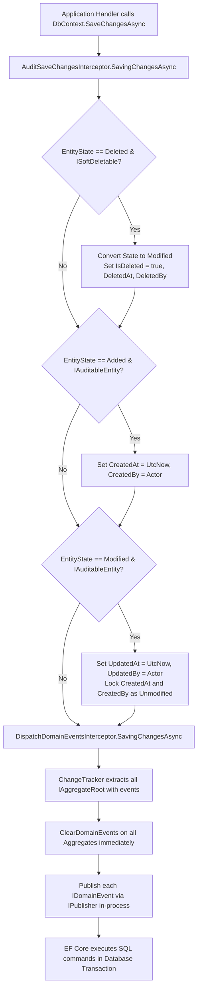

# SuperMarket.BuildingBlocks — Architecture Deep Dive

> **Current State:** `Implemented`  
> **Pattern:** Shared Kernel / Core Building Blocks within a Clean Architecture & DDD Ecosystem  

---

## 1. Architectural Style & Placement

`SuperMarket.BuildingBlocks` functions as the **Shared Kernel** in the SuperMarket POS Modular Monolith / Microservices architecture. It contains cross-cutting enterprise primitives that are shared across all bounded contexts (`Identity`, `Inventory`, `Sales`, `Operations`).

Internally, `BuildingBlocks` is partitioned into four decoupled modules matching Clean Architecture conventions:

```text
┌─────────────────────────────────────────────────────────────┐
│                       Infrastructure                        │
│   • AuditSaveChangesInterceptor                             │
│   • DispatchDomainEventsInterceptor                         │
│   • GlobalExceptionHandler                                  │
│   • ModelBuilderExtensions                                  │
└──────────────┬───────────────────────────────┬──────────────┘
               │                               │
               ▼                               ▼
┌───────────────────────────────┐     ┌────────────────────────┐
│          Application          │     │        Results         │
│   • CQRS Command/Query Markers│     │   • Result / Result<T> │
│   • Pipeline Behaviors        │────►│   • Error / ErrorType  │
│   • Pagination Primitives     │     │   • ROP Extensions     │
└──────────────┬────────────────┘     │   • ProblemDetails     │
               │                      └────────────────────────┘
               ▼                               ▲
┌───────────────────────────────┐              │
│            Domain             │──────────────┘
│   • Entity<TId>               │
│   • AggregateRoot<TId>        │
│   • ValueObject, DomainEvent  │
│   • Capability Interfaces     │
└───────────────────────────────┘
```

---

## 2. Layer Analysis & Responsibilities

### 2.1 Domain Layer (`SuperMarket.BuildingBlocks.Domain`)
* **Responsibility:** Define the foundational building blocks of Domain-Driven Design (DDD) and entity capability contracts.
* **Depends On:** Pure .NET core and `MediatR` (`INotification` abstraction for domain events). Zero database, ORM, or web framework dependencies.
* **Used By:** `Application`, `Infrastructure`, and the Domain layers of all downstream services (`SuperMarket.Identity.Domain`, `SuperMarket.Sales.Domain`, etc.).
* **Should Contain:**
  - Base entity abstractions (`Entity<TId>`) enforcing structural identity equality and transient state detection.
  - Aggregate root bases (`AggregateRoot<TId>`) encapsulating the in-memory domain event collection (`IDomainEvent`).
  - Base value object abstraction (`ValueObject`) enforcing structural value equality over atomic components.
  - Base domain event record (`DomainEvent`) guaranteeing immutable `EventId` and UTC `OccurredOn`.
  - Capability interfaces: `IAuditableEntity`, `ISoftDeletable`, `IActivatable`, `IAggregateRoot`.
* **Should NOT Contain:**
  - Database access logic, SQL statements, or EF Core types.
  - Business rules specific to POS operations (e.g., shifts, cash registers, barcode scanning).
  - External communication or HTTP references.

### 2.2 Results Layer (`SuperMarket.BuildingBlocks.Results`)
* **Responsibility:** Provide an expressive, allocation-efficient, and type-safe mechanism for representing operation outcomes without using exceptions for control flow.
* **Depends On:** Pure .NET core + `Microsoft.AspNetCore.Http.Abstractions` / `Microsoft.AspNetCore.Mvc.Core` (for RFC 7807 ProblemDetails mapping).
* **Used By:** All layers across all microservices.
* **Should Contain:**
  - `Result` and `Result<TValue>` with constructor invariant verification.
  - `Error` record and `ErrorType` enum with explicit integer values.
  - Railway-Oriented Programming (ROP) extension methods: `Match`, `Ensure`, `Map`, `Bind`.
  - `ToProblemDetails()` extension mapping `ErrorType` to standard HTTP status codes and RFC specifications.
* **Should NOT Contain:**
  - Concrete business exceptions or domain logic.

### 2.3 Application Layer (`SuperMarket.BuildingBlocks.Application`)
* **Responsibility:** Host CQRS markers, generic pipeline behaviors, and database-neutral pagination abstractions.
* **Depends On:** `Domain`, `Results`, `MediatR`, `FluentValidation`, `Microsoft.EntityFrameworkCore` (for `IQueryable` extension in `PagedList`).
* **Used By:** Downstream Application projects (`SuperMarket.Sales.Application`, etc.).
* **Should Contain:**
  - `ICommand`, `ICommand<TResponse>`, `IQuery<TResponse>`, and corresponding handler interfaces.
  - `ValidationPipelineBehavior<TRequest, TResponse>` providing parallel validation execution and short-circuiting.
  - `LoggingPipelineBehavior<TRequest, TResponse>` providing request lifecycle logging.
  - `PerformancePipelineBehavior<TRequest, TResponse>` providing Stopwatch SLA tracking and native OpenTelemetry metrics.
  - `PaginationParams`, `PagedList<T>`, `CursorParams<TCursor>`, `CursorPagedList<T, TCursor>`.
* **Should NOT Contain:**
  - Service-specific business command handlers or use-case implementations.

### 2.4 Infrastructure Layer (`SuperMarket.BuildingBlocks.Infrastructure`)
* **Responsibility:** Provide automated EF Core interceptors, global query filters, HTTP exception handlers, and DI registration routines.
* **Depends On:** `Domain`, `Application`, `Results`, `Microsoft.EntityFrameworkCore`, `Microsoft.AspNetCore.App`.
* **Used By:** Downstream Infrastructure and API hosting projects.
* **Should Contain:**
  - `AuditSaveChangesInterceptor`: Intercepts `SavingChanges` to stamp UTC timestamps and actor IDs, convert SQL `DELETE` to `UPDATE`, and enforce creation immutability.
  - `DispatchDomainEventsInterceptor`: Intercepts `SavingChangesAsync` to extract, clear, and publish domain events via MediatR before committing data.
  - `GlobalExceptionHandler`: Implements ASP.NET Core `IExceptionHandler` producing RFC 7807 ProblemDetails with `TraceId` for unhandled 500 exceptions.
  - `ModelBuilderExtensions.ApplySoftDeleteQueryFilter`: Reflection/Expression-tree helper applying `IsDeleted == false` to all `ISoftDeletable` entities.
  - `ICurrentUserContext`: Interface abstraction for retrieving current user ID / claims.
  - `DependencyInjection`: Extension methods for Web application setup.
* **Should NOT Contain:**
  - Concrete DbContext implementations or database connection strings.

---

## 3. Data & Control Flow Architectures

### 3.1 CQRS Pipeline Flow
When a command or query is dispatched through `ISender.Send(...)`:
1. **Logging Layer:** `LoggingPipelineBehavior` logs the incoming request name with an `Information` level.
2. **Performance Layer:** `PerformancePipelineBehavior` initializes a `Stopwatch` and tracks execution duration.
3. **Validation Layer:** `ValidationPipelineBehavior` resolves all `IValidator<TRequest>` instances registered in the container, runs them concurrently using `Task.WhenAll`, and short-circuits the pipeline with a `Result.Failure(Error.Validation(...))` if violations occur.
4. **Execution Layer:** The concrete Handler in the service Application layer processes the business operation.
5. **Post-Execution:**
   - If the Handler returns a failure `Result`, `LoggingPipelineBehavior` logs a `Warning` with the specific error code and description.
   - `PerformancePipelineBehavior` records the duration in `pos_request_duration_ms` (Histogram) and increments `pos_requests_total` (Counter). If the duration exceeds `_slowRequestThresholdMs`, a warning is logged.
   - If an unhandled exception crashes the pipeline, `LoggingPipelineBehavior` logs an `Error` and re-throws the exception to be captured by `GlobalExceptionHandler`.

### 3.2 Persistence & Interception Flow


---

## 4. Architectural Boundaries & Constraints

1. **The Pure Domain Principle:**
   The `Domain` folder within `BuildingBlocks` contains zero references to EF Core, ASP.NET Core, or relational storage libraries. Domain entities only reference the `IDomainEvent` interface (which extends MediatR's `INotification` for in-memory publishing).
2. **Strict Invariant Defense:**
   Invariants are enforced at compile-time and runtime. Creating an unrepresentable state (e.g. `new Result(true, Error.Validation(...))` or `new Result(false, Error.None)`) throws immediately during construction.
3. **Audit Immutability Protection:**
   The `AuditSaveChangesInterceptor` explicitly overrides EF Core change-tracking metadata for `CreatedAt` and `CreatedBy`:
   ```csharp
   entry.Property(nameof(IAuditableEntity.CreatedAt)).IsModified = false;
   entry.Property(nameof(IAuditableEntity.CreatedBy)).IsModified = false;
   ```
   This prevents accidental or malicious tampering of creation audit logs through updates.
4. **Idempotent In-Process Domain Event Publishing:**
   Domain events are purged (`root.ClearDomainEvents()`) before calling `_publisher.Publish(...)`. If a domain event handler triggers a secondary `SaveChangesAsync()`, events will not be dispatched repeatedly.
