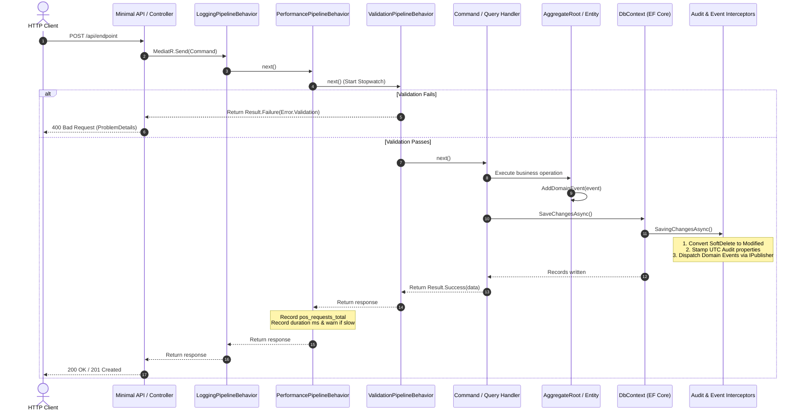

# SuperMarket.BuildingBlocks — Architecture & Engineering Overview

> **Current State:** `Implemented`  
> **Testing Status:** `149 Tests Passing (100%)` | `Branch Coverage: 94.18%` | `Line Coverage: 91.22%`  
> **Target Framework:** `.NET 10.0` (`net10.0`)  
> **Scope:** Core shared kernel library for all microservices in the SuperMarket POS ecosystem.

---

## 1. Overview & Purpose
`SuperMarket.BuildingBlocks` is the foundational shared kernel library designed to standardize core enterprise architectural patterns across all services (Identity, Inventory, Sales, Operations) in the SuperMarket POS system.

It provides reusable, high-performance primitives for:
* **Domain-Driven Design (DDD):** Base entities, aggregate roots, value objects, domain events, and capability interfaces.
* **Error Handling & Flow Control:** Explicit Result Pattern (`Result`, `Result<TValue>`) and Railway-Oriented Programming (ROP) eliminating control-flow exceptions.
* **CQRS Cross-Cutting Concerns:** MediatR pipeline behaviors for automated FluentValidation, structured lifecycle logging, and SLA performance tracking.
* **Observability & Metrics:** Native `System.Diagnostics.Metrics` (`Counter`, `Histogram`) ready for OpenTelemetry, Prometheus, and Grafana.
* **Persistence & EF Core Automation:** Interceptors for automated UTC auditing, user attribution, soft-delete state mutation, and in-process domain event dispatching.
* **Dual-Strategy Pagination:** Offset-based pagination for administration screens and keyset/cursor-based pagination for high-volume POS transaction streams.
* **HTTP Error Standardization:** RFC 7807 ProblemDetails mapping for domain errors and centralized unhandled exception interception.

---

## 2. Architectural Boundaries & Responsibility

```
┌────────────────────────────────────────────────────────────────────────┐
│                        SuperMarket POS Platform                        │
│                                                                        │
│   ┌────────────────┐   ┌────────────────┐   ┌──────────────────────┐   │
│   │ Identity Svc   │   │ Inventory Svc  │   │ Sales / POS Svc      │   │
│   └───────┬────────┘   └───────┬────────┘   └──────────┬───────────┘   │
│           │                    │                       │               │
│           ▼                    ▼                       ▼               │
│   ┌────────────────────────────────────────────────────────────────┐   │
│   │                 SuperMarket.BuildingBlocks                     │   │
│   │                                                                │   │
│   │  [Domain]        Entity<TId>, AggregateRoot<TId>, ValueObject  │   │
│   │  [Results]       Result, Result<T>, Error, Railway Extensions  │   │
│   │  [Application]   CQRS Interfaces, MediatR Pipeline Behaviors    │   │
│   │  [Infrastructure] EF Core Interceptors, ProblemDetails Handler │   │
│   └────────────────────────────────────────────────────────────────┘   │
└────────────────────────────────────────────────────────────────────────┘
```

### What Belongs in BuildingBlocks:
* Generic, reusable abstractions that contain zero domain-specific POS business logic.
* Framework-level cross-cutting behaviors (logging, validation, error mapping, metrics).
* Generic persistence interceptors and query filter extensions.
* Core error models and result types.

### What Does NOT Belong in BuildingBlocks:
* Concrete business logic, rules, or calculations (e.g., POS tax calculations, discount algorithms, stock reservation logic).
* Concrete EF Core `DbContext` subclasses or database migrations.
* Service-specific DTOs, commands, queries, or event handlers.
* External API integrations (Keycloak client implementations, payment gateways, hardware barcode scanner drivers).

---

## 3. Directory Structure

```text
src/BuildingBlocks/SuperMarket.BuildingBlocks/
├── Application/
│   ├── ICommand.cs                        # CQRS Command markers (Result / Result<T>)
│   ├── IQuery.cs                          # CQRS Query markers (Result<T>)
│   ├── ValidationPipelineBehavior.cs      # Parallel FluentValidation & short-circuiting
│   ├── LoggingPipelineBehavior.cs         # Structured lifecycle & error logging
│   ├── PerformancePipelineBehavior.cs     # Stopwatch SLA monitoring & OpenTelemetry metrics
│   ├── PerformanceSettings.cs             # Options pattern threshold configuration
│   ├── PaginationSettings.cs              # Options pattern pagination configuration
│   ├── PaginationParams.cs                # Clamped parameters for offset pagination
│   ├── PagedList.cs                       # Async EF Core offset pagination executor
│   ├── CursorParams.cs                    # Clamped parameters for keyset pagination
│   └── CursorPagedList.cs                 # Keyset pagination envelope
├── Domain/
│   ├── Entity.cs                          # Identity equality & transient state handling
│   ├── AggregateRoot.cs                   # Aggregate root base & domain event queue
│   ├── IAggregateRoot.cs                  # Interface contract for event collection
│   ├── ValueObject.cs                     # Structural component equality base
│   ├── IDomainEvent.cs                    # MediatR INotification domain event contract
│   ├── DomainEvent.cs                     # Base record with EventId & UTC OccurredOn
│   ├── IAuditableEntity.cs                # Capability interface: CreatedAt, UpdatedAt
│   ├── ISoftDeletable.cs                  # Capability interface: IsDeleted, DeletedAt
│   └── IActivatable.cs                    # Capability interface: IsActive
├── Infrastructure/
│   ├── AuditSaveChangesInterceptor.cs     # EF Core interceptor for audit & soft delete
│   ├── DispatchDomainEventsInterceptor.cs # EF Core interceptor for in-process events
│   ├── GlobalExceptionHandler.cs          # ASP.NET Core IExceptionHandler for RFC 7807
│   ├── ICurrentUserContext.cs             # Contract for current user / actor extraction
│   ├── ModelBuilderExtensions.cs          # Global Query Filter for ISoftDeletable
│   └── DependencyInjection.cs             # ServiceCollection & Pipeline extensions
└── Results/
    ├── ErrorType.cs                       # Error classification enum (Validation, NotFound, etc.)
    ├── Error.cs                           # Immutable sealed error record
    ├── Result.cs                          # Non-generic Result base with strict invariants
    ├── ResultT.cs                         # Generic Result<TValue> with Value guard
    ├── ResultExtensions.cs                # Functional ROP: Match, Ensure, Map, Bind
    └── ResultProblemDetailsExtensions.cs  # RFC 7807 HTTP ProblemDetails converter
```

---

## 4. Main Request & Execution Flow



---

## 5. Navigation & "Where to Go When..."

| Need / Task | Destination File | Action |
| :--- | :--- | :--- |
| **Add a new error category** | `Results/ErrorType.cs` & `Results/Error.cs` | Add enum member with explicit integer, add factory method in `Error`, map status in `ResultProblemDetailsExtensions.cs`. |
| **Add a new capability interface** | `Domain/` | Define interface (e.g., `ITenantScoped`), implement handling in `Infrastructure/AuditSaveChangesInterceptor.cs` or `ModelBuilderExtensions.cs`. |
| **Adjust slow request warning SLA** | `appsettings.json` (`"Performance"`) | Configure `SlowRequestThresholdMs` (defaults defensively to 500ms via `PerformanceSettings.cs`). |
| **Configure pagination limits** | `appsettings.json` (`"Pagination"`) | Configure `DefaultPageSize` and `MaxPageSize` via `PaginationSettings.cs`. |
| **Register BuildingBlocks in Web API** | `Program.cs` | Call `builder.Services.AddBuildingBlocksWeb()` and `app.UseBuildingBlocksWeb()`. |
| **Attach interceptors to service DbContext** | `Infrastructure/DependencyInjection.cs` | Inject `AuditSaveChangesInterceptor` and `DispatchDomainEventsInterceptor` into `options.AddInterceptors()`. |
| **Run & audit automated test suite** | `tests/BuildingBlocks/SuperMarket.BuildingBlocks.UnitTests/` | Run `dotnet test SuperMarketPOS.slnx` to verify all domain invariants and behaviors in seconds (see [Testing.md](Testing.md)). |

---

## 6. Architectural Constraints & Non-Negotiable Rules

1. **Explicit Return Types:** All `ICommand` and `IQuery` implementations must return `Result` or `Result<TResponse>`. Throwing exceptions for anticipated business failures is prohibited.
2. **Result Invariants:** A `Result` cannot be initialized as successful with an error, nor as a failure without an error. Attempts will throw an `InvalidOperationException`.
3. **Safe Value Access:** `Result<T>.Value` throws if `IsSuccess` is false. Always verify `IsSuccess` or use `Match` / `Bind`.
4. **Audit Immutability:** Updating an entity will never alter its original `CreatedAt` or `CreatedBy` attributes; SQL UPDATE statements are stripped of these properties via `AuditSaveChangesInterceptor`.
5. **No Hard Deletes:** Entities implementing `ISoftDeletable` are automatically converted from SQL DELETE to SQL UPDATE statements with `IsDeleted = true`.
6. **Pre-Dispatch Event Clearance:** Aggregate domain events are cleared immediately prior to in-process dispatching to guarantee idempotency and avoid cyclical dispatching loops.
