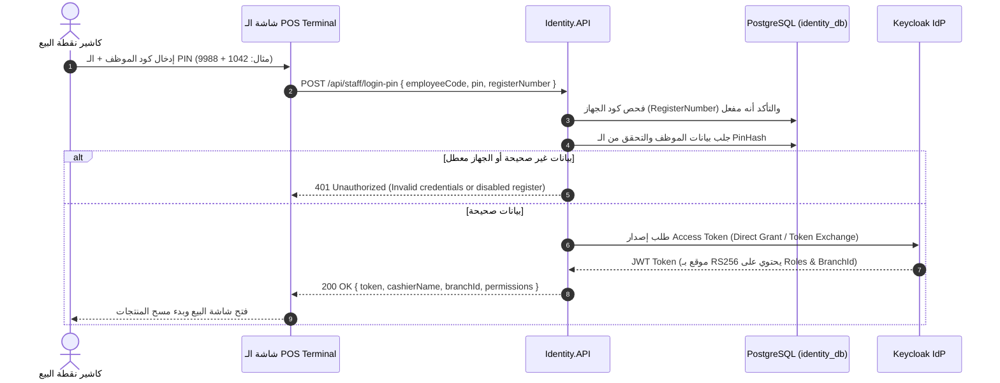
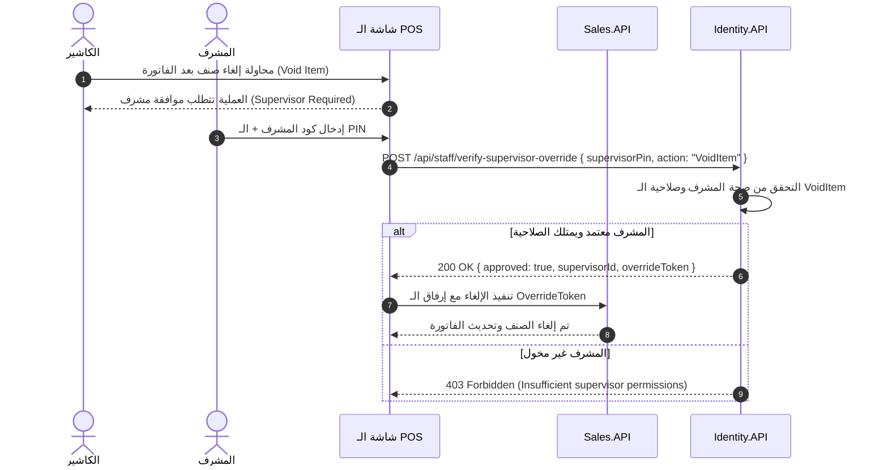

# 🏛️ التصميم المعماري لخدمة الهوية والفروع (Architecture & System Design)

## 📌 1. نمط المعمارية النظيفة (Clean Architecture Layers)

تم تصميم خدمة `SuperMarket.Identity` باتباع مبادئ **Clean Architecture** و **Domain-Driven Design (DDD)** لضمان استقلالية منطق الأعمال عن أطر العمل الخارجية:

```
┌─────────────────────────────────────────────────────────────────────────────┐
│                        SuperMarket.Identity.API Layer                       │
│         Controllers, Endpoints, Middlewares, OpenAPI (Scalar), ProblemDetails│
├─────────────────────────────────────────────────────────────────────────────┤
│                    SuperMarket.Identity.Application Layer                   │
│         CQRS Features (Branches, POS Registers, Staff), Behaviors, DTOs     │
├─────────────────────────────────────────────────────────────────────────────┤
│                   SuperMarket.Identity.Infrastructure Layer                 │
│         EF Core, PostgreSQL Context, Keycloak Admin Client, RabbitMQ Bus    │
├─────────────────────────────────────────────────────────────────────────────┤
│                       SuperMarket.Identity.Domain Layer                     │
│         Entities (Branch, POSRegister, StaffMember), Enums, Rules, Events   │
└─────────────────────────────────────────────────────────────────────────────┘
```

---

## 🧱 2. تفصيل طبقات المشروع ومكوناتها

### 1. طبقة الـ Domain (`SuperMarket.Identity.Domain`)
* **الكيانات وجذور التجميع (Aggregates & Entities):**
  * `User` (Aggregate Root): يمثل الموظف والمستخدم (`Username`, `PhoneNumber`, `Email`, `KeycloakUserId`, `PinHash`, `FullName`, `RoleId`, `BranchId`, `AccessFailedCount`, `LockoutEnd`, `LastLogin`).
  * `Role` (Entity): الأدوار الوظيفية الستة في السوبرماركت (`RoleName`, `Description`, `IsRoleActive`).
  * `Permission` (Entity): الصلاحيات الدقيقة بنمط `resource:action:scope` مع قيد فريد مركب.
  * `RolePermission` (Join Entity): جدول الربط بمفتاح مركب طبيعي `(RoleId, PermissionId)`.
  * `Branch` (Aggregate Root): الفرع التجاري وبياناته التشغيلية والضريبية.
  * `BranchOperatingHours` (Child Entity): ساعات العمل اليومية لكل فرع مع قيد فريد `(BranchId, DayOfWeek)`.
* **أحداث المجال المطبقة (Domain Events):**
  * `UserCreatedDomainEvent`: يُطلق عند تسجيل موظف جديد لتهيئة الحساب وإرسال رسالة ترحيبية بالبيانات والـ PIN.
  * `UserDeactivatedDomainEvent`: يُطلق عند تجميد أو حذف الحساب لإلغاء الجلسات النشطة وطرد الكاشير من أجهزة البيع.
  * `UserTransferredDomainEvent`: يُطلق عند نقل الموظف لفرع آخر لتحديث النطاق الجغرافي للصلاحيات.
  * `UserRoleChangedDomainEvent`: يُطلق عند ترقية أو تعديل الدور لإلغاء وتحديث كاش الصلاحيات.
  * `UserLockedOutDomainEvent`: يُطلق عند تكرار إدخال PIN خاطئ 3 مرات لقفل الحساب ومطابقة الكاميرات (CCTV Sync).

---

### 2. طبقة التطبيق (`SuperMarket.Identity.Application`)
* مبنية بنمط **Feature-based Clean Architecture مع CQRS (MediatR)**:
* **ميزات الفروع (`Features/Branches`):**
  * `CreateBranchCommand` & `CreateBranchCommandHandler` & `Validator`.
  * `UpdateBranchCommand`.
  * `GetBranchByIdQuery` & `GetBranchesListQuery`.
* **ميزات أجهزة ونقاط البيع (`Features/Registers`):**
  * `RegisterPOSTerminalCommand`.
  * `SetRegisterStatusCommand`.
  * `GetRegistersByBranchQuery`.
* **ميزات الموظفين والمصادقة (`Features/Staff`):**
  * `CreateStaffMemberCommand` (إنشاء الحساب محلياً وفي Keycloak).
  * `AuthenticateCashierPinCommand` (التحقق السريع من رمز الكاشير وإصدار Access Token).
  * `AuthorizeSupervisorOverrideCommand` (تحقق المشرف اللحظي لمنح موافقة استثنائية).
  * `TransferStaffBranchCommand`.
  * `GetStaffByBranchQuery`.
* **سلوكيات المعالجة (Pipeline Behaviors):**
  * `ValidationBehavior`: فحص المدخلات تلقائياً عبر FluentValidation.
  * `LoggingBehavior`: تسجيل أداء وزمن استجابة العمليات.

---

### 3. طبقة البنية التحتية (`SuperMarket.Identity.Infrastructure`)
* **قاعدة البيانات والـ Persistence:**
  * `IdentityDbContext`: تطبيق EF Core 10 على PostgreSQL (`identity_db`).
  * تطبيق إعدادات الفهارس الفريدة (`BranchCode`, `RegisterNumber`, `EmployeeCode`).
  * دعم **MassTransit Transactional Outbox** لضمان تسليم رسائل التكامل دون فقدان.
* **تكامل Keycloak (Keycloak Admin REST Client):**
  * واجهة `IKeycloakService` للتخاطب المباشر مع Keycloak Admin API لإنشاء مستخدمين، تعيين الأدوار، وتوليد الـ Tokens.
* **خدمة الرسائل (Message Bus):**
  * إعدادات **MassTransit RabbitMQ** لنشر الأحداث التكاملية (`BranchCreatedIntegrationEvent`, `StaffDeactivatedIntegrationEvent`).

---

### 4. طبقة العرض والـ API (`SuperMarket.Identity.API`)
* **المصادقة (Authentication):**
  * ربط `Microsoft.AspNetCore.Authentication.JwtBearer` مع Keycloak Realm (`supermarket`) والتحقق بنمط Stateless عبر الـ JWKS.
* **الصلاحيات (Authorization Policies):**
  * تسجيل السياسات المخصصة: `RequireSupervisor`, `RequireBranchManager`, `RequireAdmin`.
* **معالجة الأخطاء (Error Handling):**
  * `GlobalExceptionHandler` مدمج يُخرج استجابات موحدة متوافقة مع معيار **RFC 7807 ProblemDetails**.

---

## 🔄 3. مخطط تسجيل دخول الكاشير السريع (Fast POS Cashier PIN Login Flow)



---

## 🛡️ 4. مخطط موافقة المشرف الاستثنائية (Supervisor Override Flow)


