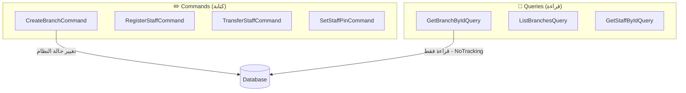
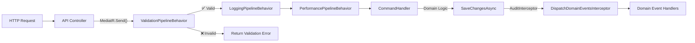
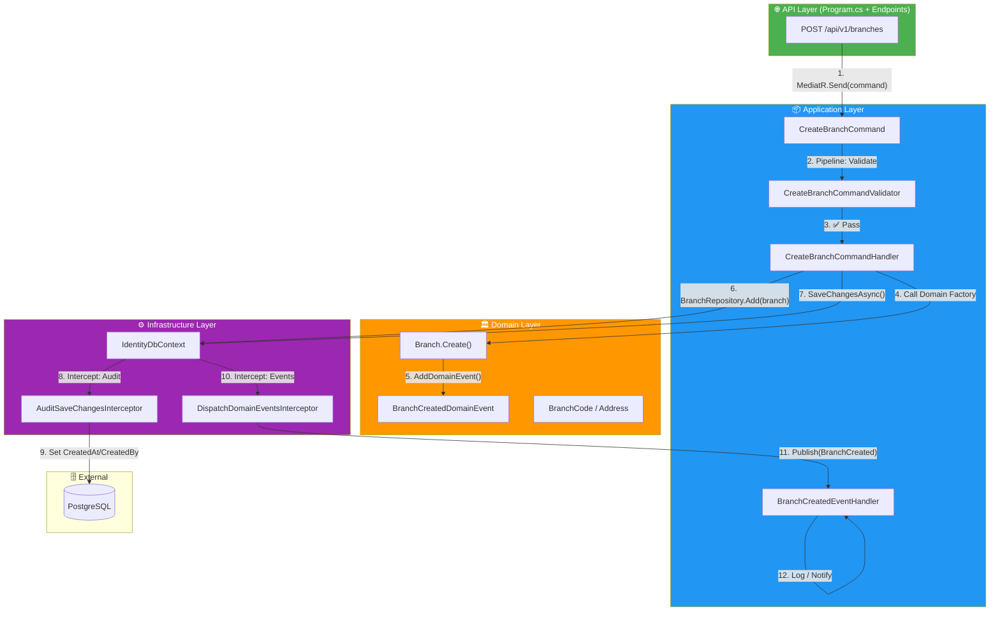
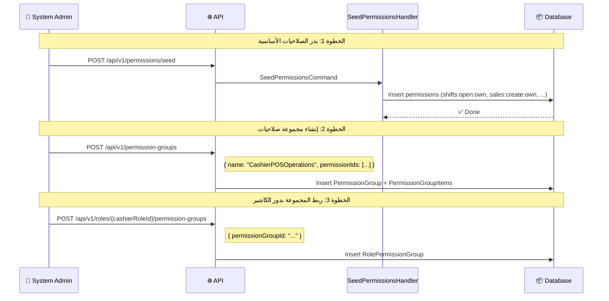
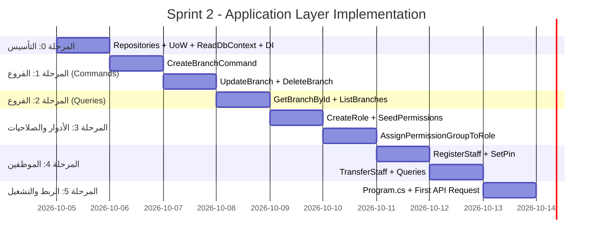

# ⚡ Sprint 2: خطة بناء طبقة التطبيق (Identity Application Layer)
## خطة معمارية شاملة — Production-Ready من اليوم الأول

---

## 📋 جدول المحتويات

1. [لماذا هذه الطبقة هي الأهم؟](#1-لماذا-هذه-الطبقة-هي-الأهم)
2. [الوضع الحالي: ماذا بنينا وماذا ينقصنا؟](#2-الوضع-الحالي)
3. [المبادئ المعمارية الحاكمة](#3-المبادئ-المعمارية-الحاكمة)
4. [هيكل المجلدات النهائي](#4-هيكل-المجلدات-النهائي)
5. [مراحل التنفيذ التفصيلية](#5-مراحل-التنفيذ-التفصيلية)
6. [كيف تتواصل الطبقات مع بعضها](#6-كيف-تتواصل-الطبقات-مع-بعضها)
7. [كيف تعمل الميزة من البداية للنهاية](#7-كيف-تعمل-الميزة-من-البداية-للنهاية)
8. [سيناريوهات الفشل الحرجة](#8-سيناريوهات-الفشل-الحرجة)
9. [أفضل الممارسات للـ Clean Code](#9-أفضل-الممارسات-للـ-clean-code)
10. [التحسينات المستقبلية](#10-التحسينات-المستقبلية)

---

## 1. لماذا هذه الطبقة هي الأهم؟

> [!IMPORTANT]
> **طبقة الـ Application هي "عقل النظام" — المكان الوحيد الذي يُنسق فيه كل شيء:**
> * الـ Domain Layer تعرف القواعد، لكنها لا تعرف كيف تحفظ البيانات.
> * الـ Infrastructure Layer تعرف كيف تحفظ البيانات، لكنها لا تعرف منطق العمل.
> * الـ API Layer تعرف كيف تستقبل HTTP Requests، لكنها لا تعرف ماذا تفعل بها.
>
> **طبقة الـ Application هي التي تربط كل هذا معاً وتُنسق تدفق العمليات.**

### ماذا ستتعلم في هذه المرحلة؟

| المفهوم | لماذا مهم؟ |
|---------|-----------|
| **CQRS Pattern** | فصل عمليات الكتابة عن القراءة لتحسين الأداء والوضوح |
| **MediatR Pipeline** | كيف تمر كل عملية عبر سلسلة من المعالجات (Validation → Logging → Performance → Handler) |
| **Dependency Inversion** | كيف تعتمد طبقة الأعمال على واجهات وليس على تفاصيل التنفيذ |
| **FluentValidation** | التحقق من المدخلات قبل أن تصل لمنطق الأعمال |
| **Domain Events** | كيف تتفاعل أجزاء النظام مع بعضها بدون ربط محكم |
| **Error Handling** | إرجاع أخطاء ذات معنى بدلاً من رمي Exceptions |
| **Unit of Work** | ضمان أن كل العمليات تنجح معاً أو تفشل معاً (Atomicity) |

---

## 2. الوضع الحالي

### ✅ ما بنيناه وجاهز للاستخدام (من Sprint 0 و Sprint 1):

```mermaid
graph LR
    subgraph BuildingBlocks["🧱 BuildingBlocks (جاهز)"]
        BB_CMD["ICommand / ICommandHandler"]
        BB_QRY["IQuery / IQueryHandler"]
        BB_RES["Result / Result＜T＞ / Error"]
        BB_VAL["ValidationPipelineBehavior"]
        BB_LOG["LoggingPipelineBehavior"]
        BB_PERF["PerformancePipelineBehavior"]
        BB_AUDIT["AuditSaveChangesInterceptor"]
        BB_EVENTS["DispatchDomainEventsInterceptor"]
        BB_DOMAIN["Entity / AggregateRoot / DomainEvent"]
    end

    subgraph Domain["🏛 Identity Domain (جاهز - 116 test)"]
        D_BRANCH["Branch + BranchOperatingHours"]
        D_USER["User (Staff/Cashier)"]
        D_ROLE["Role"]
        D_PERM["Permission + PermissionGroup"]
        D_EVENTS["7 Domain Events"]
        D_ERRORS["7 Error Classes"]
        D_VO["BranchCode / RegisterCode / Address"]
    end

    subgraph Infra["⚙️ Identity Infrastructure (جاهز - Migration Applied)"]
        I_CTX["IdentityDbContext (9 DbSets)"]
        I_CFG["9 Entity Configurations"]
        I_MIG["Initial_Identity_Schema Migration"]
        I_DI["DependencyInjection.cs"]
    end

    subgraph App["📦 Identity Application (فارغ - هنا نبدأ!)"]
        A_EMPTY["فقط .csproj فارغ"]
    end

    BuildingBlocks --> Domain
    BuildingBlocks --> Infra
    Domain --> App
```



### ❌ ما ينقصنا لبناء طبقة الـ Application:

| المكون | الحالة | لماذا مطلوب؟ |
|--------|--------|-------------|
| **Repositories (للكتابة) + IUnitOfWork** | ❌ غير موجود | واجهات تعيش في Application — تحمّل وتحفظ الـ Aggregates (ADR-001) |
| **IIdentityReadDbContext (للقراءة)** | ❌ غير موجود | واجهة قراءة `IQueryable` بدون Tracking للـ Projections (ADR-001) |
| **Commands + Validators + Handlers** | ❌ غير موجود | تنفيذ عمليات الأعمال (إنشاء فرع، تسجيل موظف...) |
| **Queries + Handlers** | ❌ غير موجود | قراءة البيانات وإرجاعها بصيغ DTO |
| **DTOs / Response Records** | ❌ غير موجود | نقل البيانات بدون كشف كيانات الـ Domain |
| **Domain Event Handlers** | ❌ غير موجود | الاستجابة للأحداث (مثل: BranchCreated → Log it) |
| **Application DependencyInjection** | ❌ غير موجود | تسجيل MediatR و FluentValidation في الـ DI Container |
| **Application Error Constants** | ❌ غير موجود | أخطاء خاصة بطبقة التطبيق (مثل: BranchCodeAlreadyExists) |

---

## 3. المبادئ المعمارية الحاكمة

### 3.1 CQRS (Command Query Responsibility Segregation)



**القاعدة الذهبية:**
* **Command** = يغيّر حالة النظام ولا يُرجع بيانات (فقط `Result` أو `Result<Guid>` للـ ID الجديد).
* **Query** = يقرأ البيانات ولا يغيّر شيئاً أبداً.

### 3.2 Dependency Inversion Principle (DIP)

```
❌ الطريقة الخاطئة:
Application → يعتمد مباشرة على → IdentityDbContext (Infrastructure)

✅ الطريقة الصحيحة:
Application    → يُعرّف واجهات → IBranchRepository, IUnitOfWork, IIdentityReadDbContext
Infrastructure → يُنفذها      → BranchRepository, IdentityDbContext
```

**لماذا؟** طبقة الأعمال تملك العقد (Contract)، والـ Infrastructure تملك التفاصيل. جهة الكتابة معزولة تماماً عن EF Core؛ جهة القراءة مربوطة بـ LINQ/EF بقرار واعٍ (انظر ADR-001).

### 3.4 ADR-001: الوصول للبيانات — Repository للكتابة، IQueryable للقراءة

> **الحالة:** ✅ مقبول (2026-10-05)

| الجانب | الأداة | السبب المختصر |
|---|---|---|
| **Commands** | `I{Aggregate}Repository` + `IUnitOfWork` | نحمّل Aggregate كاملاً لحماية القواعد، والـ Handler قابل للاختبار بـ Mock |
| **Queries** | `IIdentityReadDbContext` (`IQueryable` + `AsNoTracking`) | لا قواعد نحميها، نحتاج Projection مرنة وسريعة لكل شاشة |

**قواعد ملزمة:**
1. Repository **فقط لكل Aggregate Root** — لا `IRepository<OperatingHours>` ولا Generic Repository مكشوف.
2. الـ Repository **لا يُرجع `IQueryable`** أبداً — يُرجع Aggregates أو `bool`.
3. `GetByIdAsync` يحمّل الـ Aggregate **كاملاً** (كل الـ Includes اللازمة للقواعد).
4. التنفيذ يستخدم Base Class مشتركة `Repository<T>` في Infrastructure (Generic في التنفيذ، Specific في العقد).
5. Query Handlers **لا تُعدّل** أي كيان ولا تستدعي `SaveChangesAsync`، وتُرجع DTOs عبر `Select`.
6. الاستعلامات المتكررة في جهة القراءة → Extension Methods على `IQueryable<T>`.

**المقايضة المقبولة بوعي:** طبقة الـ Application تعتمد على حزمة `Microsoft.EntityFrameworkCore` (بدون Npgsql) لاستخدام `ToListAsync` في القراءة فقط. إذا احتجنا أداء أعلى، يُعاد كتابة Query Handler منفرد بـ Dapper دون لمس جهة الكتابة.

**ما الذي يُغيّر القرار؟** خدمة CRUD بلا قواعد → IQueryable فقط. ضغط قراءة كبير → Read Models / Dapper.

**المراجع:** Evans (DDD, 2003, ch.6) · Vernon (IDDD, 2013, ch.12) · Fowler (CQRS bliki) · Microsoft eShopOnContainers guide · Microsoft EF Core Testing docs · Khorikov (Unit Testing, 2020).

### 3.3 MediatR Pipeline (سلسلة المعالجة)



**هذا يعني:**  
قبل أن يصل أي أمر إلى الـ Handler، يمر تلقائياً عبر:
1. **ValidationPipelineBehavior** ← يتحقق من FluentValidation Rules.
2. **LoggingPipelineBehavior** ← يسجل بداية ونهاية كل عملية.
3. **PerformancePipelineBehavior** ← ينبه إذا تجاوزت العملية 500ms.

---

## 4. هيكل المجلدات النهائي

```
src/Services/Identity/SuperMarket.Identity.Application/
│
├── DependencyInjection.cs          ← تسجيل MediatR + FluentValidation
│
├── Abstractions/                   ← واجهات DIP (Ports)
│   └── Persistence/
│       ├── IUnitOfWork.cs              ← SaveChangesAsync فقط (Commands)
│       ├── IIdentityReadDbContext.cs   ← IQueryable بدون Tracking (Queries)
│       ├── IBranchRepository.cs
│       ├── IUserRepository.cs
│       ├── IRoleRepository.cs
│       └── IPermissionGroupRepository.cs   ← (القائمة النهائية حسب Aggregate Roots الفعلية في Domain)
│
├── Branches/                       ← Feature Folder: إدارة الفروع
│   ├── Commands/
│   │   ├── CreateBranch/
│   │   │   ├── CreateBranchCommand.cs
│   │   │   ├── CreateBranchCommandValidator.cs
│   │   │   └── CreateBranchCommandHandler.cs
│   │   ├── UpdateBranch/
│   │   │   ├── UpdateBranchCommand.cs
│   │   │   ├── UpdateBranchCommandValidator.cs
│   │   │   └── UpdateBranchCommandHandler.cs
│   │   └── DeleteBranch/
│   │       ├── DeleteBranchCommand.cs
│   │       └── DeleteBranchCommandHandler.cs
│   ├── Queries/
│   │   ├── GetBranchById/
│   │   │   ├── GetBranchByIdQuery.cs
│   │   │   ├── GetBranchByIdQueryHandler.cs
│   │   │   └── BranchDetailResponse.cs      ← DTO
│   │   └── ListBranches/
│   │       ├── ListBranchesQuery.cs
│   │       ├── ListBranchesQueryHandler.cs
│   │       └── BranchSummaryResponse.cs      ← DTO
│   └── EventHandlers/
│       └── BranchCreatedEventHandler.cs
│
├── Staff/                          ← Feature Folder: إدارة الموظفين
│   ├── Commands/
│   │   ├── RegisterStaff/
│   │   ├── TransferStaff/
│   │   └── SetStaffPin/
│   ├── Queries/
│   │   ├── GetStaffById/
│   │   └── ListStaff/
│   └── EventHandlers/
│       ├── UserCreatedEventHandler.cs
│       ├── UserLockedOutEventHandler.cs
│       └── UserTransferredEventHandler.cs
│
├── Roles/                          ← Feature Folder: إدارة الأدوار
│   ├── Commands/
│   │   └── CreateRole/
│   └── Queries/
│       └── ListRoles/
│
└── Permissions/                    ← Feature Folder: إدارة الصلاحيات
    ├── Commands/
    │   ├── SeedPermissions/
    │   └── AssignPermissionGroupToRole/
    └── Queries/
        └── GetRolePermissions/
```

### لماذا Feature Folders وليس Technical Folders؟

```
❌ التنظيم التقني (Technical Folders):    ✅ التنظيم بالميزة (Feature Folders):
├── Commands/                              ├── Branches/
│   ├── CreateBranchCommand.cs             │   ├── Commands/CreateBranch/
│   ├── RegisterStaffCommand.cs            │   │   ├── CreateBranchCommand.cs
│   └── TransferStaffCommand.cs            │   │   ├── ...Validator.cs
├── Handlers/                              │   │   └── ...Handler.cs
│   ├── CreateBranchHandler.cs             │   ├── Queries/GetBranchById/
│   ├── RegisterStaffHandler.cs            │   └── EventHandlers/
│   └── TransferStaffHandler.cs            ├── Staff/
├── Validators/                            │   ├── Commands/RegisterStaff/
│   ├── CreateBranchValidator.cs           │   └── ...
│   └── ...                                └── ...
```

**المزايا:**
* كل ملفات الميزة الواحدة في مكان واحد (High Cohesion).
* فتح ملف واحد ← ترى الـ Command, Validator, Handler مع بعض.
* إضافة ميزة جديدة = إنشاء مجلد جديد بدون لمس أي مجلد قديم (Open/Closed Principle).

---

## 5. مراحل التنفيذ التفصيلية

### 🔵 المرحلة 0: التأسيس المعماري (Architectural Foundation)
> **هدفها:** بناء البنية التحتية لطبقة الـ Application قبل كتابة أي Use Case.

| الخطوة | الملف | الوصف |
|--------|------|-------|
| 0.0 | — | التحقق من قائمة الـ Aggregate Roots الفعلية في Domain (من يرث `AggregateRoot`) |
| 0.1 | `Abstractions/Persistence/IUnitOfWork.cs` | `SaveChangesAsync` فقط |
| 0.2 | `Abstractions/Persistence/IBranchRepository.cs` (وبقية الـ Roots) | عقد الكتابة لكل Aggregate |
| 0.3 | `Abstractions/Persistence/IIdentityReadDbContext.cs` | `IQueryable<T>` للقراءة |
| 0.4 | `Infrastructure/Persistence/Repositories/Repository.cs` | Base Class: `Add`, `Remove`, `GetByIdAsync` الافتراضي |
| 0.5 | `Infrastructure/Persistence/Repositories/BranchRepository.cs` | تنفيذ خاص + Includes الكاملة |
| 0.6 | `IdentityDbContext` → implements `IUnitOfWork`, `IIdentityReadDbContext` | الـ Read Sets تُرجع `AsNoTracking()` |
| 0.7 | `Infrastructure/DependencyInjection.cs` | تسجيل الكل `Scoped` (نفس DbContext لكل Request) |
| 0.8 | `Application/DependencyInjection.cs` | تسجيل MediatR + FluentValidation + Pipeline Behaviors |

#### تفاصيل التصميم (ADR-001):

```csharp
// Application/Abstractions/Persistence/IUnitOfWork.cs
public interface IUnitOfWork
{
    Task<int> SaveChangesAsync(CancellationToken cancellationToken = default);
}

// Application/Abstractions/Persistence/IBranchRepository.cs
// Write-side contract: returns aggregates, never IQueryable.
public interface IBranchRepository
{
    Task<Branch?> GetByIdAsync(Guid id, CancellationToken cancellationToken = default);
    Task<bool> ExistsByCodeAsync(BranchCode code, CancellationToken cancellationToken = default);
    void Add(Branch branch);
}

// Application/Abstractions/Persistence/IIdentityReadDbContext.cs
// Read-side contract: no-tracking queryables for projections only.
public interface IIdentityReadDbContext
{
    IQueryable<Branch> Branches { get; }
    IQueryable<User> Users { get; }
    IQueryable<Role> Roles { get; }
    IQueryable<Permission> Permissions { get; }
}
```

```csharp
// Infrastructure/Persistence/Repositories/Repository.cs
internal abstract class Repository<TAggregate>(IdentityDbContext dbContext)
    where TAggregate : AggregateRoot
{
    protected IdentityDbContext DbContext { get; } = dbContext;

    public void Add(TAggregate aggregate) => DbContext.Set<TAggregate>().Add(aggregate);

    public virtual Task<TAggregate?> GetByIdAsync(Guid id, CancellationToken cancellationToken = default) =>
        DbContext.Set<TAggregate>().FirstOrDefaultAsync(a => a.Id == id, cancellationToken);
}

// Infrastructure/Persistence/Repositories/BranchRepository.cs
internal sealed class BranchRepository(IdentityDbContext dbContext)
    : Repository<Branch>(dbContext), IBranchRepository
{
    // Always load the full aggregate so domain rules see complete state.
    public override Task<Branch?> GetByIdAsync(Guid id, CancellationToken cancellationToken = default) =>
        DbContext.Branches
            .Include(b => b.OperatingHours)
            .FirstOrDefaultAsync(b => b.Id == id, cancellationToken);

    public Task<bool> ExistsByCodeAsync(BranchCode code, CancellationToken cancellationToken = default) =>
        DbContext.Branches.AnyAsync(b => b.Code == code, cancellationToken);
}
```

> [!NOTE]
> **لماذا `IUnitOfWork` منفصل عن الـ Repositories؟**
> كل الـ Repositories تشترك في نفس `IdentityDbContext` (Scoped لكل Request). لذلك `SaveChangesAsync()` واحدة تحفظ تغييرات كل الـ Aggregates في Transaction واحدة. الـ Repository يُسجّل التغييرات، والـ UnitOfWork يقرر متى تُحفظ.

> [!WARNING]
> **قرار سابق مُلغى:** التصميم الأول (`IIdentityUnitOfWork` يكشف `IQueryable` لكل الكيانات + `Add<TEntity>` عام) استُبدل بـ ADR-001، لأنه كان يسمح بتعديل الكيانات الفرعية مباشرة متجاوزاً الـ Aggregate Root، ويصعّب اختبار الـ Command Handlers بـ Mock.


---

### 🟢 المرحلة 1: أول ميزة كاملة — إنشاء فرع (CreateBranch)
> **هدفها:** بناء أول Use Case كاملة End-to-End لإثبات أن كل الطبقات تتواصل.

| الخطوة | الملف | الوصف |
|--------|------|-------|
| 1.1 | `Branches/Commands/CreateBranch/CreateBranchCommand.cs` | الأمر (DTO Input) |
| 1.2 | `Branches/Commands/CreateBranch/CreateBranchCommandValidator.cs` | التحقق من المدخلات بـ FluentValidation |
| 1.3 | `Branches/Commands/CreateBranch/CreateBranchCommandHandler.cs` | منطق التنسيق: فحص التكرار → إنشاء الكيان → حفظ |
| 1.4 | `Branches/EventHandlers/BranchCreatedEventHandler.cs` | الاستجابة للحدث بعد الحفظ (Logging) |

#### كيف يبدو الـ Command:
```csharp
public sealed record CreateBranchCommand(
    string Code,
    string Name,
    string Street,
    string City,
    string Region,
    string Phone,
    string TaxNumber,
    string? Email = null,
    string Currency = "YE") : ICommand<Guid>;
```

#### كيف يبدو الـ Validator:
```csharp
public sealed class CreateBranchCommandValidator : AbstractValidator<CreateBranchCommand>
{
    public CreateBranchCommandValidator()
    {
        RuleFor(x => x.Code).NotEmpty().Length(2, 20);
        RuleFor(x => x.Name).NotEmpty().MaximumLength(200);
        RuleFor(x => x.Street).NotEmpty();
        RuleFor(x => x.City).NotEmpty();
        RuleFor(x => x.Region).NotEmpty();
        RuleFor(x => x.Phone).NotEmpty();
        RuleFor(x => x.TaxNumber).NotEmpty();
    }
}
```

#### كيف يبدو الـ Handler:
```csharp
public sealed class CreateBranchCommandHandler : ICommandHandler<CreateBranchCommand, Guid>
{
    private readonly IBranchRepository _branchRepository;
    private readonly IUnitOfWork _unitOfWork;

    public CreateBranchCommandHandler(IBranchRepository branchRepository, IUnitOfWork unitOfWork)
    {
        _branchRepository = branchRepository;
        _unitOfWork = unitOfWork;
    }

    public async Task<Result<Guid>> Handle(
        CreateBranchCommand request, CancellationToken cancellationToken)
    {
        // 1. Build value objects (domain validation)
        var codeResult = BranchCode.Create(request.Code);
        if (codeResult.IsFailure)
            return Result.Failure<Guid>(codeResult.Error);

        var addressResult = Address.Create(request.Street, request.City, request.Region);
        if (addressResult.IsFailure)
            return Result.Failure<Guid>(addressResult.Error);

        // 2. Uniqueness check (application rule — DB unique index is the final guard)
        if (await _branchRepository.ExistsByCodeAsync(codeResult.Value, cancellationToken))
            return Result.Failure<Guid>(BranchApplicationErrors.BranchCodeAlreadyExists);

        var branchResult = Branch.Create(
            codeResult.Value, request.Name, addressResult.Value,
            request.Phone, request.TaxNumber, request.Email, request.Currency);

        if (branchResult.IsFailure)
            return Result.Failure<Guid>(branchResult.Error);

        // 3. Register and commit
        _branchRepository.Add(branchResult.Value);
        await _unitOfWork.SaveChangesAsync(cancellationToken);

        // 4. إرجاع الـ ID الجديد
        return Result.Success(branchResult.Value.Id);
    }
}
```

> [!TIP]
> **لاحظ:** الـ Handler لا يرمي Exception أبداً! كل فشل هو `Result.Failure` مع رسالة واضحة.
> وعندما يُستدعى `SaveChangesAsync`، يُطلق `DispatchDomainEventsInterceptor` حدث `BranchCreatedDomainEvent` تلقائياً.

---

### 🟡 المرحلة 2: استعلامات الفروع (Branch Queries)
> **هدفها:** بناء أول Query لإثبات أن نمط الـ CQRS يعمل.

| الخطوة | الملف | الوصف |
|--------|------|-------|
| 2.1 | `Branches/Queries/GetBranchById/BranchDetailResponse.cs` | DTO للاستجابة |
| 2.2 | `Branches/Queries/GetBranchById/GetBranchByIdQuery.cs` | الاستعلام |
| 2.3 | `Branches/Queries/GetBranchById/GetBranchByIdQueryHandler.cs` | `IIdentityReadDbContext` + `Select` إلى DTO |
| 2.4 | `Branches/Queries/ListBranches/` | استعلام قائمة الفروع مع Pagination |

#### كيف يبدو الـ Query Handler (جهة القراءة):
```csharp
public sealed class GetBranchByIdQueryHandler(IIdentityReadDbContext readDb)
    : IQueryHandler<GetBranchByIdQuery, BranchDetailResponse>
{
    public async Task<Result<BranchDetailResponse>> Handle(
        GetBranchByIdQuery request, CancellationToken cancellationToken)
    {
        // Projection: only the needed columns, no tracking, no aggregate loading.
        var branch = await readDb.Branches
            .Where(b => b.Id == request.BranchId)
            .Select(b => new BranchDetailResponse(b.Id, b.Code.Value, b.Name, b.Address.City))
            .FirstOrDefaultAsync(cancellationToken);

        return branch is null
            ? Result.Failure<BranchDetailResponse>(BranchApplicationErrors.NotFound(request.BranchId))
            : Result.Success(branch);
    }
}
```

---

### 🟠 المرحلة 3: إدارة الأدوار والصلاحيات (Roles & Permissions Seeding)
> **هدفها:** بناء الأساس الذي تعتمد عليه إدارة الموظفين.

| الخطوة | الملف | الوصف |
|--------|------|-------|
| 3.1 | `Roles/Commands/CreateRole/` | إنشاء دور جديد (Cashier, StoreManager...) |
| 3.2 | `Permissions/Commands/SeedPermissions/` | بذر الصلاحيات الأولية في النظام |
| 3.3 | `Permissions/Commands/AssignPermissionGroupToRole/` | ربط مجموعة صلاحيات بدور |

> [!IMPORTANT]
> **لماذا الأدوار والصلاحيات أولاً قبل الموظفين؟**
> لأن `User.Create()` يتطلب `roleId` إجباري! لا يمكن إنشاء موظف بدون دور موجود مسبقاً.
> هذا تسلسل اعتمادية (Dependency Chain): `Permission → PermissionGroup → Role → User`

---

### 🔴 المرحلة 4: إدارة الموظفين (Staff Management)
> **هدفها:** تسجيل الموظفين وإدارة حساباتهم.

| الخطوة | الملف | الوصف |
|--------|------|-------|
| 4.1 | `Staff/Commands/RegisterStaff/` | تسجيل موظف جديد وربطه بفرع ودور |
| 4.2 | `Staff/Commands/SetStaffPin/` | تعيين PIN مشفر للكاشير |
| 4.3 | `Staff/Commands/TransferStaff/` | نقل موظف لفرع آخر |
| 4.4 | `Staff/Queries/GetStaffById/` | استعراض بيانات موظف |
| 4.5 | `Staff/EventHandlers/` | معالجة أحداث الموظفين |

---

### 🟣 المرحلة 5: تسجيل الخدمات في DI (Wiring Everything Together)
> **هدفها:** ربط كل شيء في `Program.cs` وتشغيل أول طلب API حقيقي.

---

## 6. كيف تتواصل الطبقات مع بعضها



### شرح التدفق خطوة بخطوة:

1. **API** تستقبل HTTP POST وتحوله إلى `CreateBranchCommand`.
2. **MediatR** يبحث في DI Container عن Pipeline Behaviors والـ Handler المناسب.
3. **ValidationPipelineBehavior** يشغل `CreateBranchCommandValidator`.
   * إذا فشل التحقق ← يرجع `Result.Failure` مباشرة ولا يصل للـ Handler.
4. **LoggingPipelineBehavior** يسجل "Starting request: CreateBranchCommand".
5. **PerformancePipelineBehavior** يبدأ Stopwatch.
6. **CreateBranchCommandHandler** ينفذ:
   * يفحص تكرار الكود في DB.
   * يستدعي `Branch.Create()` (Domain Factory).
   * الـ Domain يُسجل حدث `BranchCreatedDomainEvent` في ذاكرة الكائن.
   * يضيف الكيان للـ DbContext عبر `_branchRepository.Add()`.
   * يستدعي `SaveChangesAsync()`.
7. **AuditSaveChangesInterceptor** يعترض الحفظ ← يضع `CreatedAt` و `CreatedBy`.
8. **EF Core** يكتب في PostgreSQL.
9. **DispatchDomainEventsInterceptor** يعترض بعد الحفظ ← يقرأ الأحداث المسجلة ← ينشرها عبر MediatR.
10. **BranchCreatedEventHandler** يستقبل الحدث ← يسجله في Log أو يرسل إشعار.
11. الـ Handler يرجع `Result.Success(branchId)` ← API تحوله لـ `201 Created`.

---

## 7. كيف تعمل الميزة من البداية للنهاية

### مثال حي: إنشاء فرع جديد

```
📱 العميل يرسل:
POST /api/v1/branches
{
    "code": "BR-SANAA-01",
    "name": "فرع صنعاء الرئيسي",
    "street": "شارع الزبيري",
    "city": "صنعاء",
    "region": "أمانة العاصمة",
    "phone": "+967-1-234567",
    "taxNumber": "TAX-2024-001"
}

✅ الاستجابة الناجحة:
HTTP 201 Created
{
    "id": "a1b2c3d4-e5f6-..."
}

❌ الاستجابة عند فشل التحقق:
HTTP 400 Bad Request (RFC 7807)
{
    "type": "https://tools.ietf.org/html/rfc7807",
    "title": "Validation Error",
    "status": 400,
    "detail": "Code: Branch code must be between 2 and 20 characters",
    "errors": {
        "Code": ["Branch code must be between 2 and 20 characters"]
    }
}

❌ الاستجابة عند تكرار الكود:
HTTP 409 Conflict
{
    "type": "https://tools.ietf.org/html/rfc7807",
    "title": "Conflict",
    "status": 409,
    "detail": "A branch with code 'BR-SANAA-01' already exists."
}
```

### كيف تُنشأ الصلاحيات؟ (Permission Seeding Flow)



---

## 8. سيناريوهات الفشل الحرجة

> [!CAUTION]
> **هذه سيناريوهات حقيقية ستواجهها. وفقاً لبروتوكول التعلم التجريبي:**
> سنتعرض لها فعلاً، نفهم المشكلة، نحلل الخيارات، ثم نختار الحل الأنسب.

### 🔥 السيناريو 1: Race Condition — تكرار كود الفرع (Duplicate BranchCode)

```
المشكلة:
→ مستخدمان يرسلان "BR-SANAA-01" في نفس الميلي ثانية
→ كلاهما يمر من فحص AnyAsync() = false
→ كلاهما يحاول Insert
→ أحدهما ينجح والآخر يرمي DbUpdateException (Unique Index Violation)

متى ستواجهها: عند اختبار Concurrent Requests.
ما سنتعلمه: Optimistic Concurrency vs Database-Level Protection.
```

### 🔥 السيناريو 2: Partial Failure — حفظ الفرع لكن فشل الحدث

```
المشكلة:
→ SaveChangesAsync() ينجح ← الفرع محفوظ في DB
→ DispatchDomainEventsInterceptor ← ينشر BranchCreatedDomainEvent
→ BranchCreatedEventHandler يرمي Exception (مثلاً: فشل إرسال إشعار)
→ هل الفرع موجود في DB أم لا؟ هل ينبغي التراجع؟

ما سنتعلمه: Transactional Outbox Pattern vs Eventual Consistency.
```

### 🔥 السيناريو 3: Stale Read — NoTracking وتحديث متزامن

```
المشكلة:
→ Query يقرأ بيانات فرع بـ NoTracking
→ مستخدم آخر يحدث نفس الفرع في نفس الثانية
→ المستخدم الأول يرى بيانات قديمة (Stale Data)

متى ستواجهها: عند بناء واجهة إدارة الفروع.
ما سنتعلمه: ETags / Optimistic Concurrency Tokens (xmin في PostgreSQL).
```

### 🔥 السيناريو 4: Cascading Delete — حذف فرع مرتبط بموظفين

```
المشكلة:
→ Admin يحاول حذف فرع (SoftDelete)
→ الفرع مرتبط بـ 10 موظفين و 5 أجهزة POS
→ هل نحذف الفرع فقط؟ أم نُعطّل الموظفين المرتبطين تلقائياً؟

ما سنتعلمه: Aggregate Boundary Protection و Business Rules vs Technical Constraints.
```

### 🔥 السيناريو 5: PIN Hash Timing Attack

```
المشكلة:
→ مهاجم يرسل محاولات تسجيل دخول متعددة
→ وقت الاستجابة للـ PIN الخاطئ أقصر من وقت الاستجابة للـ PIN الصحيح
→ عبر قياس الزمن (Timing Analysis) يستطيع تخمين أجزاء من الـ PIN

ما سنتعلمه: Constant-Time Comparison و Rate Limiting.
```

### 🔥 السيناريو 6: Database Connection Exhaustion

```
المشكلة:
→ حجم الـ Connection Pool محدود (افتراضياً 100 اتصال في Npgsql)
→ عند 200 طلب متزامن، تبدأ الطلبات بالفشل بـ TimeoutException
→ الـ Retry Policy تزيد الضغط بدلاً من تخفيفه (Retry Storm)

ما سنتعلمه: Connection Pool Tuning, Circuit Breaker Pattern, Backpressure.
```

---

## 9. أفضل الممارسات للـ Clean Code

### ✅ قواعد ذهبية نلتزم بها في كل Handler:

| القاعدة | المعنى | المثال |
|---------|--------|--------|
| **SRP** | كل Handler يفعل شيئاً واحداً فقط | `CreateBranchHandler` لا يُنشئ موظفين |
| **No Exception Flow** | لا نرمي Exceptions للتحكم بالتدفق | `return Result.Failure(...)` بدلاً من `throw` |
| **Thin Handler** | الـ Handler يُنسق فقط، المنطق الثقيل في الـ Domain | الـ Handler يستدعي `Branch.Create()` ولا يكتب منطق الإنشاء بنفسه |
| **Immutable Commands** | الـ Command هو `record` ثابت لا يتغير بعد إنشائه | `sealed record CreateBranchCommand(...)` |
| **Validation First** | كل تحقق خارجي (مثل تكرار الكود) يحدث قبل إنشاء الكيان | فحص DB أولاً ← ثم `Branch.Create()` |
| **CancellationToken** | كل استعلام DB يمرر `CancellationToken` | `AnyAsync(pred, cancellationToken)` |
| **Explicit Errors** | كل خطأ له كود فريد ورسالة واضحة | `"Branch.CodeAlreadyExists"` وليس `"Error occurred"` |

### ✅ قواعد تسمية ثابتة:

```
Command:     {Action}{Entity}Command          → CreateBranchCommand
Validator:   {Action}{Entity}CommandValidator  → CreateBranchCommandValidator
Handler:     {Action}{Entity}CommandHandler    → CreateBranchCommandHandler
Query:       {Action}{Entity}Query             → GetBranchByIdQuery
Response:    {Entity}{Detail/Summary}Response  → BranchDetailResponse
EventHandler:{Entity}{Event}EventHandler       → BranchCreatedEventHandler
Errors:      {Entity}ApplicationErrors         → BranchApplicationErrors
```

---

## 10. التحسينات المستقبلية

### ما يمكن تحسينه بعد إتمام Sprint 2:

| التحسين | الوصف | متى؟ |
|---------|-------|------|
| **Caching Layer** | كاش Redis لصلاحيات المستخدم لتجنب استعلام DB في كل طلب | Sprint 2, Task 2.3 |
| **Outbox Pattern** | ضمان تسليم Domain Events حتى لو فشل النظام بعد SaveChanges | Sprint 4+ |
| **Read Models / Projections** | جداول مخصصة للقراءة السريعة (Materialized Views) | عند ظهور مشاكل أداء |
| **Idempotency Keys** | منع تكرار العمليات عند إعادة إرسال الطلب | Sprint 3 (API Layer) |
| **Bulk Operations** | عمليات إدراج/تحديث جماعية باستخدام `ExecuteUpdateAsync` | عند الحاجة لنقل بيانات ضخمة |
| **Specification Pattern** | تجميع شروط الاستعلام المعقدة في كائنات قابلة لإعادة الاستخدام | إذا لم تعد Extension Methods كافية |
| **Dapper للقراءة** | إعادة كتابة Query Handler ثقيل بـ SQL مباشر (ADR-001 يسمح بذلك) | عند ظهور مشكلة أداء مقاسة |
| **Health Checks** | فحص صحة الاتصال بـ DB و Keycloak و Redis | Sprint 3 (API Layer) |
| **Structured Logging** | Serilog مع Seq أو Elasticsearch لتسهيل البحث في السجلات | Sprint 6 |

---

## ترتيب التنفيذ النهائي (Execution Order)



---

> [!TIP]
> **الخطوة المباشرة التالية:**
> نبدأ بـ **المرحلة 0: التأسيس المعماري** — `IUnitOfWork` + Repositories + `IIdentityReadDbContext` + `DependencyInjection.cs` (حسب ADR-001).
> هل أنت مستعد؟
